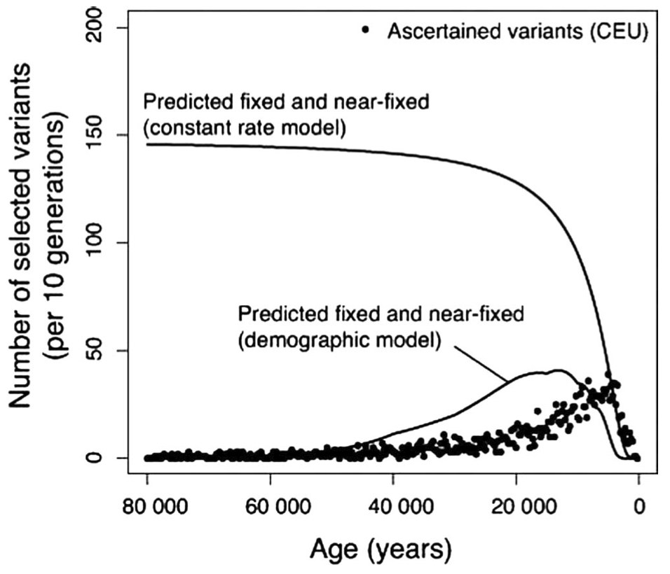
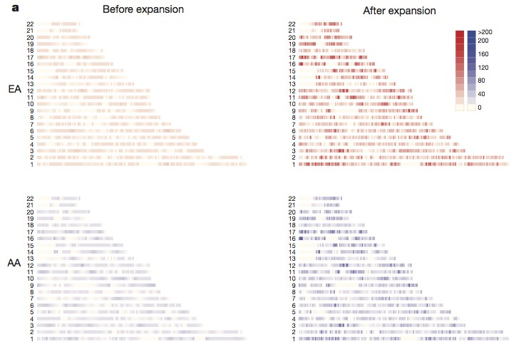

In my [last post](https://www.jasoncollins.blog/more-people-means-more-ideas-and-mutations/), I noted R.A. Fisher's argument that a larger population leads to more mutations and greater potential for adaptive evolution. As human populations have undergone massive growth over recent tens of thousands of years, we would expect the evidence of this population growth to show in our genomes. In this post, I point to a couple of papers that look at this evidence.

In the first, [Recent acceleration of human adaptive evolution](https://doi.org/10.1073/pnas.0707650104), John Hawks and colleagues examined the age distribution of positively selected gene variants in a 3.9 million SNP dataset. To determine the variant (allele) ages, they examined "linkage blocks". When an SNP is selected, it tends to carry with it other polymorphisms on the chromosome around it. If a variant tends to have a similar set of polymorphisms around it, while another variant at that same point does not, this suggests that the first is under positive selection, dragging along its neighbouring polymorphisms with it (the linkage block). The older original variant will have a bigger mix of polymorphisms around it through reshuffling over time.

This paper has two great charts that illustrate the findings. The first compares the age distribution of the variants in African and European populations. In both populations, the peak in variants is observed in recent history, which matches a theory of mutations increasing with population. Interestingly, we see an earlier peak for the African population. Africa had a larger late Pleistocene population, while population in Europe and West Asia took off after the Neolithic revolution.

The second chart plots the observed variant ages against two models: one with constant mutation rates, and a second where mutations rates increase with population size. The second model provides a far better (but not perfect) fit to the observed data.

You can also read more on this paper (written around the time it came out) on [John Hawks's blog](http://johnhawks.net/weblog/topics/evolution/selection/acceleration/accel_story_2007.html?seemore=y) and at [Gene Expression](http://blogs.discovermagazine.com/gnxp/2007/12/accelerated-adaptive-human-evolution/#.UcpkvuuiaI4).

The [second paper by Fu and colleagues](https://doi.org/10.1038/nature11690), published in Nature Genetics, contained analysis of the age of over one million single nucleotide variants across 6,500 people. Fu and colleagues found that most of the variants that they analysed were relatively young, with the majority arising in the last 5,000 to 10,000 years (as would be expected if mutations increase with population). The age of the variants is best shown in the following chart which is a heat map of the variants in African and European populations before and after recent accelerated population growth (i.e. before or within the last 5,000 years).

While Fu and colleagues don't transfer this story of the growth in rare variants to one of adaptive evolution, you can see how it fits with the first paper by Hawks and colleagues. These variants, even though most may be deleterious, provides the store of variation on which evolution can act.

I [posted a round-up](https://www.jasoncollins.blog/a-flood-of-new-genetic-variation/) of some other blog posts on this second article at the end of last year when the article underwent initial electronic release. The [post by John Hawks](http://johnhawks.net/weblog/reviews/genomics/selection/fu-2012-mutation-ages-europeans-africans.html) is very good.

*The reason I'm covering this territory is to lay the groundwork for a post on my latest working paper: [Population, Technological Progress and the Evolution of Innovative Potential](http://ssrn.com/abstract=2284456). You can now find that [post here](https://www.jasoncollins.blog/population-technological-progress-and-the-evolution-of-innovative-potential/).
