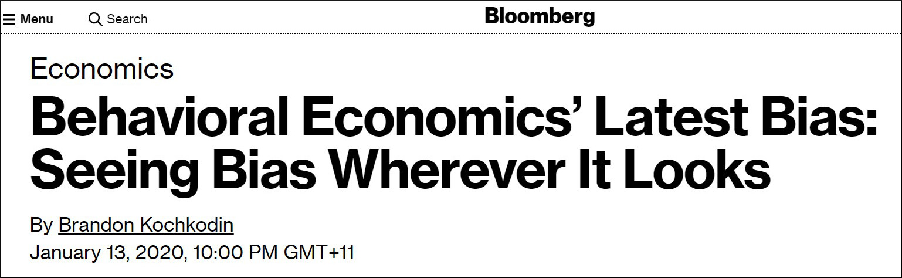
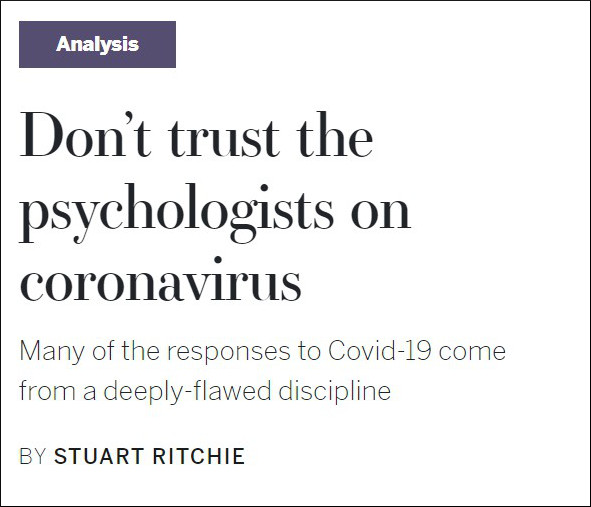
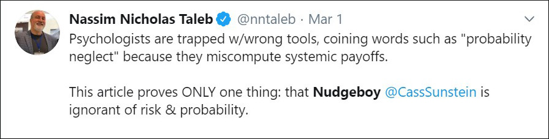
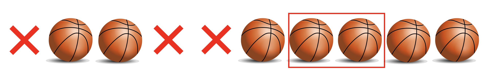
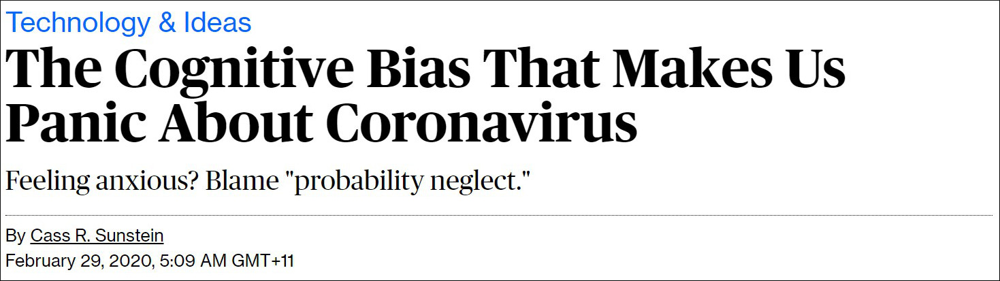
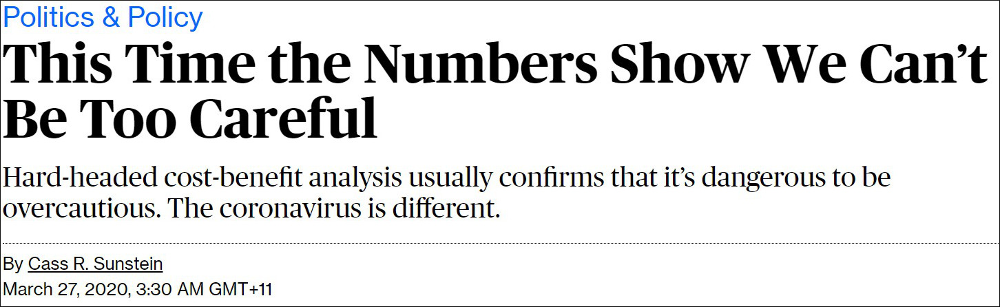
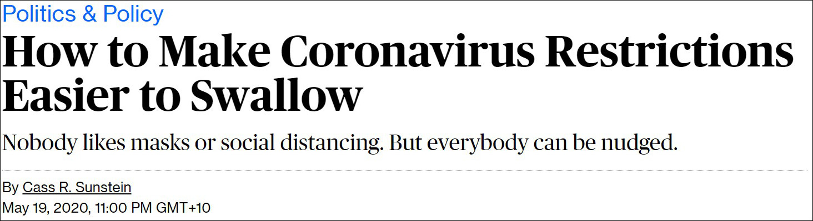

Below is the text of my presentation at [Nudgsestock on 12 June 2020](https://www.nudgestock.co.uk/).

## Intro

Over the past decade or two, behavioural scientists have had a great ride. There have been bestselling books and Nobel Memorial Prizes. Every second government department and corporate has set up a team.

But recently, the wind seems to have changed. We're told that [behavioural economics is itself biased](https://www.bloomberg.com/news/articles/2020-01-13/behavioral-economics-latest-bias-seeing-bias-wherever-it-looks).

"[Don't trust the psychologists on coronavirus](https://unherd.com/2020/03/dont-trust-the-psychologists-on-coronavirus/) - Many of the responses to Covid-19 come from a deeply-flawed discipline".

["Nudgeboy"](https://twitter.com/nntaleb/status/1233755916119543809) has become a pejorative.

I believe this challenge is deserved.

For too long we have been opining about people's irrationality - that is, the irrationality of others - and that if only we designed the world more intelligently, people would make better decisions.

We often make these judgements based on narrow lab experiments that we generalise to the outside world. But as we well know, sometimes those experiments don't replicate in that narrow lab environment. And even of those that replicate in the lab, many become an ineffective, or even dangerous tool when we try to apply them in the complex outside world.

Let me tell you a story to illustrate.

## The hot hand fallacy

This story comes from great [work by Joshua Miller and Adam Sanjurjo](https://doi.org/10.3982/ECTA14943). It stands as one of the starkest examples of where I have been forced to change my beliefs.

There is strong evidence from the lab that people have misperceptions about what randomness looks like. When a person is asked to generate a series that approximates the flipping of a coin, they will alternate between heads and tails too often, and balance the frequencies of heads and tails over too short a sequence. When people are asked to judge which of two different sequences of coin flips are more likely, they tend to pick sequences with more alternation, despite their probability being the same.

What happens when we look for a failure to perceive randomness in the outside world? Out of the lab?

When people watch basketball, they often see a hot hand. They will describe players as "hot" and "in form". Their belief is that the person who has just hit a shot or a series of shots is more likely to hit their next one.

But is this belief in the "hot hand" a rational belief? Or is the hot hand an illusion, whereby, just like they do with coins, they are seeing streaks in what is actually randomness?

In a famous examination of this question, [Thomas Gilovich, Robert Vallone and Amos Tversky](https://doi.org/10.1016/0010-0285(85)90010-6) took shot data from a variety of sources, including the Philadelphia 76ers and Boston Celtics, and examined it for evidence of a hot hand.

What did they find? The hot hand was an illusion. As Daniel Kahneman wrote in [Thinking, Fast and Slow](https://www.jasoncollins.blog/re-reading-kahnemans-thinking-fast-and-slow/) when describing this research:

> The hot hand is entirely in the eye of the beholders, who are consistently too quick to perceive order and causality in randomness. The hot hand is a massive and widespread cognitive illusion.

Possibly even more interesting was the reaction to the findings from those in the sporting world. Despite the analysis, many sports figures denied that it could be true. Red Auerbach, who coached the Boston Celtics to nine NBA championships, [said](http://archive.wilsonquarterly.com/sites/default/files/articles/WQ_VOL15_SP_1991_Article_02.pdf) "Who is this guy? So he makes a study. I couldn't care less."

This provides another insight, about which Gilovich wrote:

> \[T\]he story of our research on the hot hand is only partly about the misperception of random events. It is also about how tenaciously people cling to their beliefs even in the face of hostile evidence.

So, this isn't just about the misperception of the hot hand, but also about the failure of people to see their error when presented with evidence about it.

Let's delve into how Gilovich, Vallone and Tversky showed the absence of a hot hand.

Imagine a person who took ten shots in a basketball game. A ball is a hit, an X is a miss.

What would count as evidence of a hot hand? What we can do is look at shots following a previous hit. For instance, in this sequence of shots there are 6 occasions where we have a shot following a previous hit. Five of those shots, such as the seventh here, are followed by another hit.

We can then compare their normal shooting percentage with the proportion of shots they hit if the shot immediately before was a hit. If their hit rate after a hit is higher than their normal shot probability, then we might say they get a hot hand.

This is effectively how Gilovich, Vallone and Tversky examined the hot hand in coming to their conclusion that it doesn't exist. They also looked at whether there was a hit or miss after longer streaks of hits or misses, but this captures the basic methodology. It seems sensible.

But let me take a detour that involves flipping a coin.

Suppose you flip a coin three times. Here are the eight possible sequences of heads and tails. Each sequence has an equal probability of occurring. What if I asked you: if you were to flip a coin three times, and there is a heads followed by another flip in that sequence, what is the expected probability that another heads will follow that heads?

Here is the proportion of heads following a previous flip of heads for each sequence. In the first row of the table, the first flip is a head. That first flip is followed by another head. After the second flip, a head, we also have a head. There is no flip after the third head. 100% of the heads in that sequence followed by another flip are followed by a head.

In the second row of the table, 50% of the heads are followed by a head. In the last two rows, there are no heads followed by another flip.

Now, back to our question: if you were to flip a coin three times, and there is a heads followed by another flip in that sequence, what is the expected probability that another heads will follow that heads? It turns out it is 42%, which I can get by averaging those proportions.

**8 possible combinations of heads and tails across three flips**

| **Flips**          | **p(H**t+1\|Ht) |
|:-------------------|:--------------------------------------|
| HHH                | 100%                                  |
| HHT                | 50%                                   |
| HTH                | 0%                                    |
| HTT                | 0%                                    |
| THH                | 100%                                  |
| THT                | 0%                                    |
| TTH                | \-                                    |
| TTT                | \-                                    |
| **Expected value** | **42%**                               |

That doesn't seem right. If we count across all the sequences, we see that there are 8 flips of heads that are followed by another flip. Of the subsequent flips, 4 are heads and 4 are tails, spot on the 50% you expect.

What is going on in that second column? By looking at these short sequences, we are introducing a bias. The cases of heads following heads tend to cluster together, such as in the first sequence which has two cases of a heads following a heads. Yet the sequence THT, which has only one shot occurring after a heads, is equally likely to occur. The reason a tails appears more likely to follow a heads is because of this bias whereby the streaks tend to cluster together. The expected value I get when taking a series of three flips is 42%, when in fact the actual probability of a heads following a heads is 50%. As the sequence of flips gets longer, the size of the bias is reduced, although it is increased if we examine longer streaks, such as the probability of a heads after three previous heads.

Why have I bothered with this counterintuitive story about coin flipping?

Because this bias is present in the methodology of the papers that purportedly demonstrated that there was no hot hand in basketball. Because of this bias, the proportion of hits following a hit or sequence of hits is biased downwards. Like our calculation using coins, the expected proportion of hits following a hit in a sequence is lower than the actual probability of hitting a shot.

Conversely the hot hand pushes the probability of hitting a shot after a previous hit up. Together, the downward bias and the hot hand roughly cancelled each other out, leading to the conclusion by researchers that each shot is independent of the last.

The result is, that when you correct for the bias, you can see that there actually is a hot hand in basketball.

When Miller and Sanjurjo crunched the numbers for one of the studies in the Gilovich and friends paper, they found that the probability of hitting a shot following a sequence of three previous hits is 13 percentage points higher than after a sequence of three misses. There truly is a hot hand. If Red Auerbach had coached as though there were no hot hand, what would his record have looked like?

I should say, this point does not debunk the earlier point about people misperceiving randomness. The lab evidence is strong. People tend to see the hot hand when people flip coins. It is possible that people overestimate the strength of the hot hand in the wild, although that is hard to show. But the hot hand exists.

Let's turn back to one of the quotes I showed earlier.

> \[T\]he story of our research on the hot hand is only partly about the misperception of random events. It is also about how tenaciously people cling to their beliefs even in the face of hostile evidence.

The researchers expanded the original hot hand research from a story about people misperceiving randomness, to one of them continuing to do so even when presented with evidence that they were making an error.

But, as we can now see, their belief in the hot hand was not an error. The punters in the stands were right. Their accumulated experience had given them the answer. The researchers were wrong. Rather than the researchers asking whether they themselves were making an error when people refused to believe their research, they double downed and identified a second failure of human reasoning. The blunt dismissal of people's beliefs led behavioural scientists to hold an untrue belief for over thirty years

This is a persistent characteristic of much applied behavioural science. It was an error I made many times when I first came to the discipline. We spend too little time questioning our understanding of the decisions or observations other people make. If we believe they are in error, we should first question whether the error is ours.

## Priming

Here's another example. There is a body of behavioural science research known as priming, that suggests that even slight cues in the environment can change our actions. A lot of priming research has bitten the dust through the replication crisis - ideas such as words associated with old people slow our walking pace, known as the Florida effect, or that images of money make us selfish, or that priming us with the ten commandments can make us more honest. It simply hasn't stood the test of time.

Yet here's a passage from [Daniel Kahneman's Thinking, Fast and Slow](https://www.jasoncollins.blog/kahnemans-thinking-fast-and-slow/):

> When I describe priming studies to audiences, the reaction is often disbelief. ...
>
> The idea you should focus on, however, is that disbelief is not an option. The results are not made up, nor are they statistical flukes. You have no choice but to accept that the major conclusions of these studies are true.

No. Again, it turns out the doubt of these audiences was justified.

There is an interesting intersection between this priming research and the hot hand. Much behavioural science research (including priming) is built on the concept that subtle, often ignored features of our environment can have marked effects on our decisions and performance. Yet why didn't the hot hand researchers consider that a basketball player would be influenced by their earlier shots, surely a highly salient part of the environment and influence on their mental state? But, alas, the desire to show one bias allowed us to overlook another.

## Probability neglect

Now to a more recent story, which involves a concept called probability neglect.

The idea behind probability neglect is that when we consider a small risk, we tend to either ignore the risk or give it too much weight. We give disproportionate weight to the difference between zero and one percent relative to the difference between one and 99 percent probability.

There's good evidence from the lab that we suffer from probability neglect - in the same way there is solid lab evidence about our misperceptions of randomness. But once again, the danger emerges when we take this finding and use it to assess the decisions of people in the outside world.

Here's a recent example by Nudge author Cass Sunstein that hasn't aged particularly well: [The Cognitive Bias That Makes Us Panic About Coronavirus](https://www.bloomberg.com/opinion/articles/2020-02-28/coronavirus-panic-caused-by-probability-neglect), with the subtitle: Feeling anxious? Blame "probability neglect."

The opening paragraph of the article reads:

> At this stage, no one can specify the magnitude of the threat from the coronavirus. But one thing is clear: A lot of people are more scared than they have any reason to be. They have an exaggerated sense of their own personal risk.

If you can't specify a magnitude, it's somewhat hard to claim that a response is exaggerated. But beyond that, here we see a set of findings from the lab - Sunstein later in the article describes one of the lab experiments - extrapolated to the real world, with little time spent asking whether an experiment in the lab can capture the more complex dynamics around people's response to the coronavirus. In the lab, we know the probabilities. We have set them. Outside, in a case such as coronavirus, we don't have any benchmark against which to assess people's responses. As Sunstein notes, we also don't know the magnitude.

Sunstein should have asked: Some people are reacting more than I think they should. Is there something about their response to risk that I should pay attention to? Why am I right and they wrong?

In fact, even when they are likely wrong - perhaps those panicking are like the broken clock that is right twice a day - we should ask whether there is wisdom in their actions. What if there is an asymmetry in the potential costs and benefits of overreacting versus under-reacting? Is it better to be typically wrong on probability - always assume there is a tiger in the grass - than to be largely right but occasionally experience ruin?

Sunstein, of course, was not exactly Robinson Crusoe in claiming that we were overreacting in late February. In fact, even now it's not entirely clear what the appropriate response was for many people, regions or countries.

But by late March, without skipping a beat, he was noting that ["This Time the Numbers Show We Can't Be Too Careful"](https://www.bloomberg.com/opinion/articles/2020-03-26/coronavirus-lockdowns-look-smart-under-cost-benefit-scrutiny). No mention of the allegation of a misperception of risk less than four weeks earlier.

Of course, one of the weaknesses of applied behavioural science is that you can tell a story no matter what the observed behaviour. Six weeks later Sunstein was writing "How to Make Coronavirus Restrictions Easier to Swallow", giving guidance on how to stop an under-reaction.

As Sunstein wrote:

> To address the coronavirus pandemic, it's essential to influence human behavior; to promote social distancing, to get people to wear masks, to encourage people to stay home. Many nations have imposed mandates as well. But to enforce the mandates and to promote safer choices as the mandates wind down, people have to be nudged.

So now it's all about trying to get people to stay home, because they, err, are underestimating the risk? Maybe it's better to be right twice a day than to be the clock that is always two hours too slow.

## Getting the right objective

These two stories - about the hot hand and coronavirus - illustrate the danger of taking lab experiments into a far more complex environment, the outside world. You can already see some of the reasons why this can cause problems. We may not have the full set of information held by the decision maker. We might simply stuff up our analysis of the problem. It's complex.

In closing, I want to suggest another problem with judging other people's decisions, and that is that we can mistake (or give insufficient consideration of) what a person's objective actually is and how they can best achieve that objective.

Behavioural scientists have a better insight into this than many. We know that people aren't just selfishly trying to maximise their income, wealth or consumption.

Yet, despite this, when we assess people's behaviour in the wild, we often assess the rationality of their behaviours against a rather narrow set of outcomes, such as how their decisions benefit their finances or health in the long-term. We then try to nudge them in that direction.

Yet, that's often not what people want.

My PhD combined evolutionary biology with economics, so I often think about our objectives with an evolutionary lens. Our mind was selected to have preferences that would tend to result in survival and reproduction in the environment in which it evolved.

Of course, most of us don't specifically plot to maximise our reproductive output. Rather, evolution shapes our preferences so that we seek proximate objectives.

When we examine objectives from an evolutionary biology perspective, what appears irrational can simply be a misunderstanding on our part of what someone's objectives are. The type of behaviour to, say, attract a partner, is going to look somewhat different to that of someone simply maximising financial resources. In fact, someone might effectively burn financial resources as part of their rational course of action.

One reason for this is that a core part of the evolved toolkit is our use of signals. We want to signal our traits or resources to others, including allies, enemies and potential reproductive partners.

Yet a problem with signals is that our interests are often not aligned with the recipient of our signal. We have an incentive to be dishonest, and the recipient knows this.

As a result, we need our signal to be reliable. One such way is that the signal imposes a cost on the signaller - and not just any cost - an actual handicap that someone without the trait or resources could not fake. The now almost cliched example of this is the peacock's tail. It is a reliable signal of male health as only a male in good condition can maintain the unwieldy tail without falling prey to predators.

In the same way, one of the best ways to signal wealth is to burn money. Health can be signalled by unhealthy behaviours that would fry someone with a lesser constitution. An applied behavioural scientist assessing these behaviours from the perspective of the effect on long-term health or retirement savings is going to be somewhat confused. Yet when you see the objective, the behaviour has a purpose.

Of course, it does not immediately follow that understanding a person's evolutionary objectives will rationalise their behaviour. As our taste for sweet and fatty foods implies, our preferences evolved in a world much different to ours. But it does suggest that we need to be wary in judging people's actions as their objective may not be what we think it is.

## Reducing power use

This possible misunderstanding of people's objectives can also arise simply as a practical issue. Let me give an example which, although not evolutionary, I think about a lot.

Power companies often want to limit their customers' electricity demand for environmental reasons, or to reduce peak demand.

One of the favourite tricks to do this is to provide a comparison of that person or household's power consumption with their neighbours. People have a desire to conform, and look to cues to inform their decisions. If shown that their power usage is above their neighbours, they tend to reduce their use.

Source: [Opower, Allcott and Kessler (2019) AEJ: Applied Economics](https://doi.org/10.1257/app.20170328)

What is this person or household's objective? If it were purely financial, success! They have saved on their power bill. Their reduction in use also happens to align with the environmental or peak demand reduction objectives of the nudger.

Yet is their objective that simple? What if it is, say, happiness or satisfaction in life? What of factors such as their comfort?

And then what of their self-image? You've just compared them negatively with their neighbour. Is it likely to increase their happiness to see that they compare poorly? Does it increase mental stress? As applied behavioural scientists, we spend decidedly little time thinking about the breadth of the possible objectives someone may have and the effect of our nudge on them.

That is not to say that you cannot find examples where behavioural scientists have gone the next step to do the welfare calculus. This example of a comparison I have shown here comes from a paper by [Hunt Allcott and Judd Kessler](https://doi.org/10.1257/app.20170328) describing work with Opower. And what did they find? Although they argued that the net social welfare of the nudge was positive, a failure to consider these other objectives markedly overstates the benefits. Plus, about one third of the recipients would be willing to pay to not receive the nudge.

## Close

And now I will close, with a plea. As applied behavioural scientists, we need to inject some humility into our assessment of other people's decisions. We need stop underestimating the intelligence of other people. We need to tone down the glee we have in communicating sexy, counterintuitive experimental findings that demonstrate errors by others. We need to stop making glib assumptions about what other people want and how they can best achieve their objectives. And importantly, we need to stop being lazy storytellers who don't subject ourselves to the same critique that we would apply to someone else.
