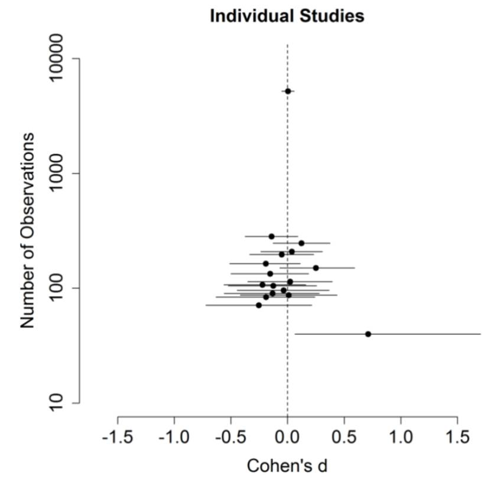
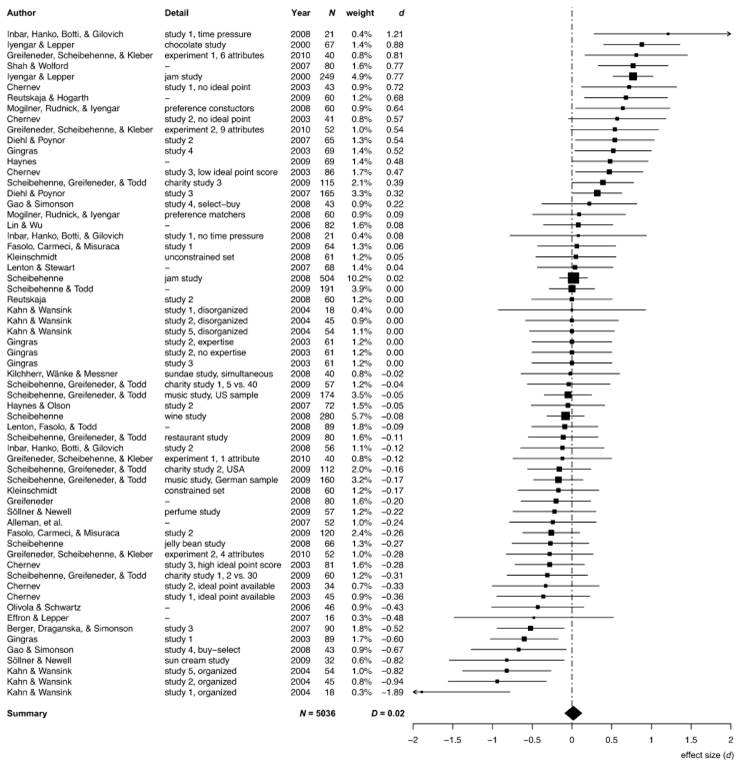

Below is the text of my presentation to the [Sydney Behavioural Economics and Behavioural Science Meetup on 11 May 2016](http://www.meetup.com/Sydney-Behavioural-Economics-Science-Meetup/events/230534530/). The talk is aimed at an intelligent non-specialist audience. I expect the behavioural science knowledge of most attendees is drawn from popular behavioural science books and meetups such as this.

**Intro**

The typical behavioural science or behavioural economics event is a love-in. We all get together to laugh at people's irrationality - that is, the irrationality of others - and opine that if only we designed the world more intelligently, people would make better decisions.

We can point to a vast literature -- described in books such as Dan Ariely's[Predictably Irrational](/arielys-predictably-irrational/), Daniel Kahneman's[Thinking, Fast and Slow](/kahnemans-thinking-fast-and-slow/), and Richard Thaler and Cass Sunstein's[Nudge](/thaler-and-sunsteins-nudge/) -- all demonstrating the fallibility of humans, the vast array of biases we exhibit in our everyday decision making, and how we can help to overcome these problems.

Today I want to muddy the waters. Not only is the "we can save the world" TED talk angle that tends to accompany behavioural science stories boring, but this angle also ignores the problems and debates in the field.

I am going to tell you four stories -- stories that many of you will have heard before. Then I am going to look at the foundations of each of these stories and show that the conclusions you should draw from each are not as clear as you might have been told.

I will say at the outset that the message of this talk is not that all behavioural science is bunk. Rather, you need to critically assess what you hear.

I should also point out that I am only covering one of the possible angles of critique. There are plenty of others.

For those who want to capture what I say, at 7pm tonight (AEST) the script of what I propose to talk about and the important images from my slides will be posted on my blog at [jasoncollins.blog](https://www.jasoncollins.blog). That post will include links to all the studies I refer to.

**Story one -- the Florida effect**

[John Bargh and friends](https://doi.org/10.1037/0022-3514.71.2.230) asked two groups of 30 psychology students to rearrange scrambled words into a sentence that made sense. Students in each of these groups were randomly assigned into one of two conditions. Some students received scrambled sentences with words that relate to elderly stereotypes, such as *worried, Florida, old, lonely, grey, wrinkle*, and so on. The other students were given sentences with non-age-specific words.

{width=60%}

After completing this exercise the participants were debriefed and thanked. They then exited the laboratory by walking down a corridor.

Now for the punch line. The experimenters timed the participants as they walked down the corridor. Those who had rearranged the sentences with non-age specific words walked down the corridor in a touch over seven seconds. Those who had rearranged the sentences with the elderly "primes" walked more slowly -- down the corridor in a bit over eight seconds. A very cool result that has become known as the Florida Effect.

Except......the study doesn't seem to replicate. In 2012 [a paper was published in PLOS One](http://journals.plos.org/plosone/article?id=10.1371/journal.pone.0029081) where Stephen Doyen and friends used a laser timer to time how long people took to walk down the corridor after rearranging their scrambled sentences. The presence of the elderly words did not change their walking speed (unless the experimenters knew about the treatment - but that's another story). There's another failed replication on [PsychFileDrawer](http://www.psychfiledrawer.org/replication.php?attempt=MTU%3D).

What was most striking about this failed replication -- apart from putting a big question mark next to the result - was the way the [lead researcher John Bargh attacked the PLOS One paper](https://osf.io/73a5f) in a post on his Psychology Today blog (his blog post appears to have been deleted, but you can see a description of the content [in Ed Yong's article](https://www.nationalgeographic.com/science/article/failed-replication-bargh-psychology-study-doyen)). Apart from calling the post "Nothing in their heads" and describing the researchers as incompetent, he desperately tried to differentiate the results - such as by arguing there were differences in methodology (which in some cases did not actually exist) - and by suggesting that the replication team used too many primes.

I don't want to pick on this particular study alone (although I'm happy to pick on the reaction). After all, failure to replicate is not proof that the effect does not exist. But failure to replicate is a systematic problem in the behavioural sciences (in fact, many sciences). [A study by Brian Nosek and friends published in Science](http://science.sciencemag.org/content/349/6251/aac4716) examined 100 cognitive and social psychology studies published in several major psychology journals. They subjectively rated 39% of the studies they attempted to replicate as having replicated. Only 25% of social psychology studies in that study met that mark. The size of the effect in these studies was also around half of that in the originals - as shown in this plot of original versus replication effect sizes. The Florida effect is just the tip of the iceberg.

{width=80%}

Priming studies seem to be particularly problematic. Another priming area in trouble is "money priming", where exposure to images of money or the concept of money make people less willing to help others or more likely to endorse a free market economy. As an example, [one set of replications](http://www.ncbi.nlm.nih.gov/pubmed/26214168) of the effect of money primes on political views by Rohrer and friends - as shown in these four charts - found no effect ([ungated pdf](http://uweb.cas.usf.edu/~drohrer/pdfs/Rohrer_et_al_2015JEPG.pdf)). Analysis of the broader literature on money priming suggests, among other things, [massive publication bias](http://psycnet.apa.org/journals/xge/145/5/655.html).

As a non-priming example, those of you who have read Daniel Kahneman's [Thinking, Fast and Slow](https://www.jasoncollins.blog/kahnemans-thinking-fast-and-slow/) or Malcolm Gladwell's David and Goliath might recall a study by [Adam Alter and friends](https://doi.org/10.1037/0096-3445.136.4.569). In that study, 40 students were exposed to two versions of the cognitive reflection task. One of the typical questions in the cognitive reflection task is the following classic:

> A bat and a ball cost \$1.10 in total. The bat costs \$1.00 more than the ball. How much does the ball cost?

The two versions differed in that one used small light grey font that made the questions hard to read. Those exposed to the harder to read questions achieved higher scores.

It all sounds very cool. Slowing people down made them do better. But while the original study with 40 subjects found a large effect, [replications involving thousands of people found nothing](http://psycnet.apa.org/journals/xge/144/2/e16/) (Terry Burnham discusses this paper in more detail [here](http://www.terryburnham.com/2015/04/a-trick-for-higher-sat-scores.html)). As you can see in the chart, the positive result is a small sample outlier.

{width=70%}

Then there is [ego depletion](https://www.jasoncollins.blog/failure-to-replicate-ego-depletion-edition/) - the idea that we have a fixed stock of willpower that becomes depleted through use. If we have to use our willpower in one setting, we're more likely to crumble later on as our ego is depleted.

Now, this theory doesn't rest on one study - [a 2010 meta-analysis](http://psycnet.apa.org/?&fa=main.doiLanding&doi=10.1037/a0019486) examined 83 studies with 198 experiments in concluding there was an ego depletion effect. But that meta-analysis had a lot of flaws, including only including published studies.

Soon a pre-registered replication of one ego depletion experiment involving 23 labs and over 2,000 subjects will be [published in Psychological Science](http://www.psychologicalscience.org/index.php/publications/rrr-the-ego-depletion-paradigm). The result? If there is any effect of ego depletion - at least as captured in that experiment - it is close to zero.

So what is going on here? Why all these failures? One, there is likely publication bias. Only those studies with positive results make it into print. Small sample sizes in many studies make it likely that any positive results are false positives.

Then there is p-hacking. People play around with their hypotheses and the data until they get the result they want.

Then there is [the garden of forking paths](http://www.stat.columbia.edu/~gelman/research/unpublished/p_hacking.pdf), which is the more subtle process whereby people choose their method of analysis or what data to exclude by what often seems to be good reasons after the fact. All of these lead to a higher probability of positive results and these positive results end up being the ones that we read.

Now that these bodies of research are crumbling, some of the obfuscation going on is deplorable. John Bargh's concerning the Florida effect is one of the more extreme examples. Many of the original study proponents erect the defences and claim poor replication technique or that they haven't captured all the subtleties of the situation. Personally, I'd like to see a lot more admissions of "well, that didn't turn out".

But what is also surprising was the level of confidence some people had in these findings. Here's a passage from [Kahneman's Thinking, Fast and Slow](https://www.jasoncollins.blog/kahnemans-thinking-fast-and-slow/) - straight out of the chapter on priming:

> When I describe priming studies to audiences, the reaction is often disbelief. This is not a surprise: System 2 believes that it is in charge and that it knows the reasons for its choices. Questions are probably cropping up in your mind as well: How is it possible for such trivial manipulations of the context to have such large effects? ...
>
> The idea you should focus on, however, is that disbelief is not an option. The results are not made up, nor are they statistical flukes. You have no choice but to accept that the major conclusions of these studies are true.

Err, no.

So, don't believe every study you read. Maintain some of that scepticism even for large bodies of published research. Look for pre-registered replications where people clearly stated what they were going to do before they did it.

And I should say, this recommendation doesn't just apply to academic studies. There are now plenty of governments and consultants running around advertising the results of their behavioural work with approaches also likely to be subject to similar problems.

**Story two - the jam study**

On two Saturdays in a California supermarket, [Mark Lepper and Sheena Iyengar](https://doi.org/10.1037/0022-3514.79.6.995) ([ungated pdf](http://werbepsychologie-uamr.de/files/literatur/01_Iyengar_Lepper(2000)_Choice-Overload.pdf)) set up tasting displays of either six or 24 jars of jam. Consumers could taste as many jams as they wished, and if they approached the tasting table they received a \$1 discount coupon to buy the jam.

For attracting initial interest, the large display of 24 jams did a better job, with 60 per cent of people who passed the display stopping. Forty per cent of people stopped at the six jam display. But only three per cent of those who stopped at the 24 jam display purchased any of the jam, compared with almost 30 per cent who stopped at the six jam display.

This result has been one of the centrepieces of the argument that more choice is not necessarily good. The larger display seemed to reduce consumer motivation to buy the product. The theories around this concept and the associated idea that more choice does not make us happy are often labelled the choice overload hypothesis or the paradox of choice. [Barry Schwartz wrote a whole book](https://www.jasoncollins.blog/barry-schwartzs-the-paradox-of-choice-why-more-is-less/) on this topic.

Fast-forward 10 years to [another paper](https://doi.org/10.1086/651235), this one by Benjamin Scheibehenne and friends ([ungated pdf](http://scheibehenne.de/ScheibehenneGreifenederTodd2010.pdf)). They surveyed the literature on the choice overload hypothesis -- there is plenty. And across the basket of studies - shown in this chart - evidence of choice overload does not emerge so clearly. In some cases, choice increases purchases. In others it reduces them. Scheibehenne and friends determined that the mean effect size of changing the number of choices across the studies was effectively zero.

These reviewed studies included a few attempts to replicate the jam study results. An experiment using jam in an upscale German supermarket found no effect. Other experiments found no effect of choice size using chocolates or jelly beans. There were small differences in study design between these and the original jam study (as original authors are often quick to point out when replications fail), but if studies are so sensitive to study design and hard to replicate, it seems foolhardy to extrapolate the results of the original study too far.

There is a great quote from one of my favourite books, [Jim Manzi's Uncontrolled](https://www.jasoncollins.blog/manzis-uncontrolled/), which captures this danger.

> \[P\]opularizers telescoped the conclusions derived from one coupon-plus-display promotion in one store on two Saturdays, up through assertions about the impact of product selection for jam for this store, to the impact of product selection for jam for all grocery stores in America, to claims about the impact of product selection for all retail products of any kind in every store, ultimately to fairly grandiose claims about the benefits of choice to society.

While these study results often lead to grandiose extrapolations, the defences of these studies when there is a failure to replicate or ambiguous evidence often undermine the extent of these claims. Claiming that the replication didn't perfectly copy the original study suggests the original effect applies to a small set of circumstances. This is no longer TED talk material that can be applied across our whole life.

That is not to say that there is not something interesting going on in these choice studies. Scheibehenne and friends suggest that there may be a set of restrictive conditions under which choice overload occurs. These conditions might involve the complexity (and not the size) of the choice, the lack of dominant alternatives, assortment of options, time pressure or the distribution of product quality ([as also suggested by another meta-analysis](https://doi.org/10.1016/j.jcps.2014.08.002)). And since the jam study appears tough to replicate, these conditions might be narrow. They suggest more subtle solutions than simply reducing choice. Let's not recommend supermarkets get rid of 75% of their product lines to boost their sales by 900%.

So, even if a study suggests something interesting is going on, don't immediately swallow the TED talk and book on how this completely changes our understanding of the world. Even if the result is interesting, the story is likely more subtle than the way it is told.

**Story three - organ donation**

Organ donation rates are an often used example of the power of defaults. I'm now going to take a moment to read a [passage by Dan Ariely](http://freakonomics.com/2008/04/08/how-much-progress-have-psychology-and-psychiatry-really-made-a-freakonomics-quorum/) explaining how defaults affect organ donation rates. He refers to this chart from [Johnson and Goldstein (2003)](http://www.sciencemag.org/content/302/5649/1338) ([ungated pdf](http://www.dangoldstein.com/papers/DefaultsScience.pdf)):

> One of my favorite graphs in all of social science is the following plot from an inspiring paper by Eric Johnson and Daniel Goldstein. This graph shows the percentage of people, across different European countries, who are willing to donate their organs after they pass away. When people see this plot and try to speculate about the cause for the differences between the countries that donate a lot (in blue) and the countries that donate little (in orange) they usually come up with "big" reasons such as religion, culture, etc.

But you will notice that pairs of similar countries have very different levels of organ donations. For example, take the following pairs of countries: Denmark and Sweden; the Netherlands and Belgium; Austria and Germany (and depending on your individual perspective France and the UK). These are countries that we usually think of as rather similar in terms of culture, religion, etc., yet their levels of organ donations are very different.

So, what could explain these differences? It turns out that it is the design of the form at the DMV. In countries where the form is set as "opt-in" (check this box if you want to participate in the organ donation program) people do not check the box and as a consequence they do not become a part of the program. In countries where the form is set as "opt-out" (check this box if you don't want to participate in the organ donation program) people also do not check the box and are automatically enrolled in the program. In both cases large proportions of people simply adopt the default option.

But does this chart seem right given that story? Only 2 in every 10,000 people fail to opt-out in Austria? Only 3 in 10,000 in Hungary? It seems too few. And for Dan Ariely's story, it is too few, because the process is not as described.

The hint is in the term "presumed consent" in the chart description. There is actually no time where Austrians or Hungarians are presented with a form where they can simply change from the default. Instead, they are presumed to consent to organ donation. To change that presumption, they have to take steps such as contacting government authorities to submit forms stating they don't want their organs removed. Most people probably don't even think about it. It's like calling my Australian citizenship - resulting from my birth in Australia - a default and praising the Australian Government for its fine choice architecture.

And what about the outcomes we care about - [actual organ donation rates](https://en.wikipedia.org/wiki/International_organ_donor_rates). Remember, the numbers on the Johnson and Goldstein chart aren't the proportion of people with organs removed from their bodies. It turns out that the relationship is much weaker there.

Here is a second chart with actual donation rates - the same countries in the same order. The relationship suddenly looks a lot less clear. Germany at 15.3 deceased donors per million people is not far from Austria's 18.8 and above Sweden's 15.1. For two countries not on this chart, Spain, which has an opt-out arrangement, is far ahead of most countries at 33.8 deceased donors per million, but the United States, an opt-in country, is also ahead of most opt-out countries with a donation rate of 26.0.

\[To be clear, I am not suggesting that Johnson and Goldstein did not analyse the actual donation rates, nor that no difference exists - there is an estimate of the effect of presumed consent in their paper, and other papers also attempt to do this. Those papers generally find a positive effect. However, the story is almost always told using the first chart. A difference of 16.4 versus 14.1 donors per million (Johnson and Goldstein's estimate) is not quite as striking as 99.98% for Austria versus 12% for Germany. Even my uncontrolled chart could be seen to be exaggerating the difference - the averages in my chart are 13.1 per million for opt out and 19.3 per million for presumed consent.\]

So, if you can, read the original papers, not the popularised version - and I should say that although I've picked on Dan Ariely's telling of the story here, he is hardly Robinson Crusoe in telling the organ donation story in that way. I've lost count of the number of times reading the original paper has completely derailed what I thought was the paper's message.

In fact, sometimes you will discover there is no evidence for the story at all - Richard Titmuss's suggestion that paying for blood donations might reduce supply by crowding out intrinsic motivations was a thought experiment, not an observed effect. [Recent evidence](https://www.aeaweb.org/articles?id=10.1257/jep.28.2.177) suggests that - as per most economic goods - paying for blood could increase supply.

And this organ donation story provides a second more subtle lesson - if you can, look at the outcomes we want to influence, not some proxy that might not lead where you hope.

**Story four - the hot hand**

This last story is going to be somewhat technical. I actually chose it as a challenge to myself to see if I could communicate this idea to a group of intelligent non-technical people. It's also a very cool story, based on [work by Joshua Miller and Adam Sanjurjo](http://papers.ssrn.com/sol3/papers.cfm?abstract_id=2627354). I don't expect you to be able to immediately go and give these explanations to someone else at the end of this talk, but I hope you can see something interesting is going on.

So, when people watch sports such as basketball, they often see a hot hand. They will describe players as "hot" and "in form". Our belief is that the person who has just hit a shot or a series of shots is more likely to hit their next one.

But is this belief in the 'hot hand' a rational belief? Or is it the case that people are seeing something that doesn't exist? Is the 'hot hand' an illusion?

To answer this question, [Thomas Gilovich, Robert Vallone and Amos Tversky](http://www.sciencedirect.com/science/article/pii/0010028585900106) took masses of shot data from a variety of sources, including the Philadelphia 76ers and Boston Celtics, and examined it for evidence of a hot hand. This included shots in games, free throws and a controlled shooting experiment.

What did they find? The hot hand was an illusion.

So, let's talk a bit about how we might show this. This table shows a set of four shots by a player in each of 10 games. In the first column is the results of their shots. An X is a hit, an O is a miss. This particular player took 40 shots and hit 20 -- so they are a 50% shooter.

So what would count as evidence of a hot hand? What we can do is compare 1) the proportion of shots they hit if the shot immediately before was a hit with 2) their normal shooting percentage. If their hit rate after a hit is higher than their normal shot probability, then we might say they get hot.

The second column of the table shows proportion of shots hit by the player if the shot before was a hit. Looking at the first sequence, the first shot was a hit, and it is followed by a hit. The second shot, a hit, is followed by a miss. So, for that first sequence, the proportion of hits if the shot before was a hit is 50%. The last shot, the third hit, is not followed by any other shots, so does not affect our calculation. The rest of that column shows the proportion of hits followed by hits for the other sequences. Where there is no hit in the first three shots, those sequences don't enter our calculations.

**Basketball player shot sequences (X=hit, O=miss)**

| **Shots**   | p(Xt\|Xt+1) |
|:------------|:----------------------------------|
| XXOX        | 50%                               |
| OXOX        | 0%                                |
| OOXX        | 100%                              |
| OXOX        | 0%                                |
| XXXX        | 100%                              |
| XOOX        | 0%                                |
| XXOO        | 50%                               |
| OOOO        | \-                                |
| OOOX        | \-                                |
| OOXX        | 100%                              |
| **AVERAGE** | **50%**                           |

Across these sequences, the average proportion of hits following a hit is 50%. (That average is also the expected value we would get if we randomly picked one of these sequences.) Since the proportion of hits after a hit is the same as their shooting percentage, we could argue that they don't have a hot hand.

Now, I am going to take you on a detour, and then we'll come back to this example. And that detour involves the coin flipping that I got everyone to do before we commenced.

34 people flipped a coin four times, and I asked you to try to flip a heads on each flip. \[The numbers obtained for the coin flipping were, obviously, added after the fact. The raw data is [here](img/2016-05-11-bad-behavioural-science-failures-bias-and-fairy-tales/flips1.jpg). And as it turned out they did not quite tell the story I expected, so there are some slight amendments below to the original script.\] Here are the results of our experiment. In the second column is the proportion of heads that you threw. Across all of you, you flipped heads 49% of the time, pretty close to 50%. Obviously you have no control over your flips. But what is more interesting is the second column. On average, the proportion of heads flipped after an earlier flip of heads looks to be closer to 48%.

**Meetup experiment results - flipping a coin four times**

| **Number of players** | **p(H)** | **p(H\|H)** |
|:----------------------|:---------|:------------|
| 34                    | 49%      | 48%         |

Now, intuition tells us the probability of a heads after flipping an earlier heads will be 50% (unless you suffer from the gambler's fallacy). So this seems to be the right result.

But let's have a closer look at this. This next table shows the 16 possible combinations of heads and tails you could have flipped. Each of these 16 combinations has an equal probability of occurring. What is the average proportion of heads following a previous flip of a heads? It turns out it is 40.5%. That doesn't seem right. But let's delve deeper into this. In the third column is how many heads follow a heads, and the fourth how many tails follow a heads. If we count across all the sequences, we see that we have 12 heads and 12 tails after the 24 earlier flips of heads - spot on the 50% you expect.

**16 possible combinations of heads and tails across four flips**

| **Flips**   | **p(H**t+1\|Ht) | **n(H**t+1\|Ht) | **n(T**t+1\|Ht) |
|:--------------|:---------------------|:-------------------|:--------------|
| HHHH        | 100%                                  | 3                                     | 0                                     |
| HHHT        | 67%                                   | 2                                     | 1                                     |
| HHTH        | 50%                                   | 1                                     | 1                                     |
| HHTT        | 50%                                   | 1                                     | 1                                     |
| HTHH        | 50%                                   | 1                                     | 1                                     |
| HTHT        | 0%                                    | 0                                     | 2                                     |
| HTTH        | 0%                                    | 0                                     | 1                                     |
| HTTT        | 0%                                    | 0                                     | 1                                     |
| THHH        | 100%                                  | 2                                     | 0                                     |
| THHT        | 50%                                   | 1                                     | 1                                     |
| THTH        | 0%                                    | 0                                     | 1                                     |
| THTT        | 0%                                    | 0                                     | 1                                     |
| TTHH        | 100%                                  | 1                                     | 0                                     |
| TTHT        | 0%                                    | 0                                     | 1                                     |
| TTTH        | \-                                    | \-                                    | \-                                    |
| TTTT        | \-                                    | \-                                    | \-                                    |
| **AVERAGE** | **40.5%**                             | **12**                                | **12**                                |

So what is going on in that second column. By looking at these short sequences, we are introducing a bias. Most of the cases of heads following heads are clustered together - such as the first sequence which has three cases of a heads following a heads. Yet it has the same weight in our average as the sequence TTHT - with only one shot occurring after a heads. The reason a tails appears more likely to follow a heads is because of this bias. The actual probability of a heads following a heads is 50%.

And if we do the same exercise for your flips, the result looks now look a bit different - you flipped 28 heads and 22 tails for the 50 flips directly after a head. 56% heads, 44% tails. It seems you have a hot hand, although our original analysis clouded that result (Obviously, they didn't really have a hot hand - it is a chance result. There was a 24% probability of getting 28 or more heads. Ideally I should have got a larger sample size.)

**Meetup experiment results - flipping a coin four times**

| **Number of players** | **p(H)** | **p(H\|H)** | **n(H\|H)** | **n(T\|H)** |
|:----------------------|:---------|:------------|:------------|:------------|
| 34                    | 49%      | 48%         | 28          | 22          |

Turning back to the basketball example I showed you at the beginning, there I suggested there was a 50% chance of a hit after a hit for a 50% shooter - the first two columns of the table below. But let's count the shots that occur after a hit. There are 12 shots that occur after a hit, and it turns out that 7 of these shots are a hit. Our shooter hits 58% of shots immediately following a hit. They miss on only 42% of those shots. They have a hot hand (noting the small sample size here......but you get the picture).

**Basketball player shot sequences (X=hit, O=miss)**

| **Shots**   | **p(X**t+1\|Xt) | **n(X**t+1\|Xt) | **n(O**t+1\|Xt) |
|:--------------------|:----------------|:-----------------|:----------------|
| XXOX        | 50%                                   | 1                                     | 1                                     |
| OXOX        | 0%                                    | 0                                     | 1                                     |
| OOXX        | 100%                                  | 1                                     | 0                                     |
| OXOX        | 0%                                    | 0                                     | 1                                     |
| XXXX        | 100%                                  | 3                                     | 0                                     |
| XOOX        | 0%                                    | 0                                     | 1                                     |
| XXOO        | 50%                                   | 1                                     | 1                                     |
| OOOO        | \-                                    | \-                                    | \-                                    |
| OOOX        | \-                                    | \-                                    | \-                                    |
| OOXX        | 100%                                  | 1                                     | 0                                     |
| **AVERAGE** | **50%**                               | **7**                                 | **5**                                 |

So, why have I bothered with this stats lesson? By taking short sequences of shots and measuring the proportion of hits following a hit, I have introduced a bias in the measurement. The reason this is important is because the papers that supposedly show that there is no hot hand used a methodology that suffered from this same bias. When you correct for the bias, there is a hot hand.

Taking the famous paper by Tom Gilovich and friends that I mentioned at the beginning, they did not average across sequences as I have shown here. But by looking at short sequences of shots, selecting each hit (or sequence of hits) and seeing the result of the following shot, they introduced the same bias. The bias acts in the opposite direction to the hot hand, effectively cancelling it out and leading to a conclusion that each shot is independent of the last.

Miller and Sanjurjo crunched the numbers for one of the studies in the Gilovich and friends paper, and found that the probability of hitting a three pointer following a sequence of three previous hits is 13 percentage points higher than after a sequence of three misses. There truly is a hot hand. To give you a sense of the scale of that difference, Miller and Sanjurjo note that the difference between the median and best three point shooter in the NBA is only 10 percentage points.

Apart from the fact that this statistical bias slipped past everyone's attention for close to thirty years, I find this result extraordinarily interesting for another reason. We have a body of research that suggests that even slight cues in the environment can change our actions. Words associated with old people can slow us down. Images of money can make us selfish. And so on. Yet why haven't these same researchers been asking why a basketball player would not be influenced by their earlier shots - surely a more salient part of the environment than the word "Florida"? The desire to show one bias allowed them to overlook another.

So, remember that behavioural scientists are as biased as anyone.

**If you are interested in learning more....**

Before I close, I'll leave with a few places you can go if you found tonight's presentation interesting.

First is Andrew Gelman's truly wonderful blog [Statistical Modeling, Causal Inference, and Social Science](http://andrewgelman.com/). Please don't be put off by the name - you will learn something from Gelman even if you know little about statistics. Personally, I've learnt more about statistics from this blog than I did through the half a dozen statistics and econometrics units I completed through university. This is the number one place to see crap papers skewered and for discussion about why we see so much poor research. Google Andrew Gelman and his blog will be at the top of the list.

Second, read [Jim Manzi's Uncontrolled](https://www.jasoncollins.blog/manzis-uncontrolled/). It will give you a new lens with which to think about causal associations in our world. Manzi's plea for humility about what we believe we know is important.

Third, read some Gerd Gigerenzer. I only touched on a couple of the critiques of behavioural science tonight. There are many others, such as the question of how irrational we really are. On this angle, Gigerenzer's work is among the most interesting. I suggest starting with [Simple Heuristics That Make Us Smart](https://www.jasoncollins.blog/simple-heuristics-that-make-us-smart/) by Gigerenzer, Peter Todd and the ABC Research Group, and go from there.

Finally, check out [my blog](https://www.jasoncollins.blog) at [jasoncollins.blog](https://www.jasoncollins.blog). I'm grumpy about more than the material that I covered tonight. I will point you to one piece -- [Please Not Another Bias: An Evolutionary Take on Behavioural Economics](https://www.jasoncollins.blog/please-not-another-bias-an-evolutionary-take-on-behavioural-economics/) - where I complain about how behavioural economics needs to be more than a collection of biases, but hopefully you will find more there that's of interest to you.

And that's it for tonight.
