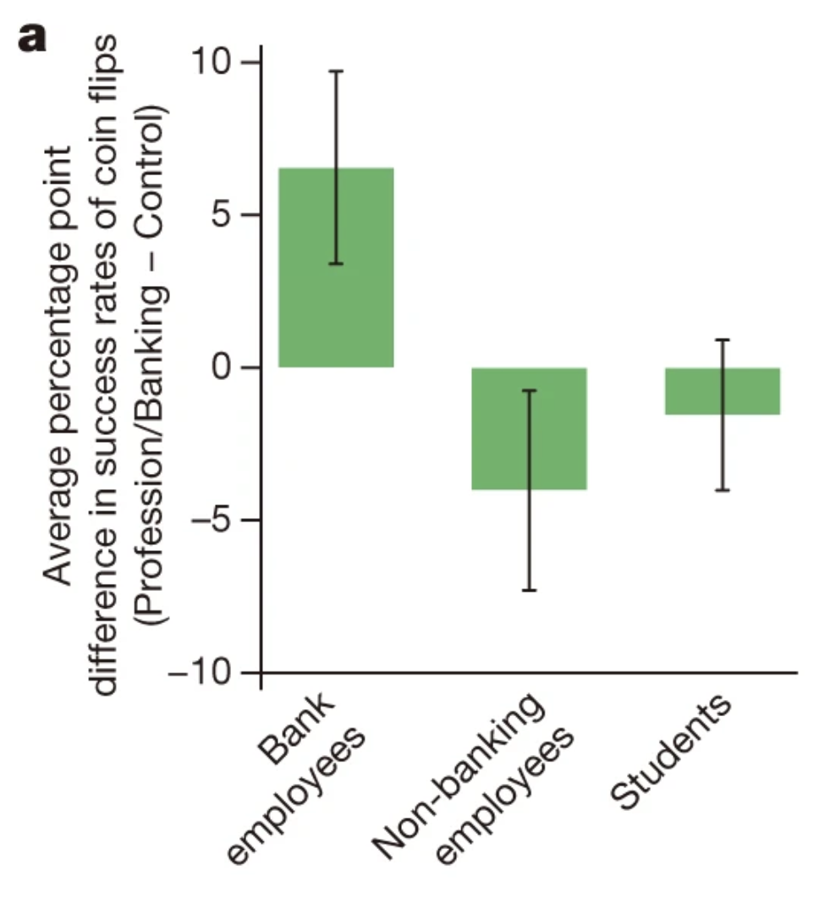
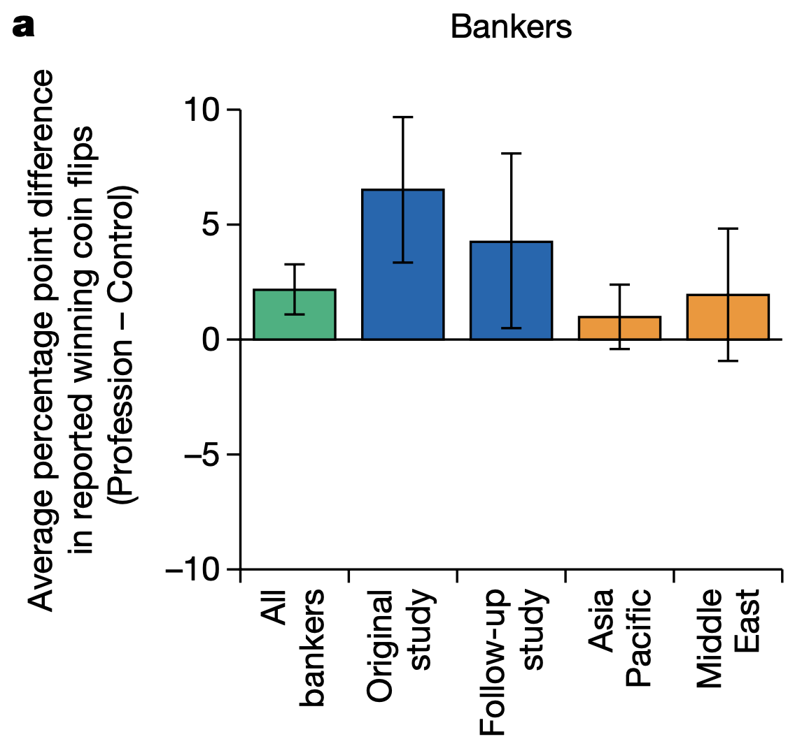

In an oft-quoted and cited Nature paper, [*Business culture and dishonesty in the banking industry*](https://doi.org/10.1038/nature13977), Cohn and colleagues argue that the culture in banking weakens and undermines the honesty norm. In the abstract they state:

> \[W\]e show that employees of a large, international bank behave, on average, honestly in a control condition. However, when their professional identity as bank employees is rendered salient, a significant proportion of them become dishonest. ... Our results thus suggest that the prevailing business culture in the banking industry weakens and undermines the honesty norm, implying that measures to re-establish an honest culture are very important.

There was no shortage of media spouting the news. Altmetric finds [83 stories from 74 outlets](https://www.altmetric.com/details/2905465/news) (as of the date of this post). Here's one example from the [ABC](https://www.abc.net.au/news/2014-11-28/study-finds-bankers-dishonest-by-training-not-by-nature/5925814):

> A Swiss study has set out to establish once and for all whether bankers are scheming, untrustworthy scoundrels.
>
> The study of more than 200 international bankers put their honesty to the test and found them to be fundamentally decent human beings, until they were reminded about what they did for a living.
>
> At that point, the research team discovered they began cheating on their tests.

I am going to take their experiment and provide a different interpretation: that outside of their employment, bankers are more honest than the rest of us.

I don't believe my alternative interpretation. Both my and the authors' interpretations are exercises in chasing noise. This study won't replicate (and in at least two instances, didn't - more on that below).

But, this examination of the claims on face value illustrates the forking paths that an analysis can take to create a newsworthy headline.

**The experiment**

Cohn and friends recruited 128 bank employees and randomly split them into two groups, the treatment and control. (First warning sign: the sample size.) Before undertaking the experimental task, the treatment group was "primed" with a series of questions that reminded them that they were a bank employee (e.g. At which bank are you presently employed?). The control group were asked questions unrelated to their professional identity.

The experimenters then asked each member of these two groups to flip a coin 10 times, reporting the result via a computer. No-one else could see what they had flipped. The experimenters paid them \$20 per flip if they equalled or outperformed a randomly selected colleague. Ten correct flips and you could have \$200 coming your way.

So how can we know if any particular person is telling the truth? You can't. But across a decent sized group you expect, on average, 50% heads and 50% tails (or more precisely, a binomial distribution with a mean of 0.5). Someone getting 10 heads is a 1 in a thousand event. By comparing the distribution of the results to what you would expect, you can infer the level of cheating.

So, how did the bankers go? In the control group, 51.6% of coin flips were successful. It's slightly more than 50%, but within the realms of chance for a group of honest coin flippers. The bankers primed with their professional identity reported 58.2% successful flips, 6.6 percentage points more than the control group. The dishonest bandits.

But how do we know that this result is particular to bankers? What if we primed other professionals with their profession? What if we took a group with no connection to the banking industry and primed them with banking concepts?

Cohn and friends answered these questions directly. When they primed a group of non-banking professionals with their professional identity, they reported 3 percentage points *fewer* successful coin flips than those in a control condition. Students primed with banking concepts also reported fewer successes, around 1.5%. These differences weren't statistically significant and could have happened by chance.

These experimental outcomes are the centrepiece behind the conclusion that the prevailing culture in banking weakens and undermines the honesty norm for bankers.

But now let's go to the supplementary materials and learn a bit more about these non-banking professionals and students.

**An alternative interpretation**

For the non-banking professionals and students, I have only reported the differences in successful coin flips above - as did the authors in the main paper. So how many successes did these non-banking professionals and students have?

In the control condition, the non-banking professionals reported 59.8% successful flips. This dropped to 55.8% when primed with their professional identity. The students were also dishonest bandits, reporting 57.9% successful flips in the control condition, and 56.4% in the banking prime condition.

So looking across the three groups (bankers, non-banking professionals and students), the only honest group we have come across are the bankers in the control condition.

We see a similar effect in an additional sample of 80 bankers reported in the supplementary material. There, the professional prime made bankers more dishonest (although the authors claim victory with p=0.069), but bankers themselves are more honest than the non-bankers to begin with.

This raises the question of what the appropriate reference point for this analysis is. Should we be asking if banking primes induce banker dishonesty? Or should we be asking whether the control primes - which were designed to be innocuous - can induce honesty? To accept that the banking prime induces bankers to cheat more, we also need to have a starting point that bankers, on the whole, cheat less.

I don't see a great deal of value in trying to interpret this result and determine which frame is correct. The result is just noise. But once you look at these numbers, the interpretation by Cohn and friends appears little more than an overly keen attempt to get the results to fit a story.

**Replications**

I noted above that I don't believe this result will replicate, and there are now at least two studies making that argument: one a direct replication, and the other conceptual.

The direct replication is by [Rahwan and friends](https://doi.org/10.1038/s41586-019-1741-y). They increased the sample size to 768 bankers, plus over 500 non-bankers. The headline is that the result did not replicate in the Asia Pacific or Middle East banker populations used in the study. The two blue bars in the below chart represent the original Cohn and friends study, plus the additional 80 banker sample I referred to above.

What is perhaps more interesting than this replication, however, is the response. Cohn and friends were given the opportunity to [publish a response](https://doi.org/10.1038/s41586-019-1729-7) to the replications. Given the original submission date by Rahwan and friends of 6 September 2016 and an acceptance date of 26 August 2019, I can only imagine the wrangling that went on behind the scenes.

Cohn and friends raise several objections to the replication. The main one is that their original study is famous and received wide media coverage. A third of the replication participants reported being aware of the original study. This could affect which banks agreed to participate in the study (most declined) and the behaviour of the participants.

I give this critique some weight, but don't feel great about it. The original authors conduct a low sample size study of a noisy phenomena, overhype their result and then complain about a replication because everyone has heard about their overhyped result. It's as though the publicity creates a shield to replication.

If we can't take the replication on face value, this isn't grounds for retaining a belief in the original experiment. Personally, I'll revert to my [default belief](/a-default-of-disbelief) that the original result is spurious. I'll give weight to it when someone finds a away to get around the publicity problem and demonstrate the result in a pre-registered replication.

Another criticism of the replication by Cohn and friends is whether the replication result is generalisable. They write:

> Rahwan et al. acknowledge that there are important differences between the groups used in their study and our study. For example, both of their experiments were confined to employees of commercial banks who provide basic retail services. By contrast, the participants in our study work in banks who also mostly operate in trading, asset management, investment banking and private banking. It is possible that commercial banks have a different business culture and attract different types of employees than banks that offer the full range of financial services.
>
> In summary, these issues suggest that the study by Rahwan et al. cannot address the question of whether our results generally apply to other institutions and countries.

I must have missed the section in the original paper suggesting that it might not apply outside of their particular banking context.

That said, I'm not convinced Cohn and friends' original study tells us anything about the institution they studied, nor its country.

The other replication that I'll briefly mention was a conceptual replication by [Huber and friends](https://doi.org/10.1016/j.jebo.2020.10.020). This paper was interesting in that it found the opposite result: financial professionals behaved more honestly in a financial context. If you were to differentiate it from Cohn and friends, you would say that Cohn and friends was about identify, whereas Huber and friends was about the decision making context. If I were to extrapolate either study to real-world implications, I'd lean to the former, but I can't say I would confidently generalise either of the experiments.

**Other critiques**

There is a longer line-up of critiques of the original banker dishonesty paper.

Vranka and Houdek, in their paper [Many faces of bankers' identity: how (not) to study dishonesty](https://doi.org/10.3389/fpsyg.2015.00302), suggest that there are many other ways to interpret the results. I agree with that overarching premise that the interpretation that was picked up was one of many (as in my own illustration). But I am less convinced by some of their suggested alternatives, such as the presence of stereotype or money primes. Those primes seem as robust as this banking prime is likely to be. They also pick on the point that bankers are more honest in the control condition.

[Jean-Michel Hupé critiques](https:doi.org/https://doi.org/10.31235/osf.io/nt6xk) the statistical approach, with which I also have some sympathy, but I haven't spent enough time thinking about it to agree with his suggested alternative approach.

Finally, [Thomas Stöckl argues](https://doi.org/10.1016/j.jbef.2015.10.003) there is an alternative explanation to business culture. Rather, the behaviour might simply reflect the professional requirements of the banking industry. This feels like splitting hairs but is an interesting point. As the payoff is competitive (\$20 per flip if you beat your colleague), there is a strong risk-reward tradeoff. If the bankers are particularly skilled at this - it is a basic competence of the industry - the prime could lead them to exercise this skill (which occurs at the expense of the honesty norm).

**An afterthought**

That this experimental result is bunk is not a reason to dismiss the idea that banking culture is poor or that exposure to that culture increases dishonesty. The general problem with the priming literature is that it attempts to elicit effects through primes that are insignificant relative to the actual environments people face.

For example, there is a large difference between answering a few questions about banking and working in a bank. In the latter, you are surrounded by other people, interacting with them daily, seeing what they do. Just because a few questions do not produce an effect doesn't mean that months of exposure to your work environment won't change behaviour. Unfortunately, experiments such as this add approximately zero useful information as to whether this is actually the case.
