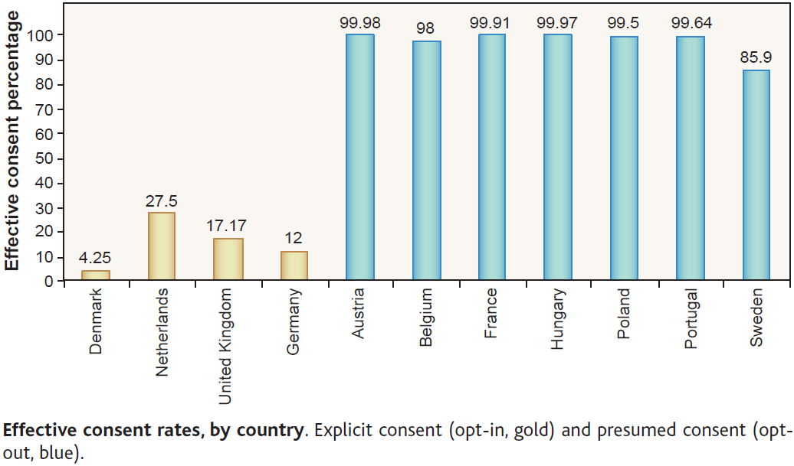

Organ donation rates are an often used example of the power of defaults. Take the [following passage by Dan Ariely](http://freakonomics.com/2008/04/08/how-much-progress-have-psychology-and-psychiatry-really-made-a-freakonomics-quorum/), explaining this (also often used) chart from [Johnson and Goldstein (2003)](http://www.sciencemag.org/content/302/5649/1338) ([ungated pdf](http://www.dangoldstein.com/papers/DefaultsScience.pdf)):

>One of my favorite graphs in all of social science is the following plot from an inspiring paper by Eric Johnson and Daniel Goldstein. This graph shows the percentage of people, across different European countries, who are willing to donate their organs after they pass away. When people see this plot and try to speculate about the cause for the differences between the countries that donate a lot (in blue) and the countries that donate little (in orange) they usually come up with “big” reasons such as religion, culture, etc.
>
>But you will notice that pairs of similar countries have very different levels of organ donations. For example, take the following pairs of countries: Denmark and Sweden; the Netherlands and Belgium; Austria and Germany (and depending on your individual perspective France and the UK). These are countries that we usually think of as rather similar in terms of culture, religion, etc., yet their levels of organ donations are very different.
>
>So, what could explain these differences? It turns out that it is the design of the form at the DMV. In countries where the form is set as “opt-in” (check this box if you want to participate in the organ donation program) people do not check the box and as a consequence they do not become a part of the program. In countries where the form is set as “opt-out” (check this box if you don’t want to participate in the organ donation program) people also do not check the box and are automatically enrolled in the program. In both cases large proportions of people simply adopt the default option.

But does this chart seem right given that story? 99.98 per cent fail to opt-out in Austria? 99.97 per cent in Hungary? It seems too many. And for Dan Ariely's story, it is too many, because the process is not as described.

The hint is in the term "presumed consent" in chart description. There is actually no time where Austrians or Hungarians are presented with a form where they can simply change from the default. Instead, they are presumed to consent to organ donation. To change that presumption, they have to take steps such as contacting government authorities to submit forms stating they don't want their organs removed. Most people probably don't even think about it. I would feel uncomfortable calling it a "default" - and Johnson and Goldstein are clear that there are ethical questions with such "opt-out" arrangements.

So what does this mean in practice? Take the following from [an Austrian government site](http://www.goeg.at/en/Opting-out-Registry):

>In Austria, organs, parts of organs or tissue of potential donors may be removed if the person in question did not expressly refuse organ donation before their death.
>
>In order to document such objections effectively, the Opting-out Registry of persons refusing organ donation was established. Apart from refusals documented in the Registry, also other forms of refusal of post-mortem organ donations are respected (e.g., a written explanation among the identification papers or an oral refusal witnessed by relatives).
>
>The Opting-out Registry has primarily been designed for people living in Austria, and the Austrian social security number is used as the main identification tool. Persons who are staying in Austria for a short time only (for holidays, conferences, family visits) should preferably keep their written personal wishes regarding donations, among their identification papers (consent: I am willing to donate my organs; refusal: I do not want to donate my organs). Their wish is respected in the event of death. In addition, this person’s relatives are consulted.

You can download a form from that page to lodge a refusal in the registry.

The last sentence of the government text gives a hint to the process on the ground - the deceased's relatives are consulted. The process effectively leaves the question of organ donation unaddressed until after death.

I expect consultation with relatives is part of the reason behind the much [smaller differences in the outcome we care about - organ donation rates](http://en.wikipedia.org/wiki/International_organ_donor_rates#Europe). Germany at 15.3 deceased donors per million people is not far from Austria's 18.8 and Sweden's 15.1. Spain, which has an opt-out arrangement, is far ahead of most countries at 33.8, but the United States, an opt-in country, is also ahead of most opt-out countries with a donation rate of 26.0.

Having said all this, a lot of interesting options for organ donation should be explored - active choice, preferential access to organs for previously registered donors, respecting the wishes of the deceased over the preferences of relatives, or payments of some kind. But the story behind this chart is not as neat as it seems. And a lesson - if you can, read the original paper.