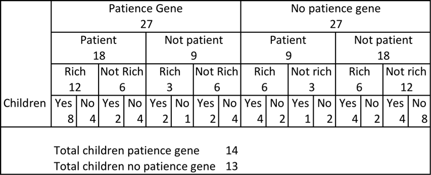
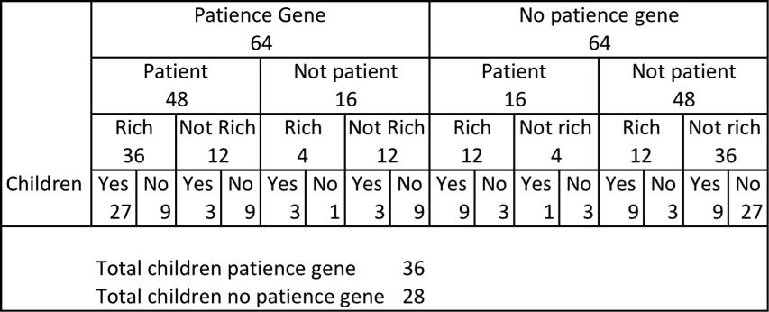
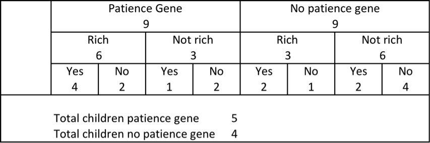

Any theory that seeks to invoke human evolution as a factor in the Industrial Revolution needs to deal with how quickly humans can evolve and whether this rate of change is fast enough to be a factor.

I was recently browsing [Gregory Clark's web-page](http://www.econ.ucdavis.edu/faculty/gclark/a_farewell_to_alms.html) for his book _A Farewell to Alms_ and came across a video of a seminar in 2007 involving Clark, Brad DeLong and Tyler Cowen. There were some interesting points throughout the session (and it is worth watching it all) but one interesting point was an argument by DeLong on the pace of evolution.



His argument was based on the following example. Suppose there is a patience gene in the population. Assume that each person with the patience gene has a two-thirds chance of being patient while those without the gene have a one-third chance. Of those who are patient, they have a two-thirds chance of being rich, versus one-third for the others. Finally, assume that those who are rich have a two-thirds chance of having children, while the rest have a one-third chance.

None of the numbers in the example seem implausible, although there is plenty of room to debate the specifics. Based on these numbers, DeLong noted that those with the patience gene have a 14 in 27 chance of having children, while those without have a 13 in 27 chance. DeLong translated this to a proportional growth rate of 1/27 or approximately 0.04 for those with the patience gene. Assuming 25 years per generation, it would take about 500 years to double the proportion of the patience gene in the population from, say, 1 per cent to 2 per cent.

The following table indicates how he came to that conclusion (the numbers are how many of each type):

DeLong took this slow rate of change to be a challenge for any genetically based theory of the Industrial Revolution. If those numbers were the last word, I would be inclined to agree. However, I would not rule out a scenario where a change in a relatively small part of the population could have large effects if s small group of individuals were responsible for a large proportion of innovation in an economy or there were positive feedback loops.

More importantly, a closer look at the numbers can change the assessment. The first issue is DeLong's interpretation of his own example. While DeLong's estimate of 0.04 for the rate of growth is approximately right when the population is composed of equal numbers of each genotype, it underestimates the growth rate when there are proportionally less patient genotypes. Take the situation where the population has 1 per cent patient genotypes. In such a case, the increase of patient genotypes is effectively their absolute growth rate as they make little difference to the total population. Therefore, they increase as a proportion of the population at a rate of 1/13, or approximately 8 per cent per generation.

This would see the patient genotypes increase to 2 per cent of the population in less than 10 generations, or around 250 years. They would quadruple their proportion of the population in 500 years. As their proportion grows, their proportional growth rate slows. However, an argument that patient genotypes increased from 5 to 20 per cent of the population over 500 years is certainly a basis for significant macroeconomic effects.

Further playing with the numbers gives us some other possibilities. If instead of using two-thirds, one-third as the basis of our calculations, we could use three-quarters-one quarter, giving the following:

These calculations yield us a proportional growth rate of 12 per cent when there is a low proportion of patient genotypes, and 6 per cent when the population is composed of around 50 per cent patient genotypes. That is a doubling in proportion every 6 generations or 150 years when there is a low proportions of patient genotypes.

Another alternative is to simply cut out a step and assume that patient genotypes have a two-thirds chance of being rich, while the others have a one-third chance. This dramatically increases the potential growth rates:

At low prevalence, the patient genotypes increase in proportion of the population at a rate of 25 per cent per generation. Every three to four generations, patient genotypes would double in proportion of the total population.

All of the above is fairly crude and open to debate. However, it seems to indicate that genetically based hypotheses about the Industrial Revolution are robust to this particular back of the envelope calculation.
