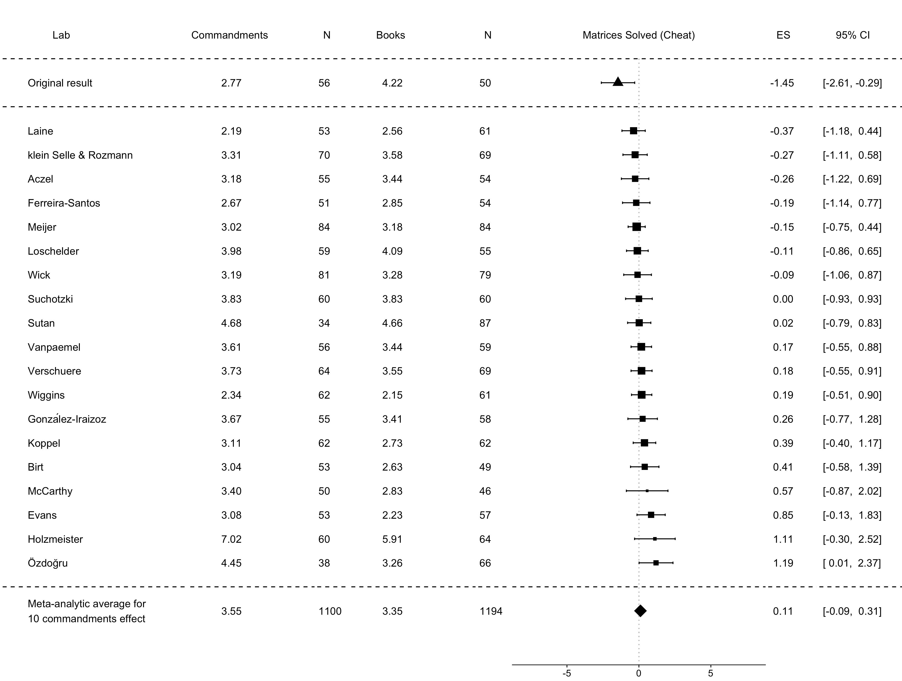

In [The (Honest) Truth About Dishonesty](https://www.jasoncollins.blog/arielys-the-honest-truth-about-dishonesty/), Dan Ariely describes an experiment to determine how much people cheat:

>[P]articipants entered a room where they sat in chairs with small desks attached (the typical exam-style setup). Next, each participant received a sheet of paper containing a series of twenty different matrices ... and were told that their task was to find in each of these matrices two numbers that added up to 10 ...
>
>We also told them that they had five minutes to solve as many of the twenty matrices as possible and that they would get paid 50 cents per correct answer (an amount that varied depending on the experiment). Once the experimenter said, “Begin!” the participants turned the page over and started solving these simple math problems as quickly as they could. ...

Here's an example matrix:

>This was how the experiment started for all the participants, but what happened at the end of the five minutes was different depending on the particular condition.
>
>Imagine that you are in the control condition... You walk up to the experimenter’s desk and hand her your solutions. After checking your answers, the experimenter smiles approvingly. “Four solved,” she says and then counts out your earnings. ... (The scores in this control condition gave us the actual level of performance on this task.)
>
>Now imagine you are in another setup, called the shredder condition, in which you have the opportunity to cheat. This condition is similar to the control condition, except that after the five minutes are up the experimenter tells you, “Now that you’ve finished, count the number of correct answers, put your worksheet through the shredder at the back of the room, and then come to the front of the room and tell me how many matrices you solved correctly.” ...
>
>If you were a participant in the shredder condition, what would you do? Would you cheat? And if so, by how much?
>
>With the results for both of these conditions, we could compare the performance in the control condition, in which cheating was impossible, to the reported performance in the shredder condition, in which cheating was possible. If the scores were the same, we would conclude that no cheating had occurred. But if we saw that, statistically speaking, people performed “better” in the shredder condition, then we could conclude that our participants overreported their performance (cheated) when they had the opportunity to shred the evidence. ...
>
>Perhaps somewhat unsurprisingly, we found that given the opportunity, many people did fudge their score. In the control condition, participants solved on average four out of the twenty matrices. Participants in the shredder condition claimed to have solved an average of six—two more than in the control condition. And this overall increase did not result from a few individuals who claimed to solve a lot more matrices, but from lots of people who cheated by just a little bit.

The question then becomes how to reduce cheating. Ariely describes one idea:

>[O]ur memory and awareness of moral codes (such as the Ten Commandments) might have an effect on how we view our own behavior.
>
>... We took a group of 450 participants and split them into two groups. We asked half of them to try to recall the Ten Commandments and then tempted them to cheat on our matrix task. We asked the other half to try to recall ten books they had read in high school before setting them loose on the matrices and the opportunity to cheat. Among the group who recalled the ten books, we saw the typical widespread but moderate cheating. On the other hand, in the group that was asked to recall the Ten Commandments, we observed no cheating whatsoever. And that was despite the fact that no one in the group was able to recall all ten.
>
>This result was very intriguing. It seemed that merely trying to recall moral standards was enough to improve moral behavior.

This experiment comes from a [paper co-authored by Nina Mazar, On Amir and Ariely](https://doi.org/10.1509/jmkr.45.6.633) ([pdf](http://people.duke.edu/~dandan/webfiles/PapersPI/Dishonesty%20of%20Honest%20People.pdf)). (I'm not sure where the 450 students in the book comes from - the paper reports 229 students for this experiment. A later experiment in the paper uses 450. There were also a few differences in this experiment to the general cheating story above. People took their answers home for "recycling", rather than shredding them, and payment was $10 per correct matrix to two randomly selected students.)

This experiment has now been subject to a [multi-lab replication by Verschuere and friends](https://osf.io/vxz7q/). The abstract of [the paper](https://osf.io/jckme/):

>The self-concept maintenance theory holds that many people will cheat in order to maximize self-profit, but only to the extent that they can do so while maintaining a positive self-concept. Mazar, Amir, and Ariely (2008; Experiment 1) gave participants an opportunity and incentive to cheat on a problem-solving task. Prior to that task, participants either recalled the 10 Commandments (a moral reminder) or recalled 10 books they had read in high school (a neutral task). Consistent with the self-concept maintenance theory, when given the opportunity to cheat, participants given the moral reminder priming task reported solving 1.45 fewer matrices than those given a neutral prime (Cohen ́s d = 0.48); moral reminders reduced cheating. The Mazar et al. (2008) paper is among the most cited papers in deception research, but it has not been replicated directly. This Registered Replication Report describes the aggregated result of 25 direct replications (total n = 5786), all of which followed the same pre-registered protocol. In the primary meta-analysis (19 replications, total n = 4674), participants who were given an opportunity to cheat reported solving 0.11 more matrices if they were given a moral reminder than if they were given a neutral reminder (95% CI: -0.09; 0.31). This small effect was numerically in the opposite direction of the original study (Cohen ́s d = -0.04).

And here's a chart demonstrating the result (Figure 2):

Multi-lab experiments like this are fantastic. There's little ambiguity about the result.

That said, there is [a response by Amir, Mazar and Ariely](https://osf.io/x2sdq/). Lots of fluff about context. No suggestion of "maybe there's nothing here".
