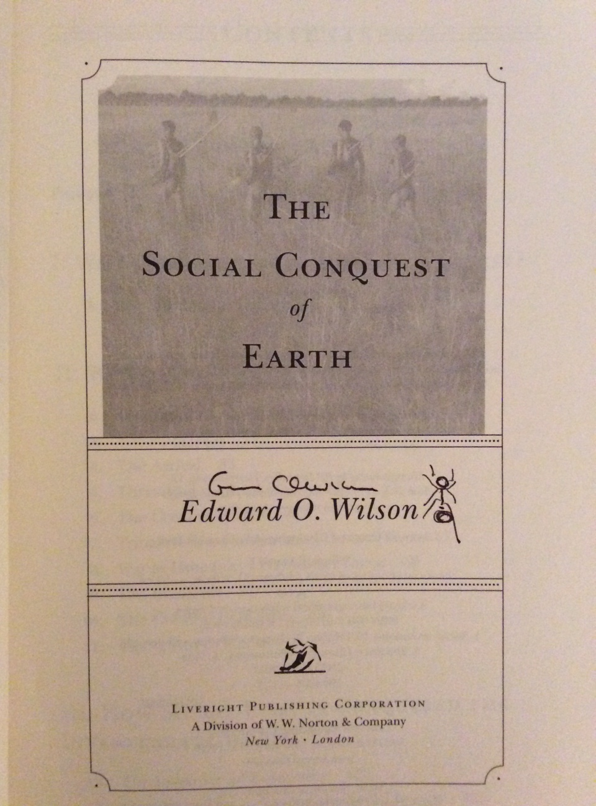

The re-eruption of the war of words between E.O. Wilson and Richard Dawkins has occurred just as I have come around to reading Wilson’s 2012 book *The Social Conquest of Earth*. In an interview on BBC2 (watch it at the bottom of this post), Wilson stated:

>There is no dispute between me and Richard Dawkins and there never has been, because he’s a journalist, and journalists are people that report what the scientists have found and the arguments I’ve had have actually been with scientists doing research.

It is an interesting call to authority that Wilson himself challenged in his reply to Dawkins’s [stinging review of the book in Prospect magazine](http://www.prospectmagazine.co.uk/science-and-technology/edward-wilson-social-conquest-earth-evolutionary-errors-origin-species) (Wilson's reply is at the bottom of the Dawkins piece) - or even Wilson's statement at the end of the book that:

>Science belongs to everybody. Its constituent parts can be challenged by anybody in the world who has sufficient information to do so.

Regardless, the debate between Wilson and Dawkins is a continuation of the group selection debate that has been running since the 1960s, with Wilson now on the group selection side, and Dawkins on that of the selfish gene. But despite this framing of the debate as a confrontation between two apparently diametrically opposed views, The Social Conquest of Earth suggests that Wilson’s view is somewhat more complicated, and possibly confused.

## The old and new group selection

As background, it is worth defining three concepts: group selection, a newer conception of group selection called multilevel selection, and inclusive fitness.

The older form of group selection is a process where the differential survival of groups leads to the evolution of traits that benefit the group. This type of group selection, pushed in the 1960s by V.C Wynne-Edwards in particular, might involve members of a group restraining reproduction during times of scarcity so that the group does not experience resource shortages.

This concept received many harsh critiques, most famously by [George Williams](http://en.wikipedia.org/wiki/Adaptation_and_Natural_Selection) and in popular form by Dawkins in [The Selfish Gene](http://en.wikipedia.org/wiki/The_Selfish_Gene). The basic problem is that if someone cheats and does not restrain reproduction when others do, they will have more offspring and come to dominate the group. The altruistic trait will only emerge if groups with more altruists have a large enough advantage over other groups to compensate for their disadvantage within their groups. These conditions are generally considered to be met in limited circumstances, and most evolutionary biologists would say that the evolution of group adaptations in this way is a theoretical possibility, occurs in some circumstances, but is a practical rarity.

Group selection was somewhat reinvigorated in the late 1970s by David Sloan Wilson and friends under a reworking that is commonly called [multilevel selection](https://www.jasoncollins.blog/what-is-multilevel-selection/). The first distinguishing feature of multilevel selection is that the definition of "group" can include transitory groupings that regularly remix. You could consider two individuals who briefly trade to be a group. The second feature of multilevel selection is that selection is decomposed across multiple levels. The analysis would look at the fitness of the two trading individuals with respect to each other, which is the individual level selection, and of the fitness of their group relative to other groups.

Multilevel selection has received a largely muted response, with inclusive fitness the alternative framework preferred by Dawkins and friends - not to mention the dominant paradigm in evolutionary biology. Inclusive fitness combines the direct effects of a trait on an individual with the indirect effects of the trait on other individuals who possess that trait. Kin selection, a strategy of favouring relatives, maximises inclusive fitness.

Inclusive fitness is famously captured by Hamilton's rule, which states that an altruistic trait will spread if _rb_>_c_. _c_ is the cost to the altruist of the trait, _b_ the benefits to others, and _r_ the relatedness between the altruist and beneficiaries. A trait to favour your brother will spread if the benefits to the brother, who is 0.5 related to you, are double the costs to you. Or as J.B.S. Haldane put it, he would give his life for two brothers or eight cousins.

While apparently opposing perspectives, inclusive fitness and multilevel selection are two sides of the same coin. If you can describe an evolutionary dynamic in terms of multilevel selection, you can also give an inclusive fitness story (many suggest the two approaches [are mathematically equivalent](http://www.jstor.org/stable/2462497), although this [is debated](http://www.sciencedirect.com/science/article/pii/S0022519311003754)). They are simply different accounting methods, or languages. The intuitive explanation for the link is that higher levels of selection (the level of groups) can favour the spread of a trait because the members of that group have a degree of relatedness.

## Wilson's critique of kin selection

Wilson's core argument through The Social Conquest of Earth is that the concept of inclusive fitness has been discredited. This claim stems from [the infamous 2010 Nature paper](http://www.nature.com/nature/journal/v466/n7310/full/nature09205.html) by Martin Nowak, Corina Tarnita and Wilson on eusociality.

An E.O. Wilson drawn ant on the title page to my book:

Eusociality involves a division of reproductive labour, such as that which occurs in the bees, ants and wasps. Eusociality and kin selection are closely linked as the higher relatedness between sisters in the bees, ants and wasps has been used to explain the willingness of most females to forgo their reproductive success for one of their sisters, the queen.

Nowak, Tarnita and Wilson's argument was that the evolution of eusociality could be explained through simple individual selection and did not require the framework of inclusive fitness. They presented a model in which eusociality evolved without any reference to relatedness.

The model itself was interesting, but it was sandwiched between a not particularly well thought-out or supported claim that "the production of inclusive fitness theory must be considered meagre" and that it "does not provide additional insight or information" to standard natural selection theory. I will let the many responses to the paper speak for themselves, including [the main response](http://www.nature.com/nature/journal/v471/n7339/full/nature09831.html?WT.ec_id=NATURE-20110324) (with the 130 odd signatures - [ungated version here](http://www.zoo.ox.ac.uk/group/gardner/publications/Abbot_et_al_2011.pdf)), which contains a table indicating the contributions of inclusive fitness. But if I were to single one paper out, it is this [one by Garnder, West and Wild](http://onlinelibrary.wiley.com/doi/10.1111/j.1420-9101.2011.02236.x/abstract), which addresses many of the mathematical arguments. Its main point, in short, is that Nowak, Tarnita and Wilson fail to distinguish between general kin selection theory and the kin selection methodology used to address specific problems. Their criticisms do not apply to the general theory.

Coming back to Wilson's book, however, Wilson seems to take an even stronger stance than in the paper. For example, he states that:

>Martin Nowak, Corina Tarnita, and I demonstrated that inclusive-fitness theory, often called kin selection theory, is both mathematically and biologically incorrect.

Through the book, Wilson’s characterisation of the paper's reception has to be described as either deceptive or oblivious. Gems such as “The beautiful theory [inclusive fitness] never worked anyway, and now it has collapsed” contrasts with what even a cursory glance at the responses suggest. Nowak, Tarnita and Wilson's critique has not generally been accepted, although reading the book gives no impression of the slightest opposition to Wilson's position. The interview that triggered this latest spat suggests Wilson is still singing a deceptive tune. He states:

>I have abandoned it [the notion of the selfish gene] and I think most serious scientists working on it have abandoned it. Some defenders may be out there, but they have been relatively or almost totally silenced since our major paper came out.

Given the paper, it is no surprise that Wilson argues throughout The Social Conquest of Earth that individual level and group selection is all that is required to explain the evolution of eusociality in insects. Wilson argues that, after the emergence of eusociality in a single colony through individual level selection, “between-colony selection” leads to the wider spread of the eusocial trait. Its selection at the individual and group levels without a multi-level selection framework. As Wilson states:

>But multilevel selection, in which colonial evolution is regarded as the interests of the individual worker pitted against the interests of its colony, may no longer be a useful concept on which to build models of genetic evolution is social insects.

I have no idea why the preferred model isn't simply a multilevel selection framework with alternative assumptions, and the confusion only increases from here.

## Eusociality in humans

Where things get truly confusing is Wilson's consideration of humans. Try as I could, I could not conceive of a sympathetic reading that would allow Wilson’s position to be seen as coherent.

First, his branding of humans as eusocial is a stretch under any definition, although he is not alone in attempting that.

But more confusingly, his argument that eusociality arose in humans due to multilevel selection is hard to understand because I have no clear idea of what he actually means. As a start, its not multilevel selection in the traditional sense, as Wilson has rejected the other side of the multilevel selection coin, inclusive fitness. Initially, I put it down to his error, but when I hit the last chapter, I realised he was using the term "multilevel selection" to mean something different. When Wilson speaks of multilevel selection, he is generally referring to individual level and group selection occurring in tandem, the "groups" being as we would traditionally define them. But then why isn't his dynamic in eusocial insects multilevel selection under his definition?

Part of my confusion (and initial assumption) also stemmed from the contrast between Wilson's past statements and what he wrote in the book. Compare these two paragraphs – the first from [a 2007 paper](http://www.jstor.org/stable/10.1086/522809) co-authored with David Sloan Wilson, and the second from the last chapter of the book.

>The theories that were originally regarded as alternatives, such that one might be right and another wrong, are now seen as equivalent in the sense that they all correctly predict what evolves in the total population. They differ, however, in how they partition selection into component vectors along the way.
>
>Theorists of inclusive fitness themselves have argued that kin selection can be translated into group selection, even though that belief has now been disproven mathematically.

Based on this, it seems that E.O. Wilson is no longer on the same page as the number one champion of multi-level selection, David Sloan Wilson. It is particularly strange in that the two Wilsons characterise what multilevel selection means for humans in almost the same way. As E.O. Wilson writes, and I expect David Sloan Wilson would agree:

>Selection at the individual level tends to create competitiveness and selfish behaviour among group members - in status, mating, and the securing of resources. In opposition, selection between groups tends to create selfless behavior, expressed in greater generosity and altruism, which in turn promote stronger cohesion and strength of the group as a whole.

E.O. Wilson's varying use of these terms points to one of the problems group selection has in popular discourse. The term group selection has been used so inconsistently and used to refer to so many different dynamics, it is often hard to know what someone means when they refer to it. [This article](http://www.ehbonline.org/article/S1090-5138(10)00090-5/abstract) ([ungated pdf](http://www.zoo.ox.ac.uk/group/west/pdf/WestElMoudenGardner_11.pdf)) points to four different uses of the term "group selection", although I have seen some suggestions that there are six different uses in the literature. When people like Wilson present their arguments in such a confusing manner, it is no surprise that others with less expertise are similarly confused. Look at [Jonathan Haidt's confusion of old group and multilevel selection](https://www.jasoncollins.blog/haidts-group-selection/) as a prime example.

## The other bits

Beyond Wilson's take on group selection, there are some interesting parts to the book.

One is Wilson's argument that many examples of kin selection can be explained as pure self interest. For example, he describes how some bird and mammal offspring remain at their parents’ nest. This has been interpreted as an example of kin selection – it helps the bird or mammal's parents and siblings. However, Wilson suggests direct self interest is at play. In cases of resource or territory scarcity, they remain with the parents to inherit the parents’ nest when the parents fall off the perch. Wilson provides several examples of this type, suggesting that the focus on kin selection clouds the assessment of what is actually occurring.

Funnily enough, these arguments mirror an argument I often make about apparently altruistic acts sought to be explained by multilevel or group selection. Many apparently altruistic acts are self interested, such as the trade that characterises our economies. If you classed two people trading with each other as a group, as you might in a [multilevel selection framework](https://www.jasoncollins.blog/what-is-multilevel-selection/), you could class the person who gained the least surplus from the trade as an “altruist”. But the simplest explanation is that they seek to gain from trade.

The final sections of the book seek to explain "who we are". I can only say that there are better places to read about the evolutionary origins of religion, art or language. While the last chapter of *Sociobiology* was revolutionary in its application of evolutionary theory to humans, the short snapshots Wilson provides in *The Social Conquest of Earth* do not do justice to the work that has occurred in the last 30 years. But that large body of work is, of course, one of Wilson's great legacies. As Dawkins noted, despite *The Social Conquest of Earth*, Wilson's place in history is assured.


