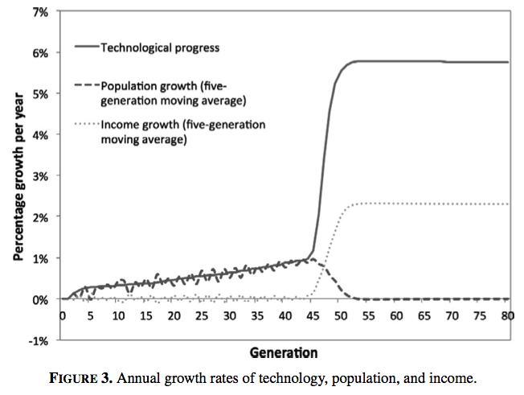
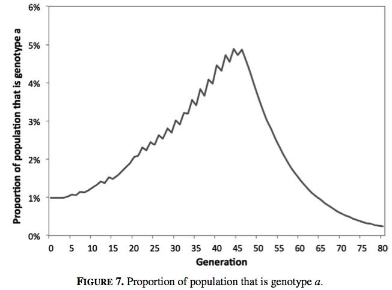
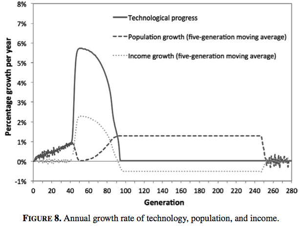
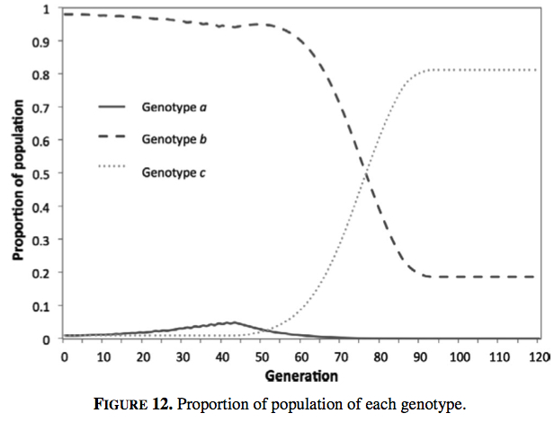

My first publication, [Economic Growth and Evolution: Parental Preference for Quality and Quantity of Offspring](https://doi.org/10.1017/S1365100513000163), has just been released electronically in Macroeconomic Dynamics ([pdf](/pdfs/Collins_et_al_2013_Economic_growth_and_evolution_parental_preference_for_quality_and_quantity_of_offspring.pdf)). With my co-authors Boris Baer and Juerg Weber, we simulate and extend Oded Galor and Omer Moav's seminal paper [Natural Selection and the Origin of Economic Growth](https://doi.org/10.1162/003355302320935007) ([ungated working paper version here](http://papers.ssrn.com/sol3/papers.cfm?abstract_id=246300)), the first paper that models an evolutionary trigger to the Industrial Revolution.

Galor and Moav's model has two types of people in the population, each with a genetically inherited preference for quality or quantity of children. The quality-preferring genotype wants their children to have higher human capital, so they invest more in their education, while the quantity-preferring genotype is more interested in raw numbers.

During the long Malthusian era in which both genotypes struggle to earn enough to subsist (i.e. during the thousands of years leading up the Industrial Revolution), the quality-preferring genotype has a fitness advantage. As a quality-preferring genotype is of higher quality, they earn more income. This higher income is more than enough to cover education expenses, so they are also able to have more children than the quantity-preferring genotypes.

This fitness advantage leads the quality-preferring genotype to increase in prevalence. As this occurs, the increasing average level of education in the population drives technological progress. This in turn increases the incentive to invest in education, creating a feedback loop between technology and education.

Eventually, the rate of technological progress gets high enough to induce the quantity-preferring genotypes to invest in education also. When this happens, the average level of education jumps, boosting technological progress and causing the Industrial Revolution.

During this process, the population growth rate changes. Up to the time of the Industrial Revolution, population growth increases with technological progress, meaning that per capita income remains at the Malthusian level. However, when the level of technology leaps with the Industrial Revolution, the level of education becomes so high that population growth drops dramatically. A demographic transition occurs.

At the time of this transition, the relative fitness of the different types changes. After the Industrial Revolution, the quality-preferring genotypes invest so much into education that they have lower fertility than the quantity-preferring genotypes. The quality-preferring genotypes reduce in prevalence, their fitness advantage erased.

Galor and Moav worked through the dynamics of the model using phase diagrams. It is not particularly easy or intuitive to see the processes working together in their paper, so the first step in our paper is to simulate the model. This demonstrates the model's feasibility, as well as showing the dynamics in a form that is easier to comprehend visually. In the chart below, you can see the dramatic jump in technological progress around generation 45 of the simulation, with per capita income growth also jumping at that time. Meanwhile, population growth drops to zero.

This second chart shows the change population composition. The quality-preferring genotype (genotype a) steadily increases in prevalence through to the Industrial Revolution, peaking at just under five per cent of the population. After the transition, it declines due to its lower fitness.

This change in selection pressure has an interesting implication. While natural selection is the trigger of the Industrial Revolution, the population composition before and after the transition is the same. There is no difference in population composition between developed and undeveloped countries. The only time there is a difference in population composition is during the transition, when the quality-preferring genotypes peak in prevalence. In some ways, the natural selection occurring in Galor and Moav's model is a sideshow to the main event, the quality-quantity trade-off. In a similar model by [Galor and Weil](http://www.jstor.org/stable/117309), a scale effect triggers the Industrial Revolution - that is, the concept that more people leads to more ideas, so technological progress increases with population growth.

That highlights the point where I am not convinced that the model describes what actually occurred. As far as human evolution relates to economic growth, I expect that inherent quality is at least (if not more) important than the quality-quantity trade-off. The Industrial Revolution was possible because higher quality (in an economic sense) people were selected for in the lead-up (with that lead up encompassing thousands of years). Further, for a man of low resources, his larger problem is convincing a woman to mate with him, not deciding on the right quantity-quantity mix.

The other thing that I should note is that, like most economic models, Galor and Moav's model includes consumption with no clear evolutionary rationale (an issue I have discussed in [an earlier post](../2011/04/consumption-and-fitness/)). Why do people in the model consume more than subsistence? If some people chose to focus all excess consumption into raising children they would come to dominate the population. This might be justified as being something to which the population has not yet adapted, but that explanation does not satisfy me.

Having made these quibbles, the model is still an impressive feat. It would not have been an easy task to create a model with technological progress, population and per capita income all following a path that resembles the last few thousand years of economic growth.

In our paper, we extend Galor and Moav's model by considering the entry of people into the population that have a low preference for child quality - i.e. they weight child quantity more highly. Entry could be through migration or mutation. We show that if people with a low enough preference for quality enter the population, their higher fitness in the modern growth state can drive the economy back into Malthusian conditions.

We simulated a version of the model which had present in the initial population a genotype with a very low preference for educating their children. This strongly quantity-preferring genotype has a similar fitness to other genotypes that do not educate in the Malthusian state, and declines in prevalence while the quality-preferring genotype increases.

Once the economy takes off into the modern growth state, the strongly quantity-preferring genotype has the highest fitness as it dedicates the lowest proportion of its resources to educating its children. The strongly quantity-preferring genotype increases in prevalence until, eventually, the average level of education in the population plummets, undermining technological progress. The world returns to a Malthusian state, with high population growth eroding the income benefits of all earlier technological progress.

The following chart shows the rate of growth of population, technological progress and income per person. The first 70 generations look like the base model simulation shown above. However, after that point, technological progress plummets to zero. For the next 150 or so generations, population growth is positive, which can occur as per person income is above subsistence. Eventually, population growth drives income down to subsistence levels and population growth ceases.

In the next figure, you can see that the strongly quantity-preferring genotype, genotype _c_, grows from being a negligible part of the population to over 90 per cent prevalence. It is this change in population composition that drives the return to Malthusian conditions (you can also see the small peak in quality-preferring types around generation 45 that kicks off the Industrial Revolution). The strongly quantity-preferring genotypes educate their children far less than the other genotypes, depressing technological progress.

There is no escape from the returned Malthusian conditions. The quality-preferring genotype will have a fitness advantage in this new Malthusian state and will increase in prevalence. But although that increase in prevalence caused a take-off in economic growth the first time, this time there is no take-off. The strongly quantity-preferring types, which now dominate the population, cannot be induced to educate their children. They simply breed faster to take advantage of any technological progress spurred by the small part of the population that is educating their children.

This regression to Malthusian conditions could also be achieved by introducing the strongly quantity-preferring genotype into the simulation at other points in time, which might be representative of global migration. If it occurs after the Industrial Revolution, the timing of the return to Malthusian conditions will occur later. Short of restricting the range of potential quality-quantity preferences, there is no way to avoid the return to Malthusian conditions in this version of model. The strongly quantity-preferring genotypes will always have a fitness advantage when income is above subsistence and their population growth will drive income back down to subsistence levels.

One possible way to prevent a return to the Malthusian state is if there is also a scale effect in the population, whereby more people results in more ideas. This would give a basis for continuing growth after the take-off in population in the lead up to the transition. However, this scale effect must not be dependent on the level of education in the population, as that will still decline to zero. Further, if there is a scale effect, it raises the question of why the evolutionary trigger is required at all.

There are, of course, a few possible interpretations of the result that the economy returns to Malthusian conditions. The model or assumptions may be wrong. Humans may only have quality-quantity preferences in the growth promoting range. Or if we take Galor and Moav's model seriously, modern levels of economic growth may be transient.

*I constructed this post out of two old posts I wrote when this work was first released as a working paper. The original posts with associated comments are [here](natural-selection-and-economic-growth) and [here](natural-selection-and-the-collapse-of-economic-growth). The R code for simulating the model can be downloaded from [here](https://github.com/jasonacollins/quantity_and_quality).
