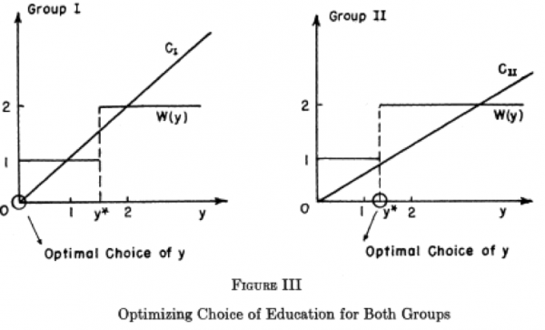
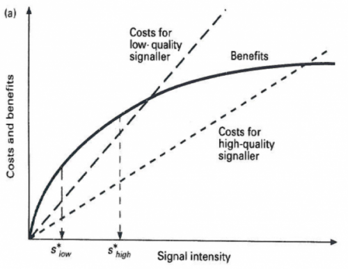

Sorry for the slightly inflammatory post title - but I went to a speech tonight that reminded me of one case where an economist was well ahead of evolutionary biologists in cracking a puzzle.

The speaker was Michael Spence, 2001 Bank of Sweden prize winner and author of the recently released *The Next Convergence: The Future of Economic Growth in a Multispeed World* (the subject of his speech).

In 1973, Spence wrote a paper called [Job Market Signalling](http://www.jstor.org/stable/1882010), one of the main reasons he won the prize. The idea of his paper was simple. Take two groups of people with different productivity (call them low and high). This productivity cannot be directly observed by the employer, but the employer can observe their level of education. Spence showed that if the low productivity workers had a higher cost of education than the high productivity workers, a separating equilibrium could arise where only the high productivity workers would educate themselves and the employers would pay these workers a higher wage. The assumption of the different costs of education was vital for this equilibrium to exist, or else low productivity workers would fake the signal. And it is a reasonable assumption. For example, if the worker is of low productivity due to low intelligence, they will have difficulty understanding lectures and doing assignments and will have to invest more time that the high productivity worker to get the same educational result.

The following diagram shows Spence's result. Each type of worker could be paid high or low wages. The employer will only pay high wages to workers with an education level above y\*. In this case, the cost of education for the low productivity "Group I" is such that they do not undertake education, while members of the high productivity "Group II" educate themselves to y\*. The benefit of education outweighs the costs for "Group II" only.

Two years after Spence's paper was published, Amotz Zahavi had a paper published titled [Mate selection - a selection for a handicap](https://doi.org/10.1016/0022-5193(75)90111-3). This paper spelt out Zahavi's handicap principle, which described how honest signals of quality between animals could evolve. The signals are honest because they impose a handicap on the signaller that only a high quality signaller can bear.

The handicap principle was not accepted at first. Richard Dawkins wrote in an early edition of *The Selfish Gene*:

>I do not believe this theory, although I am not quite so confident in my scepticism as I was when I first heard it. I pointed out then that the logical conclusion to it should be the evolution of males with only one leg and only one eye. Zahavi, who comes from Israel, instantly retorted: 'Some of our best generals have only one eye!' Nevertheless, the problem remains that the handicap theory seems to contain a basic contradiction. If the handicap is a genuine one-and it is of the essence of the theory that it has to be a genuine one-then the handicap itself will penalize the offspring just as surely as it may attract females. It is, in any case, important that the handicap must not be passed on to daughters.

John Maynard Smith published papers (such as [this](https://doi.org/10.1016/S0022-5193(76)80016-1)) suggesting that no model could be found in which the handicap principle could hold (although he did not rule out someone else finding one).

Finally, in 1990, [Alan Grafen published two papers](/conspicuous-consumption-as-a-handicap/) in which he established the population genetic and game theoretic foundations to the handicap principle. Mathematically, it could work. It convinced people such as Dawkins that the handicap principle could be right. And the key element in Grafen's analysis was different costs - as used by Spence in 1973. While Grafen's papers are quite technical, the following diagram by Rufus Johnstone provides a simple illustration of how it works - and how similar it is to the work of Michal Spence. If two different quality individuals face differential costs and the same benefits (or differential benefits and the same costs), they will signal at different levels, making their signal a reliable indicator of their quality. The high-quality individual maximises costs relative to benefits at $s_{high}$, while the low-quality individual maximises their benefits relative to costs at $s_{low}$.

The seventeen year gap between Spence and Grafen's papers appears quite long for a solution to essentially the same problem - although obviously they were framed in quite different ways. How many other instances have there been of fields facing a parallel problem but the solutions were reached such a long-time apart (not to mention independently - Spence's work was not used used in solving the handicap principle problem)?
