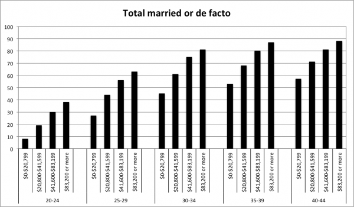

Robin Hansen [writes](http://www.overcomingbias.com/2012/01/sex-ratio-signaling.html) on the sex selective abortion of females:

>A simple supply and demand analysis says that selective abortion both _expresses_ a preference for boys and _causes_ a reduction in that preference as wives become scarce. In South Korea this process is mostly complete, with excess girls down from 15% in the 1990s to 7% today (with ~5% as the biologically natural excess). ...

Over an evolutionary time scale, the pay-offs to male and female children is, on average, equal, which would tend to balance numbers. Over shorter time scales, parents adjust socially, whether that be due to a demand response or changing preferences with income. However, females born today will not affect the ratio of males to females in their reproductive prime for another 15 to 20 years.  The [ratio of males to females](http://www.thenewatlantis.com/publications/the-global-war-against-baby-girls) in China in the 0-4 years age brackets was 110 in 1990, 120 in 1999 and 123 in 2005. We have 20 to 30 years of excess males in the pipeline before any demand response can be realised. The long-term self-correction does not change the short-term issue. (It should also be noted that these ratios are higher than the sex ratio at birth, suggesting there is post-birth mistreatment and infanticide - the preference is not only "benignly" expressed by selective abortion.)

A more interesting point is what we mean when we say there are excess males. Mating is not simply a case of equal numbers matching equal numbers. Females have a stronger preference for quality. Men seek quantity, but quality is not irrelevant.

Take the following chart of Australian marriage rates (data from [Heard (2011)](http://onlinelibrary.wiley.com/doi/10.1111/j.1728-4457.2011.00392.x/abstract)):

There is no shortage of unmarried males in low-income groups even where there is no (or minimal) sex selective abortion. Women care about quality. It could be argued that in Australia, without sex selective abortion, there is a shortage of high-quality males.

So, what is the status of the excess males in China? In the [article](http://www.thenewatlantis.com/publications/the-global-war-against-baby-girls) that triggered Hansen's post, Nicholas Eberstadt writes:

>For one thing, abnormal sex ratios appear to be almost entirely a Han phenomenon within China — and China’s Han are, generally speaking, better educated and more affluent than the country’s non-Han minorities.

From a female perspective, this may be good news as more of the product they desire is being produced - although quality is relative. For low-status males, the equation is worse.
