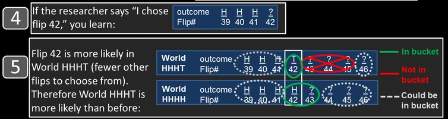

Since first coming across [Joshua Miller and Adam Sanurjo's great work](https://doi.org/10.2139/ssrn.2627354) demonstrating that the hot-hand fallacy was itself a fallacy, I've been looking for a good way to explain simply the logic behind their argument. I haven't found something that completely hits the mark yet, but the following explanation from Miller and Sanjurjo in [The Conversation](http://theconversation.com/momentum-isnt-magic-vindicating-the-hot-hand-with-the-mathematics-of-streaks-74786) might be useful to some:

>In the landmark 1985 paper “[The hot hand in basketball: On the misperception of random sequences](https://doi.org/10.1016/0010-0285(85)90010-6),” psychologists Thomas Gilovich, Robert Vallone and Amos Tversky (GVT, for short) found that when studying basketball shooting data, the sequences of makes and misses are indistinguishable from the sequences of heads and tails one would expect to see from flipping a coin repeatedly.
>
>Just as a gambler will get an occasional streak when flipping a coin, a basketball player will produce an occasional streak when shooting the ball. GVT concluded that the hot hand is a “[cognitive illusion](https://doi.org/10.1037/0033-295X.103.3.582)”; people’s tendency to detect patterns in randomness, to see perfectly typical streaks as atypical, led them to believe in an illusory hot hand.
>
>...
>
>In what turns out to be an ironic twist, we’ve recently found [this consensus view](https://books.google.com/books?id=w_fYZZPcgpkC&pg=PT157&dq=%22Tom+Gilovich,+Robert+Vallone,+and+Amos+Tversky+(1985)+demonstrated+empirically+that+the+hot+hand+does+not+exist.%22&hl=en&sa=X&ved=0ahUKEwikwc_k1e_SAhVLllQKHQ35Bd8Q6AEIGjAA#v=onepage&q=%22Tom%20Gilovich%2C%20Robert%20Vallone%2C%20and%20Amos%20Tversky%20(1985)%20demonstrated%20empirically%20that%20the%20hot%20hand%20does%20not%20exist.%22&f=false) rests on a subtle – but crucial – misconception regarding the behavior of random sequences. In GVT’s critical test of hot hand shooting conducted on the Cornell University basketball team, they examined whether players shot better when on a streak of hits than when on a streak of misses. In this intuitive test, players’ field goal percentages were not markedly greater after streaks of makes than after streaks of misses.
>
>GVT made the implicit assumption that the pattern they observed from the Cornell shooters is what you would expect to see if each player’s sequence of 100 shot outcomes were determined by coin flips. That is, the percentage of heads should be similar for the flips that follow streaks of heads, and the flips that follow streaks of misses.
>
>[Our surprising finding](https://doi.org/10.2139/ssrn.2627354) is that this appealing intuition is incorrect. For example, imagine flipping a coin 100 times and then collecting all the flips in which the preceding three flips are heads. While one would intuitively expect that the percentage of heads on these flips would be 50 percent, instead, it’s less.

>Here’s why.
>
>Suppose a researcher looks at the data from a sequence of 100 coin flips, collects all the flips for which the previous three flips are heads and inspects one of these flips. To visualize this, imagine the researcher taking these collected flips, putting them in a bucket and choosing one at random. The chance the chosen flip is a heads – equal to the percentage of heads in the bucket – we claim is less than 50 percent.
>
>
>*The percentage of heads on the flips that follow a streak of three heads can be viewed as the chance of choosing heads from a bucket consisting of all the flips that follow a streak of three heads. Miller and Sanjurjo, CC BY-ND*
>
>To see this, let’s say the researcher happens to choose flip 42 from the bucket. Now it’s true that if the researcher were to inspect flip 42 before examining the sequence, then the chance of it being heads would be exactly 50/50, as we intuitively expect. But the researcher looked at the sequence first, and collected flip 42 because it was one of the flips for which the previous three flips were heads. Why does this make it more likely that flip 42 would be tails rather than a heads?
>
>
>*Why tails is more likely when choosing a flip from the bucket. Miller and Sanjurjo, CC BY-ND*
>
>If flip 42 were heads, then flips 39, 40, 41 and 42 would be HHHH. This would mean that flip 43 would also follow three heads, and the researcher could have chosen flip 43 rather than flip 42 (but didn’t). If flip 42 were tails, then flips 39 through 42 would be HHHT, and the researcher would be restricted from choosing flip 43 (or 44, or 45). This implies that in the world in which flip 42 is tails (HHHT) flip 42 is more likely to be chosen as there are (on average) fewer eligible flips in the sequence from which to choose than in the world in which flip 42 is heads (HHHH).
>
>This reasoning holds for any flip the researcher might choose from the bucket (unless it happens to be the final flip of the sequence). The world HHHT, in which the researcher has fewer eligible flips besides the chosen flip, restricts his choice more than world HHHH, and makes him more likely to choose the flip that he chose. This makes world HHHT more likely, and consequentially makes tails more likely than heads on the chosen flip.
>
>In other words, selecting which part of the data to analyze based on information regarding where streaks are located within the data, restricts your choice, and changes the odds.

There are a few other pieces in the [article](http://theconversation.com/momentum-isnt-magic-vindicating-the-hot-hand-with-the-mathematics-of-streaks-74786) that make it worth reading, but here is an important punchline to the research:

>Because of the surprising bias we discovered, their finding of only a negligibly higher field goal percentage for shots following a streak of makes (three percentage points), was, if you do the calculation, actually 11 percentage points higher than one would expect from a coin flip!
>
>An 11 percentage point relative boost in shooting when on a hit-streak is not negligible. In fact, it is roughly equal to the difference in field goal percentage between the [_average and the very best 3-point shooter in the NBA_](http://www.espn.com/nba/statistics/player/_/stat/3-points). Thus, in contrast with what was originally found, GVT’s data reveal a substantial, and statistically significant, hot hand effect.
