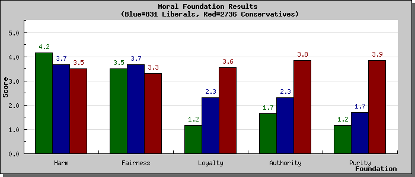
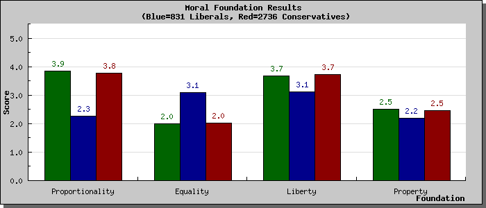

I am going to give my thoughts on Jonathan Haidt's The Righteous Mind: Why Good People Are Divided by Politics and Religion over two posts as I want to split the good from the bad (second post [here](https://www.jasoncollins.blog/haidts-group-selection/)). The first two-thirds and the conclusion of the book are excellent. However, slotted in the last third is Haidt's take on group selection. His group selection argument deserves attention, but I don't want to derail this post with a group selection critique, particularly when Haidt's broader arguments do not rest on it.

Haidt's goal is to explain why people are divided by politics and religion. He has three major explanations for this division: we are primarily guided by our intuitions (not reason); there's more to morality than harm or fairness; and morality binds and blinds.

Part 1 of the book is based on the concept that intuition comes first, strategic reasoning comes second. When presented with a new situation, we tend not to reason to our moral response. Rather, our instincts offer a moral response, and we then use our power of reasoning to justify it. Haidt asks us to picture our reasoning as a rider on an intuitive elephant. The elephant leans in response to a situation, and the rider rationalises why they are going in that direction. It takes a real effort to turn the elephant.

Much of the material through Part 1 is the fodder of popular accounts of decision-making, ranging from material on confirmation bias to [Philip Tetlock's work](https://www.jasoncollins.blog/tetlocks-expert-political-judgment-how-good-is-it-how-can-we-know/) on expert political judgment. Haidt's elephant and the rider also draws comparisons with [Daniel Kahneman's System 1 and System 2](https://www.jasoncollins.blog/kahnemans-thinking-fast-and-slow/). However, the application of this framework to moral psychology is interesting, particularly as the nature of the elephant changes between people - as Haidt highlights in Part 2.

Haidt starts Part 2 with a story about an experiment in which he exposes subjects to a novel moral dilemma and makes them justify their moral judgement. One dilemma involves a man who buys a chicken from the supermarket (already dead) and has sex with it before he cooks and eats it. As no-one is harmed, someone rationalizing the story under the scrutiny of an interviewer might ultimately decide that there was no moral transgression.

When Haidt moved beyond his usual WEIRD (Western, educated, industrialised, rich and democratic) experimental subjects to people entering a suburban McDonald's, he found that there was astonishment at the interviewer's questions as to whether the action was wrong. Why do you even need to ask? From this picture, Haidt argues that there is more to morality than fairness and harm, the staples of liberal morality (liberal in the sense the term is used in the United States - and how I will use it for the rest of this post). Instead, there are six foundations to morality - care/harm, liberty/oppression, fairness/cheating, loyalty/betrayal, authority/subversion, and sanctity/degradation.  An extra wrinkle is that fairness contains equality and proportionality elements.

Liberal morality tends to rest on the care/harm and to a lesser extent on the fairness/cheating (equality) and liberty/oppression dimensions. Conservative morality tends to rely on all six, with an emphasis on proportionality for the fairness/cheating dimension.  The libertarian moral framework rests almost entirely on the liberty/oppression dimension (with a small dose of fairness/cheating thrown in). Haidt suggests that the broader moral foundation of conservatives gives them an edge in understanding the concerns of the full political spectrum. It is not that conservatives don't care about harm. They simply weight it differently. When conservatives and liberals undertake an ideological Turing test, where they had to answer questions as though they were the other, conservatives and moderates do better than liberals. Haidt does not delve into the consequences of the narrow libertarian moral foundations in detail, but it raises the question of libertarian's ability to understand and communicate with other audiences.

The moral framework test at [YourMorals.org](http://www.yourmorals.org/) that informs much of Haidt's book suggests that I have a liberal framework, although with more weighting to proportionality than equality in the fairness/cheating dimension and a stronger tendency towards liberty (my scores are the green bars). I _lean_ libertarian, but this is more due to my beliefs about how to reduce harm than a foundation built on freedom from interference, so the assessment may make sense given my bleeding heart libertarian tendencies.

Haidt applies little substantive judgement to the merit of these moral foundations. In the conclusion, he supports moral pluralism, not relativism - but you get little of that flavour in the rest of the book. In part, Haidt's swing towards conservatism makes him disinclined to critique any of the conservative foundations. However, as a description of moral frameworks, the discussion is excellent.

In Part 3, Haidt notes the grouping instincts of humans. In times of crisis, such as after 9/11, people act less selfish and pull together as a group. This groupish behaviour can act as a barrier to understanding others and is parochial, but Haidt argues that there are ways to increase group cohesiveness in ways that are not necessarily harmful to outgroups. We should be looking for ways to trigger this cohesiveness.

To illustrate this, Haidt  dedicates a chapter to religion, the ultimate in groupish behaviour. He argues that religion is an evolved cultural trait, not a maladaptive meme, as religion binds people into groups, suppresses freeriding and supports cooperation (he even goes as far as putting religion into the group selection basket, but I will also save that issue for my [second post](https://www.jasoncollins.blog/haidts-group-selection/)).  It is not an argument that will win fans among the new atheists.

Haidt closes the book with some suggestions to answer the opening question of the book: "Can we all get along?" Haidt is slightly naive in his hope that understanding someone else's moral foundation will reduce conflict, but some of his other throw away ideas, such as having the families of legislators live in the same neighbourhoods to build civility, are interesting - although as Haidt suggests, we might be too far gone for that. If nothing else, his framework might help meet Haidt's initial goal of understanding conservative morality and allow the Democrats write some better speeches with broad appeal.

My second post on Haidt's book is [here](https://www.jasoncollins.blog/haidts-group-selection/).
