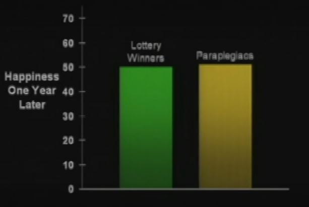

From [Dan Gilbert's 2004 TED talk](https://www.ted.com/talks/dan_gilbert_asks_why_are_we_happy), now viewed over 16 million times:

>Let's see how your experience simulators are working. Let's just run a quick diagnostic before I proceed with the rest of the talk. Here's two different futures that I invite you to contemplate. You can try to simulate them and tell me which one you think you might prefer. One of them is winning the lottery. This is about 314 million dollars. And the other is becoming paraplegic.
>
> Just give it a moment of thought. You probably don't feel like you need a moment of thought.  
>
>Interestingly, there are data on these two groups of people, data on how happy they are. And this is exactly what you expected, isn't it? But these aren't the data. I made these up!  
>  
>These are the data. You failed the pop quiz, and you're hardly five minutes into the lecture. Because the fact is that a year after losing the use of their legs, and a year after winning the lotto, lottery winners and paraplegics are equally happy with their lives.

And here's [Dan Gilbert reflecting](https://blog.ted.com/ten-years-later-dan-gilbert-on-life-after-the-surprising-science-of-happiness/) on this statement 10 years later:

>The first mistake occurred when I misstated the facts about the 1978 study by Brickman, Coates and Janoff-Bulman on lottery winners and paraplegics.
>
> At 2:54 I said, “… a year after losing the use of their legs, and a year after winning the lotto, lottery winners and paraplegics are equally happy with their lives.” In fact, the two groups were not equally happy: Although the lottery winners (M=4.00) were no happier than controls (M=3.82), both lottery winner and controls were slightly happier than paraplegics (M=2.96).
>
> So why has this study become the poster child for the concept of hedonic adaptation? First, most of us would expect lottery winners to be much happier than controls, and they weren’t. Second, most of us would expect paraplegics to be _wildly_ less happy than either controls or lottery winners, and in fact they were only _slightly_ less happy (though it is admittedly difficult to interpret numerical differences on rating scales like the ones used in this study). As the authors of the paper noted, “In general, lottery winners rated winning the lottery as a highly positive event, and paraplegics rated their accident as a highly negative event, though neither outcome was rated as extremely as might have been expected.” Almost 40 years later, I suspect that most psychologists would agree that this study produced rather weak and inconclusive findings, but that the point it made about the unanticipated power of hedonic adaptation has now been confirmed by many more powerful and methodologically superior studies. You can read the original study [here](http://psycnet.apa.org/journals/psp/36/8/917/).

It's great that he is able to step back and admit his mistakes. One thing that perplexes me, however, is that he purports to show the real data on a slide:

 

As you can see, this runs on a scale reaching up to 70, with both measured at 50. The actual measure was on a 5-point scale. Where did these numbers come from? Did Gilbert simply make these data up?

If this were just a case of misstating the point of the study, I would feel much sympathy. As he states:

>When I gave this talk in 2004, the idea that videos might someday be “posted on the internet” seemed rather remote. There was no Netflix or YouTube, and indeed, it would be two years before the first TED Talk was put online. So I thought I was speaking to a small group of people who’d come to a relatively unknown conference in Monterey, California, and had I realized that ten years later more than 8 million people would have heard what I said that day, I would have (a) rehearsed and (b) dressed better.
>
> That’s a lie. I never dress better. But I would have rehearsed. Back then, TED talks were considerably less important events and therefore a lot more improvisational, so I just grabbed some PowerPoint slides from previous lectures, rearranged them on the airplane to California, and then took the stage and winged it. I had no idea that on that day I was delivering the most important lecture of my life.

But if that chart was made up, my sympathy somewhat fades away.
