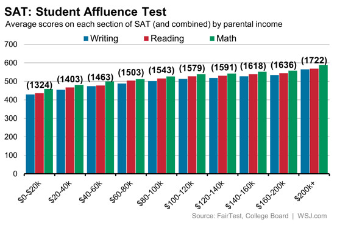

Over at WSJ Real Time Economics, [Josh Zumbrun turns the following chart into a claim](http://blogs.wsj.com/economics/2014/10/07/sat-scores-and-income-inequality-how-wealthier-kids-rank-higher/?mod=WSJBlog) that "the SAT is just another area in American life where economic inequality results in much more than just disparate incomes."

But what does the chart actually tell us? In a perfect meritocracy, the smartest students will score the highest. But as intelligence is heritable, the smarter kids will tend to have smarter and higher income patterns, giving us the pattern we see in the chart. In an alternative world where parents pay for results, we end up with the same pattern. So that charts tell us nothing. It's consistent with both worlds.

I'm not exactly Robinson Crusoe in criticising this article. See also [Arnold Kling](http://www.arnoldkling.com/blog/genes-and-academic-performance/) and [James Pethokoukis](http://www.aei-ideas.org/2014/10/something-is-missing-from-the-wall-street-journals-story-on-sat-scores-affluence-and-inequality/) - although the assortative mating Pethokoukis refers to isn't necessary to get a graph that looks like this, even though it is almost certainly playing a role.

Having picked on this article, the use of a bivariate analysis (a natural result of using a graph) while ignoring other confounding variables is a disappointingly common feature in the increasingly popular "data journalism".