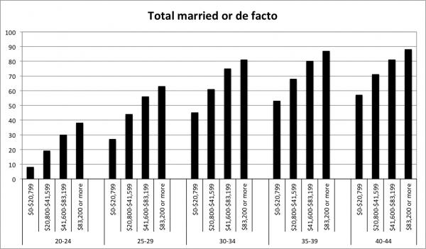

In the comments to my [post last month](/the-gender-gap/) on the Cato Unbound series [New Girl Order: Are men in decline?](http://www.cato-unbound.org/archives/august-2011-are-men-in-decline/), there was some suggestion that men were being disincentivised from working hard by the increasing income and resources of women.

Bryan Caplan [took up a similar argument](http://econlog.econlib.org/archives/2011/08/supply_demand_a.html) when he looked at what was happening through the lens of two markets - labour and mating. He concluded that:

>Income and income potential still matter.  But women now focus more on looks, machismo, coolness, and other "alpha" traits.  Holding charisma constant, working harder just doesn't attract women the way it used to.  The result: Less desirable men often give up on women altogether - further tilting the effective male/female ratio in favor of the remaining men.  And both kinds of men act like boys: The less desirable men have little to lose, and the more desirable men can get away with it.

When Caplan comes to this conclusion, he understates the strength of the effect of increasing female income on the low-status male. This is because there is an additional element of the mating and labour market relationship - labour market outcomes are a signal of quality for the mating market. Woman care not only about the resources from the man's income, but also about the signal of quality that it provides. This means that high-income men remain attractive even if the woman has considerable resources. When a woman ceases to consider the low-status male as she now has enough resources to find a higher quality mate who won't support her children, her new mate's income will act as a signal of quality in the same way that looks or charisma might.

The following chart (data from [Heard (2011)](http://onlinelibrary.wiley.com/doi/10.1111/j.1728-4457.2011.00392.x/abstract)) of Australian marriage and de-facto rates by age and income shows how strong the benefits of high income remain. The high income 20-24 year old is 4 times more likely to be married or in a de facto relationship than someone from the low-income group. Over 40 per cent of the lowest income 40-44 year old males remain unpaired. While incentives for men at the bottom of the income scales may be declining, there is still plenty of incentive to work hard for most of the male population.

