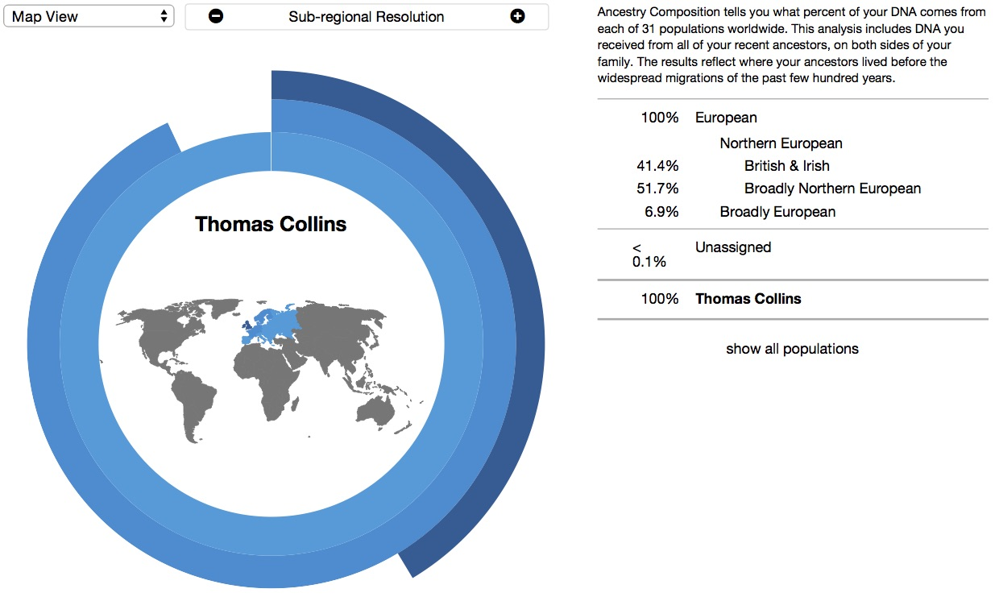
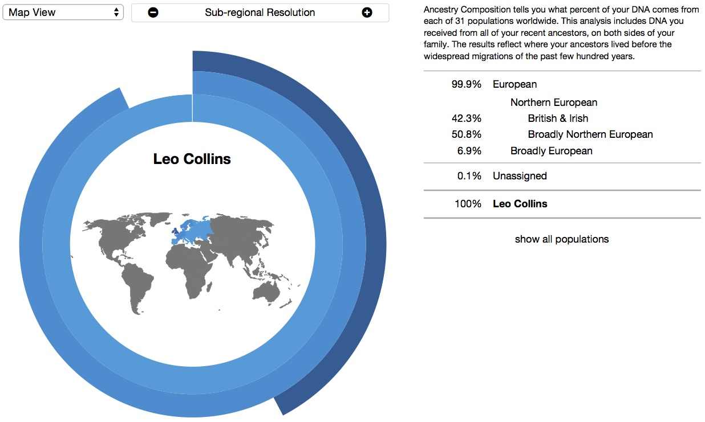

As a broad indication of the effects of measurement error in [23andme](https://www.23andme.com/), ancestry analysis for two identical twins is below. It suggests the decimal point isn't yet justified. (Their Neanderthal ancestry estimates are also off by 0.1% from each other.)

