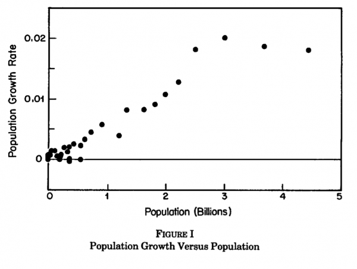

More people means more ideas. This concept underlies arguments ranging from [Julian Simon’s belief](https://www.jasoncollins.blog/would-julian-simon-worry/) that human living conditions will continue to improve through to Bryan Caplan’s argument that [we should have more kids](https://www.jasoncollins.blog/caplans-selfish-reasons-to-have-more-kids/). While I don't always take this concept to the extent of Simon or Caplan (as I have [posted on before](https://www.jasoncollins.blog/libertarians-and-fertility/)), the concept must be right at some level. One person will have more ideas than zero people. One hundred people will have more than one person. You can argue about diminishing returns and so on, but the basic concept must hold.

For me, some of the more interesting evidence is over the long-run, which Michael Kremer discusses in a paper titled [Population Growth and Technological Change: One Million B.C. to 1990](http://www.jstor.org/stable/2118405). Kremer bases his argument on the Malthusian concept that population is a measure of technology. In a Malthusian state, the environment and level of technology constrain population. As technology grows, a given area can support a higher population, so technological progress is directly linked to population growth.

Kremer showed that population growth has accelerated over the last million years (although this has slowed the last hundred or so), with population growth faster than exponential growth. This is consistent with the idea that as the population grew, people generated ideas faster and faster, further accelerating the technological growth rate, and hence population growth. The following diagram shows Kremer’s point, with the population growth rate increasing with population size until recent times.

Kremer created a number of models to show this point. In one model, he included the concept that research productivity increases with income, which might explain why some large populous countries (China and India) have lower levels of technological development (for the moment). Kremer showed that even though this creates some ambiguity about the relationship between population and technological growth, the concept that larger populations have higher levels of technological progress held.

Another concept addressed by Kremer is that productivity might depend on the size of the population. This encompasses positive network effects whereby more people allows more specialisation and service of a larger market, and negative effects such as "stepping on toes" whereby researchers duplicate each others' efforts. Including these effects in his model did not change the basic finding that technological progress increases roughly in proportion with population.

Kremer tested the model predictions with some basic regressions against long-term population data. Not surprisingly, they all showed a strong correlation between population size and population growth.

The paper gets more interesting with some of Kremer's analysis of inter-regional differences. Taking five successively smaller populations: the old world, the Americas, Australia, Tasmania and Flinders Island. For each of these areas, population density increases with land area, suggesting that higher population are able to sustain a higher level of technology. Kremer writes:

>As the model predicts, in 1500, just after Columbus' voyage reestablished technological contact, the region with the greatest land area, the Old World, had the highest technological level. The Americas followed, with the agriculture, cities, and elaborate calendars of the Aztec and Mayan civilizations. Mainland Australia was third, with a population of hunters and gatherers. Tasmania, an island slightly smaller than Ireland, lacked even such mainland Australian technologies as the boomerang, fire-making, the spear-thrower, polished stone tools, stone tools with handles, and bone tools, such as needles [Diamond, 1993]. Flinders Island, near Tasmania, has only about 680 square kilometers of land, and according to radiocarbon evidence, its last inhabitants died out about 4000 years after they were cut off by the rising seas-suggesting possible technological regress.

In some ways, the general message of Kremer's paper appears obvious. However, it is one of those papers where the feedback relationship between population and technology makes it difficult to confirm the direction of causation (even though I agree with the general concept). Regardless of the source of technological progress, the Malthusian model predicts that population will increase to match it. Higher population levels will always have a higher level of technology, regardless of the source of innovation.

The element in the data which lends strength to Kremer's argument is that technological progress accelerates when there is a larger population. However, the length of time over which Kremer makes his observations raises an important question. Human ancestors only achieved our modern brain size in the last 100,000 or so years (peaking 30,000 years ago). There is evidence of a cultural leap forward around 50,000 years ago. The source of ideas is a very different creature at each end of Kremer's time series. How much of the acceleration is generated by greater population, and how much by a more productive population?
