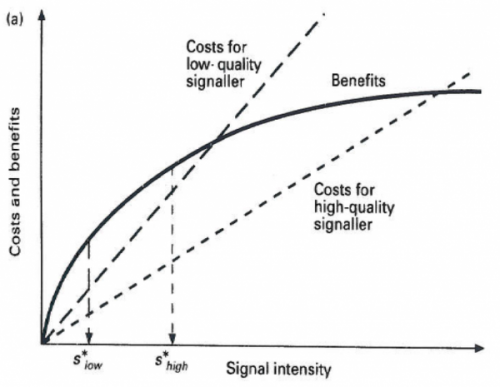

Following [my post last week](https://www.jasoncollins.blog/we-need-more-complicated-mathematical-models-in-economics/) on the need for more complicated models in economics, a [new paper in PLOS Biology](http://www.plosbiology.org/article/info%3Adoi%2F10.1371%2Fjournal.pbio.1002017) argues for the importance of mathematical models in showing 'proof of concept' (HT: [Santa Fe Institute News](http://www.santafe.edu/news/item/PLoSbio-stern-utility-mathematical-models-evolutionary-biology/)). The authors write:

>Proof-of-concept models, used in many fields, test the validity of verbal chains of logic by laying out the specific assumptions mathematically. The results that follow from these assumptions emerge through the principles of mathematics, which reduces the possibility of logical errors at this step of the process. The appropriateness of the assumptions is critical, but once they are established, the mathematical analysis provides a precise mapping to their consequences.

They point to lack of trust many people have in mathematical models, but argue that once the theoretician fulfils their duty of making the robustness of the assumptions transparent, readers should take the results seriously.

>Much of the doubt about the applicability of models may stem from a mistrust of the effects of logistical assumptions. It is the responsibility of the theoretician to make his or her knowledge of the robustness of these assumptions transparent to the reader; it may not always be obvious which assumptions are critical versus logistical, and whether the effects of the latter are known. It is likewise the responsibility of the empirically-minded reader to approach models with the same open mind that he or she would an experiment in an artificial setting, rather than immediately dismiss them because of the presence of logistical assumptions.

Several examples are provided in the paper, but my favourite example of models as 'proof of concept' relates to the handicap principle. I have [posted about this model before](https://www.jasoncollins.blog/economists-1-biologists-0/) (that time in the context of economists solving the problem 17 years before the biologists figured it out), so I will use some of my previous words.

>[In 1975], Amotz Zahavi had a paper published titled [Mate selection - a selection for a handicap](http://doi.org/10.1016/0022-5193(75)90111-3). This paper spelt out Zahavi's handicap principle, which described how honest signals of quality between animals could evolve. The signals are honest because they impose a handicap on the signaller that only a high quality signaller can bear.
>
>The handicap principle was not accepted at first. Richard Dawkins wrote in an early edition of *The Selfish Gene*:
> 
>>I do not believe this theory, although I am not quite so confident in my scepticism as I was when I first heard it. I pointed out then that the logical conclusion to it should be the evolution of males with only one leg and only one eye. Zahavi, who comes from Israel, instantly retorted: 'Some of our best generals have only one eye!' Nevertheless, the problem remains that the handicap theory seems to contain a basic contradiction. If the handicap is a genuine one-and it is of the essence of the theory that it has to be a genuine one-then the handicap itself will penalize the offspring just as surely as it may attract females. It is, in any case, important that the handicap must not be passed on to daughters.
> 
>John Maynard Smith published papers (such as [this](https://doi.org/10.1016/S0022-5193(76)80016-1)) suggesting that no model could be found in which the handicap principle could hold (although he did not rule out someone else finding one).
>
>Finally, in 1990, [Alan Grafen published two papers](https://www.jasoncollins.blog/conspicuous-consumption-as-a-handicap/) in which he established the population genetic and game theoretic foundations to the handicap principle. Mathematically, it could work. It convinced people such as Dawkins that the handicap principle could be right. ... While Grafen's papers are quite technical, the following diagram [by Rufus Johnstone](http://books.google.com.au/books?hl=en&lr=&id=Sc7qvOBluVwC&oi=fnd&pg=PA155&dq=rufus+johnstone+the+evolution+of+animal+signals&ots=ZFayblqxsZ&sig=zJyUI74SU1LdZ0b2RXCQLSqvv_M#v=onepage&q=rufus%20johnstone%20the%20evolution%20of%20animal%20signals&f=false) provides a simple illustration of how it works - and how similar it is to the work of Michael Spence. If two different quality individuals face differential costs and the same benefits (or differential benefits and the same costs), they will signal at different levels, making their signal a reliable indicator of their quality. The high-quality individual maximises costs relative to benefits at s*$_{high}$, while the low-quality individual maximises their benefits relative to costs at slow.
>
>

I like this example for two reasons. First, a mathematical model effectively settled a dispute in biology. Most biologists now agree the evolution of handicaps as signals is plausible - it is now a question of how prevalent. But second, once the complicated model was developed, a quick intuitive mathematical explanation that is relatively easy to convert back into English followed.
