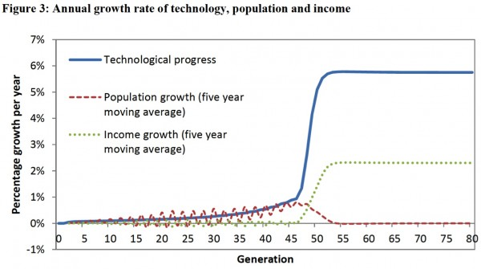
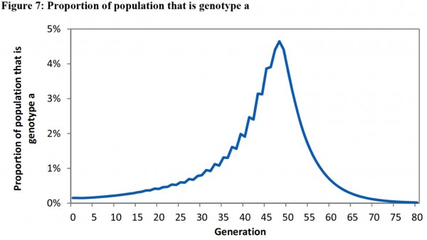

[_Natural Selection and the Origin of Economic Growth_](http://qje.oxfordjournals.org/content/117/4/1133.short) by Oded Galor and Omer Moav is somewhat of an outlier. I'm not aware of any other paper that models the Industrial Revolution as a result of natural selection, apart from a similar paper [by Galor and Michalopoulos](http://www.sciencedirect.com/science/article/pii/S0022053111000573). [Zak and Park wrote a paper](https://www.jasoncollins.blog/population-genetics-and-economic-growth/) that examines population genetics and economic growth but they do not directly tackle the Industrial Revolution. In [A Farewell to Alms](http://www.econ.ucdavis.edu/faculty/gclark/a_farewell_to_alms.html), Greg Clark notes that Galor and Moav's paper reignited his interest in this topic, but Clark does not model his hypothesis.

Galor and Moav's paper is based on a model that has two types of people in the population. Each of these types has a genetically inherited preference for quality or quantity of children. The quality-preferring genotype wants their children to have higher human capital, so they invest more in their education, while the quantity-preferring genotype is more interested in raw numbers.

During the long Malthusian era in which both genotypes struggle to earn enough to subsist (i.e. during the thousands of years leading up the Industrial Revolution), the quality-preferring genotypes have a fitness advantage. As the quality-preferring genotypes are of higher quality, they earn higher wages. These higher wages are more than enough to cover education expenses, so they are also able to have more children than the quantity-preferring genotypes.

This fitness advantage leads the quality-preferring genotypes to increase in prevalence. As this occurs, technological progress increases, as the average level of education in the population drives technological progress. This in turn increases the incentive to invest in education, creating a feedback loop between technology and education.

As this goes on, the population grows. Per capita income does not increase as any technological progress is balanced out by population growth, which is the central problem of the Malthusian world.

Eventually, the rate of technological progress gets high enough to induce the quantity-preferring genotypes to invest in education. When this happens, the average level of education jumps, boosting technological progress and causing the Industrial Revolution.

During this process, the population growth rate changes. Up to the time of the Industrial Revolution, population growth increases with technological progress. However, when the level of technology leaps with the Industrial Revolution, the level of education becomes so high that population growth drops dramatically. Everyone is investing more into education than raw numbers of children.

From an evolutionary perspective, the Industrial Revolution also changes the selection pressure in the model. After the Industrial Revolution, the quality-preferring genotypes invest so much into education that they have lower fertility than the quantity-preferring genotypes. They then reduce in prevalence, their fitness advantage erased.

Galor and Moav paper work through the dynamics of the model using phase diagrams. It is not particularly easy or intuitive to see the processes working together in their paper, so my two PhD supervisors and I have just put out [a discussion paper](http://papers.ssrn.com/sol3/papers.cfm?abstract_id=1851251) that describes simulations of the model - and shows the dynamics in a form that is easier to visually comprehend. In the chart below, you can see the dramatic jump in technological progress around generation 45 of the simulation, with per capita income growth also jumping at that time. Meanwhile, population growth drops to zero.

This second chart shows the change population composition. The quality-preferring genotype (genotype a) steadily increases in prevalence through to the Industrial Revolution, peaking at just under 5 per cent of the population. Afterwards, it is selected against.

This change in selection pressure has an interesting implication. While natural selection is the trigger of the Industrial Revolution, the population composition before and after the transition is the same. There is no difference in population composition between developed and undeveloped countries. The only time there is a difference in population composition is during the transition, when the quality-preferring genotypes peak.

In some ways, the natural selection occurring in Galor and Moav's model is a sideshow to the main event, the quality-quantity trade-off. In a similar model by [Galor and Weil](http://www.jstor.org/stable/117309), a scale effect triggered the Industrial Revolution - that is, the concept that more people leads to more ideas, so technological progress increases with population growth. I am sure that other triggers could be substituted.

That highlights the point where I am not convinced that the model is true (to the extent that a model can be). As far as human evolution relates to economic growth, I expect that inherent quality is more important (and by quality, I mean economically useful qualities) than the quality-quantity trade-off. The Industrial Revolution was possible because higher quality people were selected for in the lead-up (and the lead up encompasses thousands of years).

If quality is inherent, a high-quality person should have as many children as possible and this would have little effect on quality. For a man of low resources, his larger problem is convincing a woman to mate with him and not deciding on the right quantity-quantity mix.

The other thing that I should note is that, like most economic models, Galor and Moav's model includes consumption with no clear evolutionary rationale (an issue I have discussed in [an earlier post](https://www.jasoncollins.blog/consumption-and-fitness/)). Why do people in the model consume more than subsistence? If some people chose to focus all excess consumption into raising children they would come to dominate the population. This might be justified as being something to which the population has not yet adapted, but that explanation does not satisfy me.

Having made these quibbles, the model is still an impressive feat. It would not have been an easy task to create a model with technological progress, population and per capita income all following a path that resembles the last few thousand years of economic growth. There are some further issues and extensions to the model that we explore in [the discussion paper](http://papers.ssrn.com/sol3/papers.cfm?abstract_id=1851251) I referred to above, but I'll talk about them in [my next post](https://www.jasoncollins.blog/natural-selection-and-the-collapse-of-economic-growth/).
