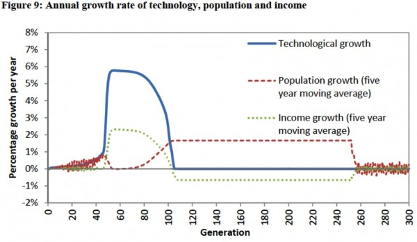
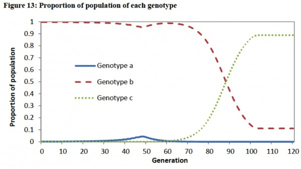

In [my last post](https://www.jasoncollins.blog/natural-selection-and-economic-growth/), I discussed Oded Galor and Omer Moav's paper [Natural Selection and the Origin of Economic Growth](http://qje.oxfordjournals.org/content/117/4/1133.short). As I noted then, my PhD supervisors, Juerg Weber and Boris Baer, and I have written [a discussion paper](http://papers.ssrn.com/sol3/papers.cfm?abstract_id=1851251) that describes a simulation of the model.

In the discussion paper we discuss an extension of the model in which we consider the entry of people into the population that have a low preference for child quality - i.e. they weight child quantity more highly. Entry could be through migration or mutation. We show that if people with a low enough preference for quality enter the population, their higher fitness in the modern growth state can drive the economy back into Malthusian conditions.

To show this, we simulated a version of the model which had present at a low level in the initial population a genotype with a very low preference for educating their children (I refer to them as the strongly quantity-preferring genotype). This strongly quantity-preferring genotype has a similar fitness to other genotypes that do not educate in the Malthusian state, and declines in prevalence while the quality-preferring genotype increases.

Once the economy takes off into the modern growth state, the strongly quantity-preferring genotype has the highest fitness as it dedicates the lowest proportion of its resources to educating its children. The strongly quantity-preferring genotype increases in prevalence until, eventually, the average level of education plummets, undermining technological progress. The world returns to a Malthusian state, with high population growth eroding the income benefits of all earlier technological progress.

The following chart shows the rate of growth of population, technological progress and income per person. The first 70 to 80 generations look like the base model simulation I described in [my earlier post](https://www.jasoncollins.blog/natural-selection-and-economic-growth/). However, after that point, technological progress plummets to zero. For the next 150 or so generations, population growth is positive, which can occur as per person income is above subsistence. Eventually, population growth drives income down to subsistence levels.

In the next figure, you can see that the strongly quantity-preferring genotype, genotype _c_, grows from being a negligible part of the population to being over 90 per cent . It is this change in population composition that drives the return to Malthusian conditions (you can also see the small peak in quality-preferring types around generation 48 that kicks off the Industrial Revolution). The strongly quantity-preferring genotypes educate their children far less than the other genotypes, depressing technological progress.

There is no escape from the returned Malthusian conditions. The quality-preferring genotype will have a fitness advantage in this new Malthusian state and will increase in prevalence. Whereas that caused a take-off in economic growth the first time, this time there is no take-off. The strongly quantity-preferring types, which now dominate the population, cannot be induced to educate their children. They simply breed faster to take advantage of any technological progress spurred by the small part of the population that is educating their children.

This result could also be achieved by introducing the strongly quantity-preferring genotype into the simulation at other points in time. If it occurs after the Industrial Revolution, the timing of the return to Malthusian conditions will occur later. However, short of restricting the range of potential quality-quantity preferences, there is no way to avoid the return to Malthusian conditions in this version of model. The strongly quantity-preferring genotypes will always have a fitness advantage when income is above subsistence and their population growth will drive income back down to subsistence levels.

There are, of course, a few possible interpretations of this result. The model or assumptions may be missing an important element (or at the extreme are wrong). Humans may only have quality-quantity preferences in the growth promoting range. Or possibly, modern levels of economic growth are only transient.
