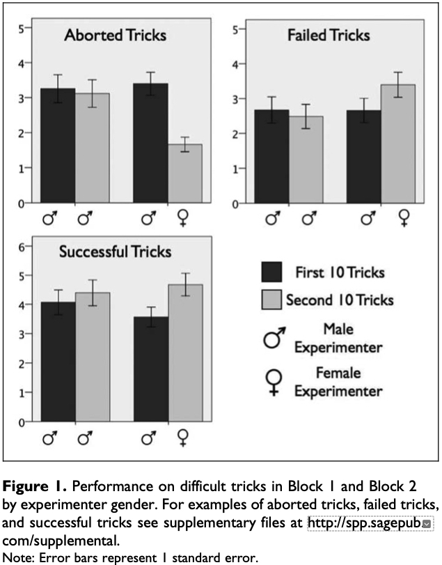
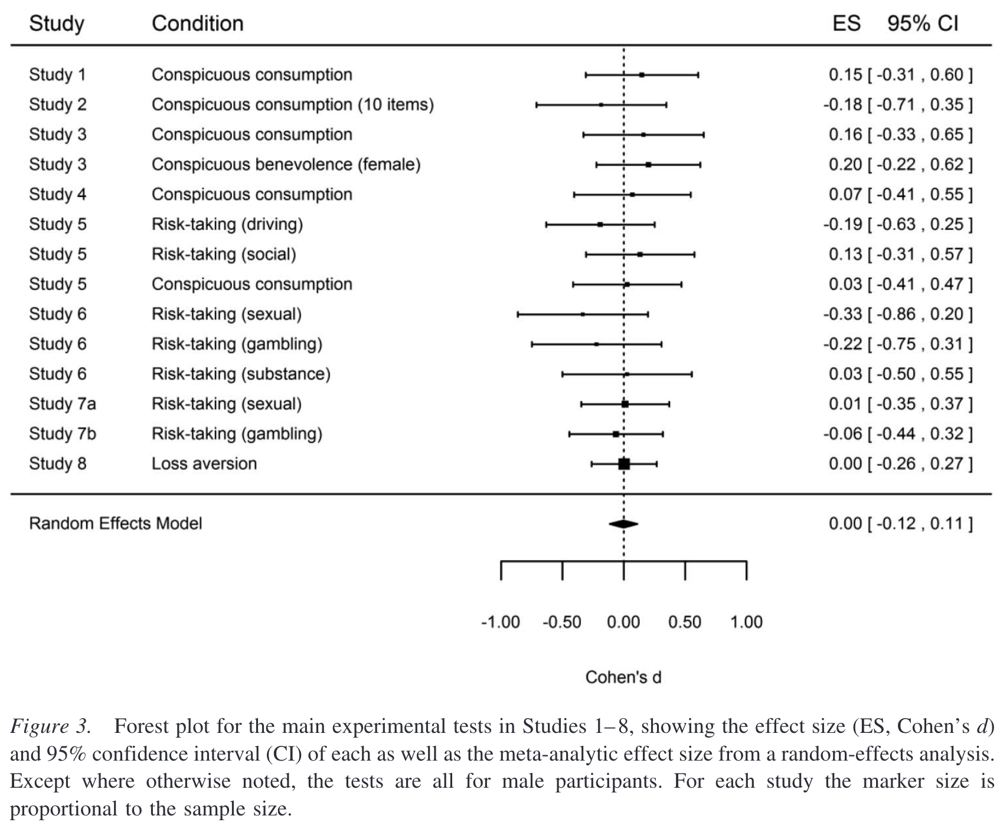
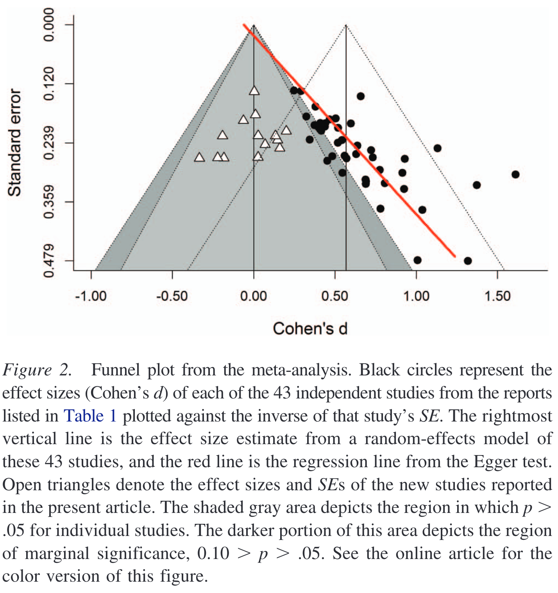
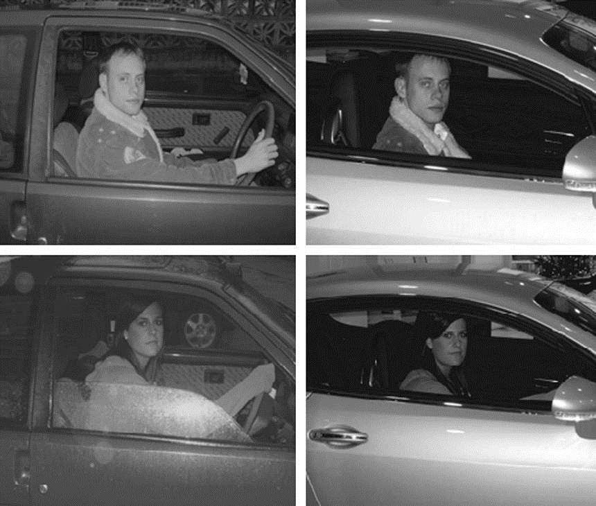

In 2015 I gave a presentation titled "Please Not Another Bias! An Evolutionary Take on Behavioural Economics" at the Marketing and Science Ideas Exchange (MSIX) conference. I posted my presentation [on this blog](/please-not-another-bias-an-evolutionary-take-on-behavioural-economics/), where it had around 100,000 readers in the first month (a lot for this blog). [A copy of the post](https://evonomics.com/please-not-another-bias-the-problem-with-behavioral-economics/) was the most popular post on Evonomics in its first year.

I still see the post shared, which brings a slight cringe, as its not the article I would write today. I stand by the general argument, but there are several points that I would like to change.

First, I wrote it for a marketing audience. It would be nice if it were more general.

Second, I believe the case for better theory in place of lists of biases has only grown, so I would like to make that case more explicitly.

Third, while I still believe evolutionary biology should be part of the development of better theories of human decision making - and any theory must be consistent with evolutionary theory - I'm also of the belief that a more eclectic selection of disciplines could contribute hypotheses.

Fourth, and the reason for this post, is that much of the experimental evidence I quoted should be considered shaky at best. When I developed the presentation the replication crisis was just warming up. There had been some high-profile failed replications, but the Open Science Collaboration's first article [Estimating the reproducibility of psychological science](https://doi.org/10.1126/science.aac4716) was still a month away. I was certainly naive about the foundations I was building on.

For the remainder of this post I walk through some of my claims and the experimental evidence to support them (not strictly in the order I discussed them then). Which would I trust today? In summary, while I still believe many of the underlying hypotheses, I don't trust any of the experimental results sufficiently to reference them in a re-write today.

I opened with a broad claim:

> So, let's do a quick quiz. Tell me two things about the driver of this Ferrari (I have stolen this example from University of New South Wales evolutionary biologist [Rob Brooks](http://www.robbrooks.net/)).
>
> 
>
> First, the driver was male.
>
> Second, the driver is likely young (in this case, 25).

I"ll back this being a robust phenomena, but we don't exactly need a body of science to make that prediction.

I then supported that point with some storytelling about the different motivations of men and women:

> So why is this the case?
>
> Females -- and in biology, this is in part how females are defined -- produce a large immobile egg. Males produce a smaller gamete -- sperm. The egg is the scarce resource. Women are born with a million or so eggs, but they release only one or so a month. Men produce 1,500 sperm a second. Each man in this room will produce enough sperm during this talk to fertilise every egg the women in this room will ever produce.
>
> Then there is what happens when a sperm and an egg are joined. The woman spends nine months carrying the baby -- and is unable to reproduce during that time. She then provides the majority of infant care. Men are less constrained by any such barriers.
>
> ...
>
> Then, for a few men, the rewards are vast.
>
> As one example, [approximately 16 million men in central Asia carry the same Y chromosome](https://doi.org/10.1086/367774) -- the Y chromosome is passed from down the male lineage from father to son. This chromosome originated in Mongolia around 1000 AD with around 8 per cent of the men in the region carrying it (0.5% of the world's male population) -- they all trace their male lineage back to the same man.
>
> One possibility is that this chromosome was so successful as it was carried by Genghis Khan and his close relatives. ...
>
> No woman could ever have that level of success -- but for men, the evolutionary rewards to success can be vast.
>
> This brings us back to our Ferrari driver. As a male, the risk-reward calculation in evolutionary terms is quite different from women. Men face a higher probability of evolutionary oblivion, and small chance of an evolutionary extravaganza. It makes sense to take risks that may lead to inordinate evolutionary success -- or at least to avoid evolutionary oblivion.

There's nothing I would say is incorrect here, and it leads to a question of whether we need to build sex more explicitly into models of human behaviour. (Probably not the zeitgeist right now.) But when I then try to add some science$^{\text{TM}}$ to my case, things become shaky.

Here's the first study I would no longer reference (which also happened to be the subject of [my first post on this blog](/its-a-risky-business-attracting-a-mate/) over a decade ago):

> One of my favourite examples of this comes from [research by Richard Ronay and Bill von Hippel](https://doi.org/10.1177/1948550609352807). They got some young male skateboarders to perform tricks, including a difficult trick that they could complete only half the time. Halfway through filming, a woman rated as highly attractive (corroborated by "many informal comments and phone number requests from the skateboarders") walked onto the scene. Once she appeared, they took more risks and were less likely to bail a trick half-way through, instead riding all the way through to the crash landing ([a story on ABC's Catalyst demonstrates this effect](http://www.abc.net.au/catalyst/stories/2967720.htm)).

In this experiment there was a small sample of 96 male skateboarders, giving groups of 43 and 53 skateboarders performing ten tricks for the male and female experimenter respectively. There were also have large effect sizes. I wouldn't claim these effects sizes are impossible using the "[effect is too large heuristic](/the-effect-is-too-large-heuristic/)", but they certainly don't make me feel comfortable. The figure below gives a sense of the change in behaviour.

To understand one point that makes this study particularly interesting, let me turn to Ulrich Schimmack's work to develop a [replicability index](https://replicationindex.com). By comparing the observed power of a set of studies and the rate at which reported results are significant, Schimmack estimates the rate at which studies will replicate in the form of the [R-Index](https://replicationindex.com/2016/01/31/a-revised-introduction-to-the-r-index/). Schimmack uses the R-Index to compare the replicability of journals, authors and departments.

The ranking of authors is of relevance here. Bill von Hippel, the second author in this skateboarding paper, was one of those ranked. I'll use [von Hippel's words from a conversation with Schimmack](https://replicationindex.com/2021/05/07/bill-von-hippel-and-ulrich-schimmack-discuss-bills-replicability-index/):

> But your work was made much more personally relevant on January 19, when you wrote a blog on "Personalized p-values for social/personality psychologists."
>
> Initially, I was curious if I would be on the list, hoping you had taken the time to evaluate my work so that I could see how I was doing. Your list was ordered from the highest replicability to lowest, so when I hadn't seen my name by the half-way point, my curiosity changed to trepidation. Alas, there I was -- sitting very near the bottom of your list with one of the lowest replicability indices of all the social psychologist's you evaluated.

On the [ranking table as at 5 July 2022](https://replicationindex.com/2021/01/19/personalized-p-values/), von Hippel is ranked 416 out of 426.

Among the numbers Schimmack generated was the significance threshold we would have to use if we wanted to reduce the false discovery rate for an author's work below 0.05. (That is the rate at which significant results are false.) For von Hippel, that number is 0.001. He also calculated the expected discovery rate based on the power of the studies (for von Hippel, 12%), which can be compared against the observed discovery rate (for von Hippel, 65%). (I think these precise numbers should be taken with a grain of salt - there are a lot of implicit assumptions in their calculation - but the gross difference is indicative of a problem.) An observed discovery rate materially higher than the expected discovery rate is a sign of publication bias or something going askew in the lab.

In this light, I feel I have to place a heavy discount on the skateboarding paper. There's nothing special about it that should lead us to give it more credence than the broader body of von Hippel's work. 

Before going to the next study, I should note that the reason I am highlighting von Hippel is because he took the criticism seriously and sought to understand what he could do better. That conversation with Shimmack excerpted above was part of the process. He then ran a replication of one of the studies he was more confident in as a test of Schimmack's arguments, and lo and behold, [it failed to replicate](https://replicationindex.com/2021/06/20/bill-von-hippel-r-index-part2/). Good on von Hippel for taking this on.

Back to my talk, unfortunately it only gets worse from here. If I had to bet which experiment would have the best (albeit limited) chance of replicating, it would be Ronay and von Hippel's.

One of those less reliable studies is a classic. In some ways it kick-started the body of research that I'm about to pull apart.

> In [an experiment by Margo Wilson and Martin Daly](https://doi.org/10.1098/rsbl.2003.0134) -- two of the pioneers of evolutionary psychology, and I recommend you read their book Homicide if you haven't -- they exposed men and women to either pictures of attractive faces or pictures of cars before undergoing tests of their degree of present bias.
>
> The men who had seen the attractive faces became more severe discounters than those who had seen the cars. They became focused on the present -- the mating opportunity.  The women did not become increasingly severe discounters in this experiment -- although there may be a smaller effect that the experiment did not have the power to detect.
>
> So here, what might be called a very strong present bias has a degree of rationality to it in that the objective of the participants is mating. Obviously, they didn't have a chance to mate with these pictures -- so there we have the issue of mismatch -- but you can see the evolutionary foundation of their decision. If they did manage to capitalise on that moment and manage to mate, their evolutionary future is set.

There might be something to the hypothesis underlying this experiment but if you wanted a study to have all the hallmarks of one that won't replicate, this is it. The men who rated "hot" women had a significant increase in discount rate. But, there were only 21 of them. This study simply comes from an era where sample sizes were so small that the experiments couldn't be expected to find a realistic effect size even if they existed. Then throw into the mix the fact that this is effectively a priming study - and we've all seen how that's fared the last decade - and absent a large replication I think we can redeuce the weight of this experiment to zero.

Before moving onto the body of research that Wilson and Daly inspired, I do want to note that priming lies at the heart of the problem with many of these evolutionary studies. I suspect many of the hypothesised effects exist in the wild. People behave differently around highly attractive potential partners. But to do a nice, cheap, easy lab experiment you need to use a weak prime to generate the phenomena, and that weak prime is the weak link in the chain. (This is why I have less slightly less scepticism about the skateboarding example - the experimental subjects weren't just reading about an attractive lab assistant.)

Daly and Wilson's experiment seems highly unlikely to replicate. The next one didn't. I wrote:

> [Take a group of men](https://doi.org/10.1037/0022-3514.93.1.85) and show them pictures of attractive women and then ask them what they will do with their money. The mating prime makes men more likely to engage in conspicuous consumption or conspicuous charitable donation, but has no effect on inconspicuous consumption.
>
> Women can also be affected by mating primes, although in that particular experiment their change in behaviour in response to pictures of attractive men was an desired increase in volunteering in a public way (but no increase in private benevolence).
>
> The difference reflects the different traits each are communicating -- men are communicating resources and the traits required to accumulate them, women their conscientiousness.

[David Shanks and friends](https://doi.org/10.1037/xge0000116) ran eight replication experiments, the first five of which were all twists on the experiments reported by Griskevicius and friends that formed the basis of the above excerpt. The result? As you can see in this figure, there's nothing there.

Even more striking is Shanks and friends' funnel plot of results published on this topic. The black dots represent published results. The white triangles represent the results of the replication experiments.

It looks like we have a hideous case of publication bias.

That said, a [subset of the authors whose studies were replicated responded](https://doi.org/10.1037/xge0000527), claiming that that an alternative approach to the meta-analysis suggested there was no evidence of p-hacking, and that the replications had numerous issues. [Shanks and Vadillo responded in turn](https://doi.org/10.1037/xge0000597). I won't tackle the back-and-forth in detail here, but will say that I believe the conclusion that romantic priming is on shaky grounds holds. Much of the critique of the replications is the often-seen handwaving that the replication methods were not close enough to the originals. But that's a sign of a flaky phenomena at best, and more likely a sign that the effect doesn't exist. The critique of the meta-analysis only serves to highlight the gross lack of statistical power across the literature.

There's also another body of evidence relevant here. Following the replications and meta-analysis by Shanks and friends, Ulrich Schimmack [put a larger set of romantic priming papers through the R-index wringer](https://replicationindex.com/2016/05/21/replicability-report-no-2-do-mating-primes-have-a-replicable-effects-on-behavior/). Perhaps most damming, a histogram of results showed evidence of severe selection bias and, Schimmack argued, evidence of questionable research practices. The papers also scored low on his R-Index, suggesting a low probability of replication across the whole literature.

Now onto the next paper referenced in my talk:

> ... [show one group of people](https://doi.org/10.1509/jmkr.46.3.384) the movie The Shining, the other half a romantic movie starring Ethan Hawke. Then manipulate the ads they see during the movies to either accentuate the uniqueness of the product, or its popularity.
>
> Those watching The Shining are more likely to prefer popular products -- safety in numbers as their danger avoidance personality is triggered. For those watching the romantic movie, they wanted unique products so that they would stand out from the crowd. Their mating motives have been triggered. You effectively get a change in preferences based on which movie they are watching and which self is answering the questions about the products. The effectiveness of social proof varied with context.

Given everything I've said about similar studies above, I can't give this one much weight. There's actually two subtle effects that need to work here. First there is a fear/romantic response sought to be generated by the movie (or in a second experiment, a story). The "popular" or "unique" products were then actually the same thing, but advertised slightly differently. For example, in experiment 1a the popular product was a museum with a tagline of "Visited by over a Million People Each Year" whereas the unique product was the same museum with the tagline "Stand Out from the Crowd". So the experiment is relying on both the initial prime and then a response to these subtle changes in messaging for effectively the same product. Not likely.

And now for the final study:

> [I]n [one study](https://doi.org/10.1348/000712609X417319) men and women were shown pictures of members of the opposite sex in either a red Ford Fiesta or a silver Bentley. Unfortunately the photos in the paper are provided in black and white -- as shown in this slide -- but these indicate the types of images the experimental subjects were shown.
>
> > 
>
> The result -- the expensive car made the male more attractive to the females, whereas there was no effect on male perception of the female drivers. The increase in male's attractiveness was equivalent to around 1 point on a scale of 1 to 10.

I'd give this result a decent chance of replicating, maybe 60%. The proposed mechanism is fairly direct, albeit involving a photo in a lab. There are other similar results. But, I'm not comfortable giving it much weight absent a pre-registered replication.

Summarising the above, I didn't reference a single experiment in that speech that I would include today. Not a great result.
