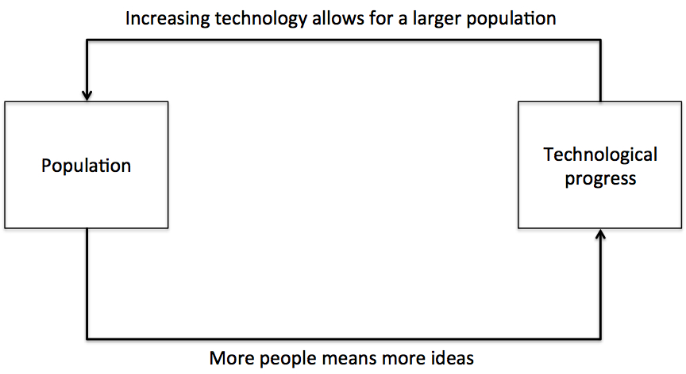
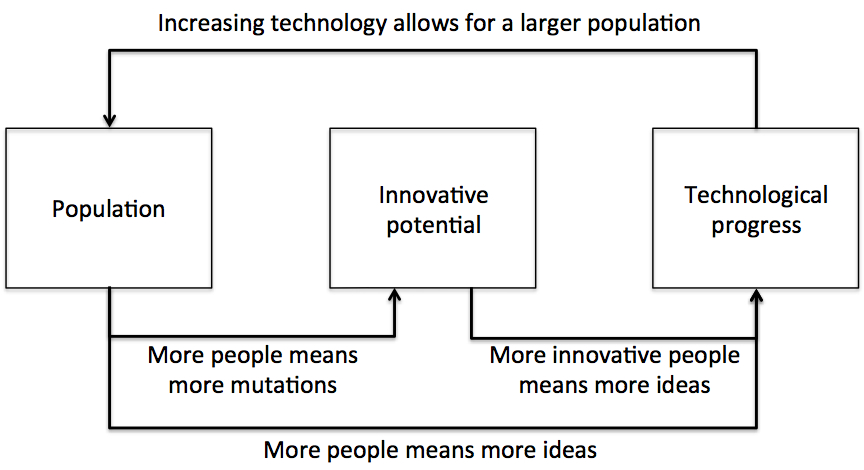

In his seminal paper [Population Growth and Technological Change: One Million B.C. to 1990](/more-people-more-ideas-in-the-long-run/), Michael Kremer combined two basic concepts to explain the greater than exponential population growth in human populations over the last million years.

The first concept is that more people means more ideas. A larger population will generate more ideas to feed technological progress.

The second concept is that, in a Malthusian world, population is constrained by income, with income a function of technology. Population can only increase if there is technological progress, with any increase in income generated by technological progress rapidly consumed by population growth.

When you combine these two concepts, a larger population generates more ideas, which in turn eases the constraint on additional population growth, which further accelerates the production of ideas. The result is population growth being in proportion to the population size. The following diagram illustrates the feedback loop.

When I first read Kremer's paper, the title caught my attention, particularly the reference to One Million B.C. Humans have evolved markedly in the last one million years. One million years ago, _Homo sapiens_ did not exist as a distinct species, with _Homo erectus_ found in Africa, Europe and Asia. Since then, cranial capacity (a proxy for brain size) has increased from around 900 cubic centimeters to 1,350 cubic centimeters. And not only have humans evolved, but [adaptive human evolution appears to be accelerating](/accelerating-adaptive-evolution-in-humans/). As [more people means more mutations](/more-people-means-more-ideas-and-mutations/), natural selection has greater material on which it can act.

It was this consideration that forms the basis of my latest working paper, [Population, Technological Progress and the Evolution of Innovative Potential](http://ssrn.com/abstract=2284456), co-authored with my supervisors Juerg Weber and Boris Baer.

In the spirit of Kremer's original paper, we develop a model of population growth and technological progress, but add an extra element, which we call "innovative potential". Innovative potential is any trait that results in the production of ideas that advance the technological frontier. Innovative potential might incorporate IQ, willingness to invest in innovation, participation in productive activities in which innovation may occur, risk preference, time preference and so on. At this stage, we do not specify the precise trait, but it is not hard to see what the likely traits are.

As more people means more mutations, mutations that increase the innovative potential of the population will occur with greater frequency in a larger population. As the population grows, so too does the rate of evolution of innovative potential.

Incorporating the evolution of innovative potential into the model creates a second element to the feedback loop, as is shown below. Population growth is now proportional to both the size and innovative potential of the population.

One of the more interesting results of the model can be seen when we partition the drivers of the acceleration of population growth between increasing population size and the increasing innovative potential of the population. As the population evolves, the relative contribution of continuing growth in innovative potential to the acceleration of population growth declines. Continuing population growth becomes the main driver of technological progress and further population growth. However, this does not mean that innovative potential is not important, as the _level_ of innovative potential continues to have a material effect. Populations with higher innovative potential will have much faster population growth.

The reason this change occurs is that population growth is driven by both increasing population size and the increasing innovative potential of the population, whereas innovative potential only increases with population size. As the innovative potential reaches a higher level, each new person is more innovative and generates more ideas, but they will only generate the same number of mutations as they always have.

One issue with introducing innovative potential into a model of this kind is that ideas are non-excludable. Suppose I invent some new technology that increases my ability to procure resources. If someone else sees and copies this idea, I wont have an evolutionary edge. In the first version of the model presented in the paper, we handwave around this issue, and suggest that innovative people may have higher fitness due to prestige, the ability to keep secrets or some other avenue of reaping the benefits of the innovation. Although this handwaving likely has an element of truth, we introduced a version of the model in which those who are more innovative are also more productive in using those ideas. The results are robust to inclusion of this element.

One other observation from the model is the robustness of the population to technological shocks. Through human history, population did not undergo a simple increase, but underwent shocks and bottlenecks. For example, a change in climate could reduce the carrying capacity of the land (through reducing the effective level of technology), reducing population size.

In Kremer's model, shocks of this nature are a strong setback to population growth and technological progress. As the population is smaller, idea production will be slower. In fact, population growth and technological progress will resemble the levels of growth when the population was last of that size. A population experiencing consistent technological shocks may never grow to a substantial size.

Where there is evolution of innovative potential, a technological shock is a setback to population growth, but the clock is not fully wound back to the time when the population was last of that size. The population now has higher innovative potential and the population recovers faster from each successive technological shock. This effect is particularly strong where higher innovative potential also increases the productivity of the population in using the new technologies.

Finally, two assumptions that we include in the model are that population instantaneously adjusts to the carrying capacity of the land, and that the spread of mutations is instantaneous. The first is a weak assumption given the time spans over which the model operates. The second is much stronger. As a result, we also consider the time it takes for a mutation to spread through the population in a dynamic model and an agent-based simulation. Delaying the spread of a mutation does not substantively change the model results, although it prevents an explosion in the innovative potential of the population at the time that the population explodes. But as noted above, even where mutations spread instantaneously, the contribution of continuing evolution of innovative potential to the acceleration of population growth drops to near zero when the population explodes. The delay in the spread of mutations simply strengthens that result.

If you would like to play with the agent-based model, code for the model is contained at the end of the working paper, or you can download the [model here](https://github.com/jasonacollins/Population_paper). I developed the model in NetLogo, an open source agent-based programming environment, which you can [download from here](http://ccl.northwestern.edu/netlogo/).
