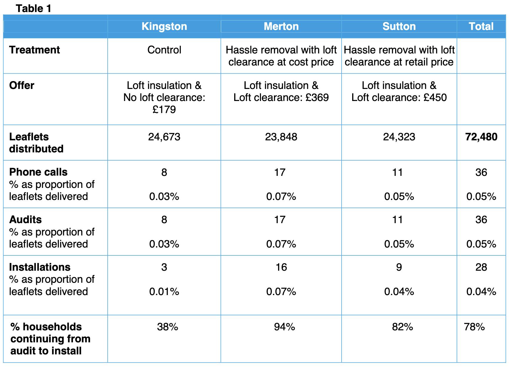

In the early days of the Behavioural Insights Team (aka The Nudge Unit), their successes quickly became part of the behavioural economics canon. They were the only behavioural team publishing results publicly, so those became the stories everyone told.

These stories included how adding social norms to tax letters [increased on-time submission](https://www.bi.team/publications/fraud-error-and-debt-behavioural-insights-team-paper/), giving sweets and a personalised message from the CEO [tripled charitable giving rates](https://www.bi.team/publications/applying-behavioural-insights-to-charitable-giving/), and messages crafted around reciprocity and fairness would boost organ donation registrations by [almost 100,000 a year](https://www.bi.team/publications/applying-behavioural-insights-to-organ-donation/). These stories are still told now.

One story I heard a lot concerned loft insulation as an energy efficiency measure. It is one of the four projects highlighted on the (promotional puff-piece) [Behavioural Insights Team Wikipedia page](https://en.wikipedia.org/wiki/Behavioural_Insights_Team#Increasing_loft_insulation_installation). Could removing the hassle factor, by offering a loft cleanout in conjunction with the installation, increase takeup?

Here's how David Halpern describes the results in [Inside the Nudge Unit](https://www.bi.team/blogs/inside-the-nudge-unit-out-on-27th-august/). (When I searched for other tellings of this story, the examples I found almost always involved David Halpern. It must be one of his favourites.)

> After looking at the issue, and talking to industry and householders, we concluded that the problem was less about money and more about hassle. Specifically, people couldn’t bear the thought of having to clear out the contents of their lofts.
> 
> To see if this was the case ... we ran a leaflet trial with a commercial provider offering households in different areas of London one of three offers:
> 
> - A home insulation service at a low, but standard cost.
> - A home insulation service with a substantial extra discount if any of your neighbours also booked the same service ...
> - A home insulation service combined with a loft clearance service, albeit at a significant extra cost to insulation alone.

> This was not a perfect trial in methodological terms. The different leaflets were tried in similar but separate local areas, and not therefore perfectly randomised and total numbers were small. Nonetheless, the effects were still striking. ... the loft clearance offer, despite costing several hundred pounds extra, had a three-times higher level of take-up.
> 
> It wasn’t that cost did not matter. In a later variation, which involved offering the loft clearance scheme at cost in order to lower the price, uptake was even higher (at around five times the standard offer). But the trial powerfully illustrated that, at least for the minority of households that had yet to insulate their lofts, it wasn’t the price of the insulation that was the barrier, but the fact that they couldn’t face the hassle of clearing their lofts.

I'll leave the discount for neighbours aside - this was from a separate trial - and focus on the "striking" effect of the loft clearance offer.

The trial and its outcomes are described in a Department of Energy & Climate Change report [Removing the hassle factor associated with loft insulation: Results of a behavioural trial](https://assets.publishing.service.gov.uk/media/5a7c4f94ed915d3d0e87b850/DECC_loft_clearance_trial_report_final.pdf).

The trial concerned three different Boroughs - Kingston, Merton and Sutton - so it's not a randomised trial as such. In each Borough, around 24,000 leaflets were distributed advertising either loft insulation for £ $179 (Kingston), loft insulation and clearance for £369 (Merton) or insulation and clearance for £450 (Sutton). The leaflets included a phone number and led to 8, 17 and 11 calls respectively. That's right, a response rate of around 0.05%

From there, there was an audit to check whether the loft was suitable for insulation, which led to a total of 3, 16 and 9 loft installations. The "three-times" in Halpern's story is the difference between 3 and 9, and the "five times" the difference between 3 and 16. When Halpern said the "numbers were small", he meant it.

Here's a screenshot of the data table:

But with three to nine installations from 24,000 letters, you can't draw any statistically sound conclusions. And that is exactly what the report states:

> On the basis of the level of uptake in this trial, the numbers are too small to provide any firm conclusions.

So, package this trial under "interesting idea for which we have almost no evidence" rather than a story of striking success. The three- and five-fold increases might just be noise. Further, most of the difference occurred between audit and installation, not in initial response rates. It's not clear what happened there.

Thus, the main thing learned from this trial is that people don't respond to leaflets offering various loft installation packages.

---

As an aside, as of the date of this post, the [Wikipedia content](https://en.wikipedia.org/wiki/Behavioural_Insights_Team#Increasing_loft_insulation_installation) on this trial reads:

> Although loft insulation is essentially a zero-risk proposition, there were very few people installing it. The team discovered that people's lofts were full of junk, and provided low-cost labour to clear them; this caused a fivefold increase in the proportion of installed insulation.

The reference is to a Telegraph article by Chris Bell. The opening of the article, [Inside the Coalition's controversial 'Nudge Unit'](https://www.telegraph.co.uk/news/politics/9853384/Inside-the-Coalitions-controversial-Nudge-Unit.html), read:

> Back in the dark ages of early 2011, the Cabinet Office began grappling with one of the most serious issues facing our age: loft insulation. A curious anomaly was emerging in official statistics — that no one wanted it. Huge subsidies had been ploughed into lagging and rolls of fibreglass; there were generously-incentivised installation schemes, that would pay for themselves within months. It was, to use non-Whitehall patois, a no-brainer. And yet public adoption rates were minuscule. Policymakers were baffled.
>
> Step forward, then, a new Government team, with a new way of thinking.
>
> Using research, plus a smidgen of common sense, they quickly identified the problem: laziness. More specifically, the sheer hassle of clearing an attic before you can insulate it. This alone was deterring us from taking up, effectively, a free lunch. And so, in a pilot trial in September 2011, they suggested a simple solution: that insulation firms offer to clear the lofts first, and dispose of our unwanted junk. In weeks, the uptake increased threefold, even though it cost the customer more. And when this service was subsidised to cost price, there was a fivefold increase.

And where did this come from. David Halpern!

> And David Halpern, director of the nine-person unit, has been tasked with turning theory into government method.
> 
> “Loft insulation is a fascinating example,” he says. “If there is ‘friction cost’ in the way of doing something, it’ll never happen. We’ll put it off. So a lot of what we do is about making life easier for people.” The unit’s Whitehall office might be minuscule and recession-frugal — and Halpern himself has the bookish appearance of, as he puts it, “a humble policy wonk”.

I wonder if there are a few BIT people who occasionally say "David, you know that loft story you keep telling, maybe lay off it a bit...".
