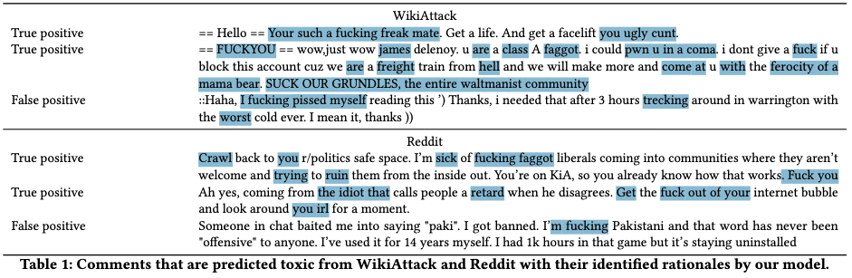

Experimental economists have a strong norm against deception in experiments. Here's Andreas @ortmann2019:

> I open with a statement of fact: deception in the form of acts of commission, while still widespread in (social) psychology and business sciences such as marketing, is factually banned in laboratory experimental economics. This ban is not legislated but, until recently, was a social norm that the community of experimental economists had been able to reasonably enforce.

For some experimental economics journals, deception is grounds for desk rejection.

There are a few reasons for this norm. An important one is that if participants are suspicious that are being deceived in an experiment or that the information they have been provided is not correct, that will alter their behavioural responses, undermining the experimental results. An example of this is the famous [Solomon Asch conformity experiments](), in which those who believed they were being deceived were less likely to be ().

There is also an externality from deception to other experiments. After being deceived in one experiment - as they often discover when promises aren't delivered or in experimental debriefs - they will be less trusting in future experiments, again changing their behaviour. Today where many experiments are run with public subject pools of people who are completing many experiments and surveys, regular deception could be expected to shift their expectations.

There is no such norm in psychology. Deception is common and (argued to be) required for many experiments, although this exposes to them to critiques about whether the observed behaviour can be generalised outside the deceptive experiment.

There is also no such norm in human-computer interaction research, as I have discovered in the last couple of years. Across the swathe of human-computer experimental literature I have traversed, deception is often used. And by deception, I am not talking about deception by omission: not telling people everything about the experiment. At some level, that is required in an experiment where people are exposed to different conditions (albeit allowing deception of this nature can become a slippery slope). Rather, the deception involves acts of commission such as telling people things that are not true.

One common form of deception concerns the AI the experimental subject is interacting with. Often, there is no actual AI. Rather, the participants are shown a set of hand-crafted responses. I have seen this called "synthetic AI". Often the human comparator does not exist either.

Beyond synthetic AI, it also seems common to tell the occasional lie to generate the desired response. Below are examples of each and a few questions in response.

## Synthetic-AI

To run an experiment on human responses to an AI, on face value you want an AI. But that's a challenge. For one, you need to procure and AI, or develop or train an AI on the task or data. Depending on the nature of the AI, you might also be designing an interface. And apart from being a lot of work, there's no guarantee that your AI will have the features you desire, such as a certain error rate or error boundary.

In economics, this challenge has typically led to the use of statistical prediction tasks. Given a dataset about, say, student achievement, you train an AI to predict achievement based on other features of the student. Apart from the easy availability of datasets to create these tasks (such as those available on [Kaggle](https://www.kaggle.com/datasets) or in repositories such as the [UC Irvine Machine Learning Repository](https://archive.ics.uci.edu/)), developing statistical models is a bread and butter task for an economist. You can often train a model on these relatively well-structured datasets in a few lines of code.

These statistical model outputs are then framed as coming from an AI, an algorithm or whatever other term you might want to give it. As indicated by the mountains of evidence that statistical models outperform human judgments, these "AIs" are typically superior to humans at the task. If you want a weaker model you might withhold data that you give to the human

Ultimately, however, statistical prediction is not the richest environment for studying human-AI interaction. Statistical prediction tasks are only a small subset of the space in which you might want AI support. That moves us into more complex domains where it's not so easy to develop a model.

In experiments coming from the human-computer interaction field, you do see statistical models, but often the experiments requite that richer environment. And that's where they turn to deception via synthetic AI.

One example of synthetic AI is in work by @buçinca2021 on whether triggering slow thinking can increase engagement with explanations of AI recommendations. They created a task where participants were shown a picture of a meal and information on the main ingredients, and asked what ingredients to substitute to make it low-carb while maintaining the original flavour.

And how was this AI developed? They write:

> We designed a simulated AI for the experiment, which had 75% accuracy of correctly recognizing the ingredient with the highest carbohydrate impact in the image of the meal. Note that we did not train an actual machine learning model for this task because we wanted to have control over the type and prevalence of error the AI would make.

This is one of the more direct statements that they made the AI outputs up, but even where less explicitly stated, it is common practice.'

The question then becomes, what do participants believe of this scenario. Do they believe that an AI is actually delivering these suggestions and associated explanations?

(This paper is illustrative of my complaint of a few months ago about the lack of openness and data sharing in human computer interaction research.)

Some people do go this extra yard - and full praise to them. As an example, @lai2022 developed neural architecture to classify Wikipedia comments and Reddit hate speech. The particular architecture they used allowed identification of the rationale, communicated through highlights of the relevant words in the text. It looks like a lot of effort, but they're not deceiving participants, plus have a more ecologically valid experimental setup. That would boost my confidence in the results.

## Straight-out porkie pies

I sympathise with the synthetic AI approach, albeit not being completely on board with it. Coming up with experimental tasks where the AI really is an AI performing the task you say it is is tough. In many cases this requires detailed model builds and software interfaces - and even then, one element is often not quite as stated.

But the deception tends not to be limited to synthetic AI. The AI is often completely misrepresented.

Here's an example from Rastogi et al (2022), who examined whether they could de-anchor experimental participants from AI advice. I reviewed this paper and the question of whether this even involves anchoring in [a post last month](ADDLINK).

The authors write:

> To induce anchoring bias, the participant was informed at the start of the training section that the AI model was 85% accurate (we carefully chose the training trials to ensure that the AI was indeed 85% accurate over these trials), while the model’s actual accuracy is 70.8% over the entire training set and 66.5% over the test set. Since our goal is to induce anchoring bias and the training time is short, we stated a high AI accuracy.

The training set they reference here is the data they trained the model on. The training trials are a set of 15

Effectively, they told people the AI had an accuracy that it didn't.

This disparity between stated accuracy (85%) and true accuracy (70.8%) is realistic if there is a distribution shift between the training and the test

However, let's consider what they can infer from 15 trials. Suppose the AI actually had 85% accuracy. You are going to see, on average, 12.75 correct trials. A 70.8% correct AI will give 10.575 trials on average.

So let's suppose you see 12 correct trials. What should you infer about the AI accuracy? The 95% confidence interval is approximately \[70%, 90%\]. You can't tell the difference between a 70% and 85% accurate algorithm. And that's assuming they're counting accurately the number of correct and incorrect answers.

They seek to defend the deception as follows:

> this disparity between stated accuracy (85%) and true accuracy (70.8%) is realistic if there is a distribution shift between the training and the test set, which would imply that the humans’ trust in AI is misplaced.

## Do participant's believe the AI is AI?

With generative AI, this is coming closer to being feasible. But looking at many experiments conducted through the last decade, I suspect many participants would not believe an AI

## Do participants believe the human is human?

Even more so

## Thoughts

I sense one reason people love experiments with LLMs is that it involves an actual AI! Although being a stochastic AI, one that is rather hard to control, that comes with a bunch of different costs.