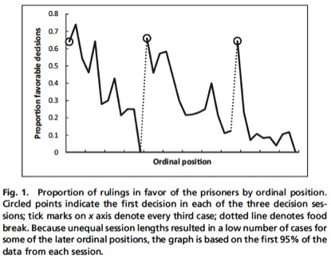

[Daniel Lakens writes](http://daniellakens.blogspot.com.au/2017/07/impossibly-hungry-judges.html):

>I was listening to a recent [Radiolab episode](http://www.radiolab.org/story/revising-fault-line/) on blame and guilt, where the guest Robert Sapolsky mentioned a famous [study](http://www.pnas.org/content/108/17/6889.short) [by Danziger and friends] on judges handing out harsher sentences before lunch than after lunch. The idea is that their mental resources deplete over time, and they stop thinking carefully about their decision – until having a bite replenishes their resources. The study is well-known, and often (as in the Radiolab episode) used to argue how limited free will is, and how much of our behavior is caused by influences outside of our own control. I had never read the original paper, so I decided to take a look.
>
>During the podcast, it was mentioned that the percentage of favorable decisions drops from 65% to 0% over the number of cases that are decided upon. This sounded unlikely. I looked at Figure 1 from the paper (below), and I couldn’t believe my eyes. Not only is the drop indeed as large as mentioned – it occurs three times in a row over the course of the day, and after a break, it returns to exactly 65%!
>
>
>
>...
>
>I think we should dismiss this finding, simply because it is impossible. When we interpret how impossibly large the effect size is, anyone with even a modest understanding of psychology should be able to conclude that it is impossible that this data pattern is caused by a psychological mechanism. As psychologists, we shouldn’t teach or cite this finding, nor use it in policy decisions as an example of psychological bias in decision making.

I was aware of one explanation for why the effect reported by Danziger and friends was so large. [Andreas Glockner explored](http://journal.sjdm.org/16/16823/jdm16823.html) what would occur if favourable rulings took longer than unfavourable rulings, and the judge (rationally) plans ahead and stops for their break if they believe the case will take longer than there is time left in the session. Simulating this scenario, Glockner generated an effect of similar magnitude to the original paper.

However, I was never convinced the case ordering was random, a core assumption behind Danziger and friends' finding. In my brief legal career I often attended preliminary court hearings where matters were listed in a long (possibly random) court list. Then the order emerged. Those with legal representation would go first. Senior lawyers would get priority over junior lawyers. Matters for immediate adjournment would be early. And so on. There was no formal procedure for this to occur other than discussion with the court orderly before and during the session.

It turns out that these Israeli judges (or, I should say, a panel of a judge, a criminologist and a social worker) experienced a similar dynamic. Lakens points to a [PNAS paper](http://www.pnas.org/content/108/42/E833.long) in which Keren Weinshall-Margela (of the Israeli Supreme Courts research division) and John Shapard investigated whether the ordering of cases was actually random. The answer was no:

>We examined data provided by the authors and obtained additional data from 12 hearing days (n = 227 decisions). We also interviewed three attorneys, a parole panel judge, and five personnel at Israeli Prison Services and Court Management, learning that case ordering is not random and that several factors contribute to the downward trend in prisoner success between meal breaks. The most important is that the board tries to complete all cases from one prison before it takes a break and to start with another prison after the break. Within each session, unrepresented prisoners usually go last and are less likely to be granted parole than prisoners with attorneys.

Danziger and friends have [responded to these claims](http://www.pnas.org/content/108/42/E834.full) and attempted to resuscitate their article, but here is something to be said for the "effect is too large" heuristic proposed by Lakens. No amount of back and forth about the finer details of the methodology can avoid that point.

The famous story about the effect of defaults on organ donation provides another example. When I first heard the claim that 99.98% of Austrians, but only 12% of Germans, are organ donors due to the default organ donation option in their driver licence renewal, I simply thought the size of the effect was unrealistic. Do only 2 in 10,000 Austrians tick the box? I would assume more that 2 in 10,000 would tick it by mistake, thinking that would make them organ donors. So when you turn to the original paper or examine the actual organ donation process you will see [this has nothing to do with driver's licences or ticking boxes](https://www.jasoncollins.blog/charts-that-dont-seem-quite-right-organ-donation-edition/). The claimed effect size and the story simply did not line up.

[Andrew Gelman](http://andrewgelman.com/) often makes a similar point. Much research in the social sciences reflects an attempt to find tiny effects in noisy data, and any large effects we find are likely gross overestimates of the true effect (to the extent the effect exists). [Gelman and John Carlin](http://journals.sagepub.com/doi/abs/10.1177/1745691614551642) call this a Type M error.

Finally, I intended to include Glockner's paper in my [critical behavioural economics and behavioural science reading list](https://www.jasoncollins.blog/a-critical-behavioural-economics-and-behavioural-science-reading-list/), but it slipped my mind. I have now included it and these other articles for a much richer story.
