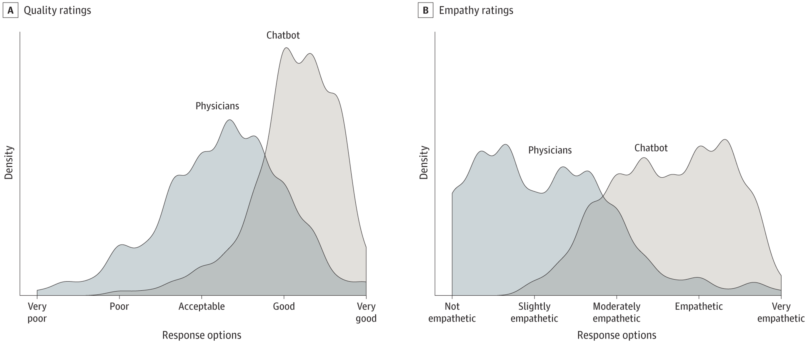

If you ever read a claim of an AI outperforming a human, dig into the performance data to check out the human benchmark. The mediocrity of the human is often more salient than the competence of the AI. The AI has an easy job.

Here's an example from a paper by Ayers and friends [-@ayers2023]. They sampled 195 question and response exchanges on Reddit’s [r/AskDocs](https://www.reddit.com/r/AskDocs) and entered those same questions into ChatGPT 3.5. Responses by the Reddit physicians and ChatGPT were then independently rated for quality and empathy.

ChatGPT responses were rated as higher quality, with 78% of ChatGPT responses rated as good or very good quality. 22% of physician responses had that rating. Similarly, 45% of ChatGPT responses were rated empathetic or very empathetic, compared to 5% for the physicians.

I [downloaded the csv file](https://doi.org/10.7910/DVN/BZARC3) of the responses. The most striking feature was the brevity and curtness of the humans (52 words average compared to 211 for ChatGPT). Here are a few of the human responses.

A friend's uninsured mother needs a liver transplant. What should she do?

> Its not just a work around the insurance, she will need lifelong expensive meds after surgery as well. Why does she not have insurance?

Should they be worried about arm pain when they sneeze?

> The answer simply is no..

Are they crazy for thinking they have pancreatic or some other cancer given a list of symptoms?

> Why do you think you have pancreatic cancer?

Where can someone from a family of anti-vaxers get information on vaccines?

> See your general practitioner. They'll understand and will sort you out bro.

Does smelly poop and less frequent bowel movements indicate cancer?

> This does not sound like cancer. I would advise stop googling.

In contrast, ChatGPT gave long, involved answers that inevitably began with a statement of concern for the medical condition. "I'm sorry to hear about your friend's mom." Funnily enough, that verbosity annoys me the most in using LLMs. One person's verbosity is another's empathy.

I don't mean the above to be read as a criticism of AI performance. (This is ChatGPT 3.5 after all!) But there's an interesting contrast between performance benchmarking and discussions of the role of AI. In benchmarking exercises, we use actual human performance as the standard. But when discussing whether AI should replace or augment human decisions, we often compare AI to an idealised human. We have a mental image of a high-quality physician with excellent bedside manner, not the distribution of skills and empathy we actually have. Scrutinising the performance data for some of these benchmarking exercises is a good reminder that AI doesn't always have to be great to be better.
