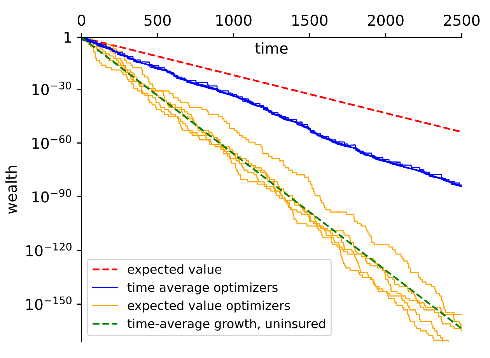
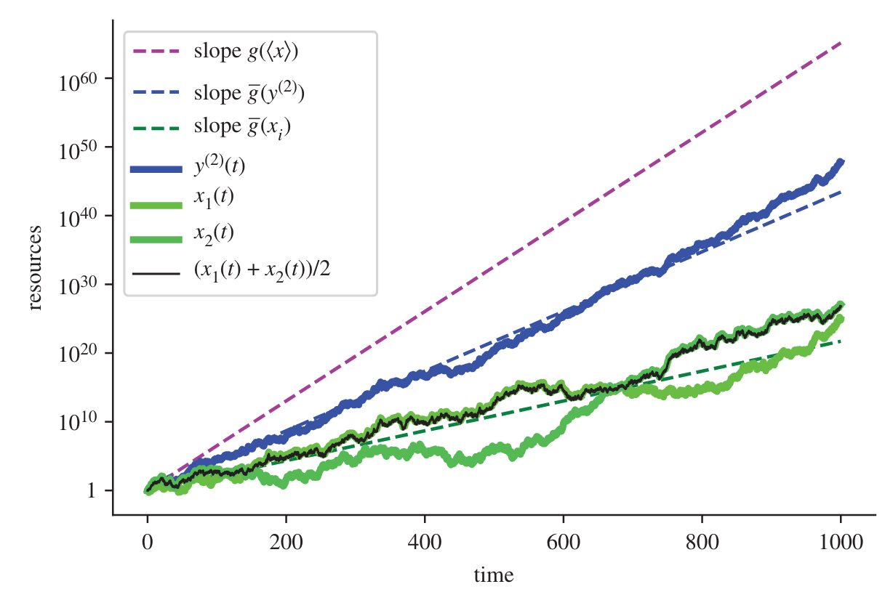
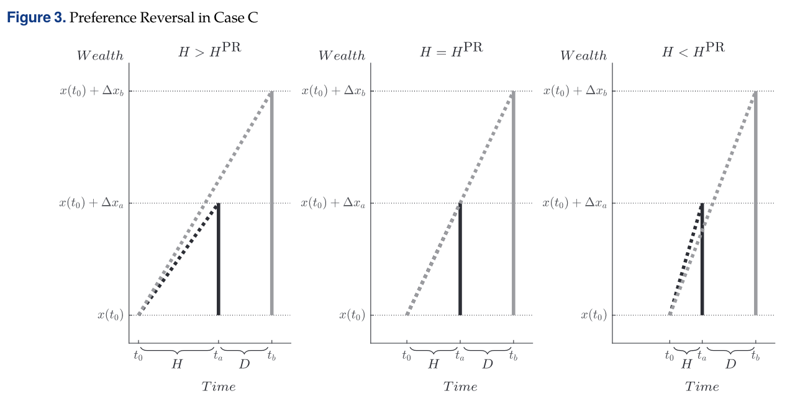
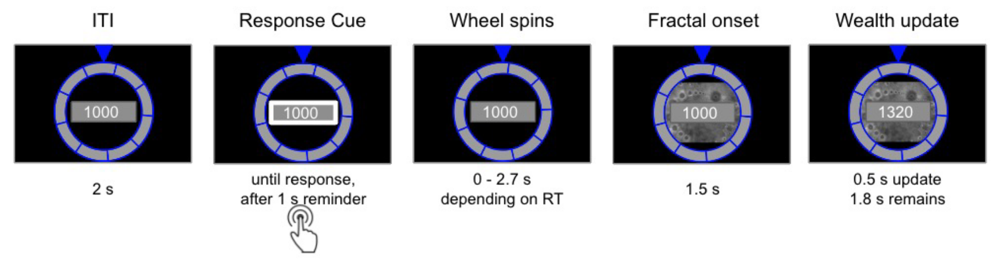
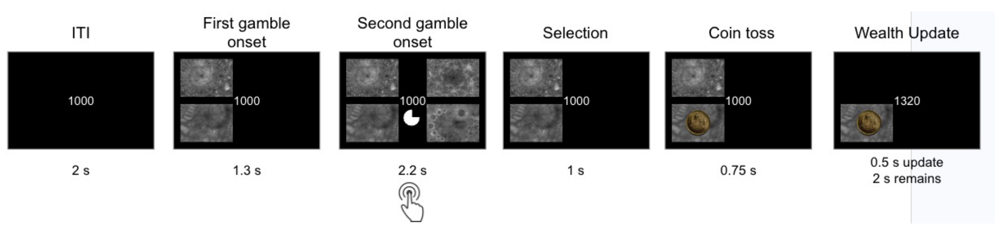
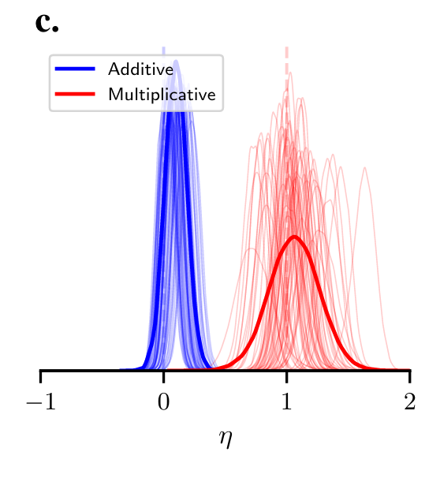

This post is my plan for a presentation at the [Foundation of Utility and Risk Conference](https://www.furconference.org/fur-2024/). I drew on the material in my previous posts laying out the [foundations of ergodicity economics](https://www.jasoncollins.blog/posts/ergodicity-economics-a-primer) and examining [what ergodicity economics states about risk preferences](https://www.jasoncollins.blog/posts/risk-and-loss-aversion-in-ergodicity-economics). This may vary from delivery - economics presentations are easily waylaid. Given it's to a technical audience, there are a few moments that might lose the lay reader.

--

## Introduction

At times, I wonder whether what I am presenting to you today is an exercise in shooting fish in a barrel. The claims made by the advocates of "ergodicity economics" are often overblown and extend far beyond what is justified.

But, underneath the bluster, I feel these are interesting fish to shoot. And despite some other attempts to shoot these fish, they still seem to be swimming around. There are a couple of published critiques of ergodicity economics, one by Doctor et al [-@doctor2020] in Nature Physics and one more recent by Matthew Ford and John Kay [-@ford2023] in Econ Journal Watch. Despite these, I still feel the central idea in ergodicity economics is interesting. So, I'm going to steelman the case for ergodicity economics, before laying some psychological and evolutionary observations. This work represents the early thinking for an in-progress working paper.

Since I developed the first cut for this presentation, a working paper describing a new experiment has been released, and its distracted me somewhat, so I'm going to distract you with it also. My thinking about this experiment is still in its early stages and I want to focus on its implications if it is true rather than the weaknesses that might undermine the result.

### The bet

So let me start with the classic example. You may have seen this before.

> Suppose you are offered a series of 100 bets on the flip of a coin. You win 50% of your wealth on heads. You lose 40% of your wealth on tails. Do you take the bet?

The expected value of the bet is 5 per cent of your wealth each flip. Continue playing for many rounds and your expected wealth is very large.

However, what is the most probable outcome over many repeats of this bet?

This plot is the result of a simulation of 10,000 people, each starting with \$100, playing this bet 100 times. The black line is the average wealth of the population. The red lines are paths of the first 20 people in the simulation.

```{r setup, message=FALSE, warning=FALSE}
#| code-summary: "Setup code"

# Load the required packages

library(ggplot2)
library(scales) #use the percent scale later
library(dplyr) #use the filter function later
```

```{r function}
#| code-summary: "Code for bet function"

# Create a function for running of the bets.

bet <- function(p, n, t, start=100, gain, loss, ergodic=FALSE, absorbing=FALSE){

  #p is probability of a gain
  #n is how many people in the simulation
  #t is the number of coin flips simulated for each person
  #start is the number of dollars each person starts with
  #if ergodic=FALSE, gain and loss are the multipliers
  #if ergodic=TRUE, gain and loss are the dollar amounts
  #if absorbing=TRUE, zero wealth ends the series of flips for that person

  params <- as.data.frame(c(p, n, t, start, gain, loss, ergodic, absorbing))
  rownames(params) <- c("p", "n", "t", "start", "gain", "loss", "ergodic", "absorbing")
  colnames(params) <- "value"

  sim <- matrix(data = NA, nrow = t, ncol = n)

  if(ergodic==FALSE){
    for (j in 1:n) {
      x <- start
      for (i in 1:t) {
      outcome <- rbinom(n=1, size=1, prob=p)
      ifelse(outcome==0, x <- x*loss, x <- x*gain)
      sim[i,j] <- x
      }
    }
  }

 if(ergodic==TRUE){
    for (j in 1:n) {
      x <- start 
      for (i in 1:t) {
      outcome <- rbinom(n=1, size=1, prob=p)
      ifelse(outcome==0, x <- x-loss, x <- x+gain)
      sim[i,j] <- x
      if(absorbing==TRUE){
        if(x<0){
          sim[i:t,j] <- 0
            break
        }
        }
      }
    }
  }

  sim <- rbind(rep(start,n), sim) #placing the starting sum in the first row
  sim <- cbind(seq(0,t), sim) #number each period
  sim <- data.frame(sim)
  colnames(sim) <- c("period", paste0("p", 1:n))
  sim <- list(params=params, sim=sim)
  sim
}
```

```{r simulation_1}
#| code-summary: "Code to run simulation"

# Simulate 10,000 people who accept a series of 1000 50:50 bets to win \$50 or lose \$40 from a starting wealth of \$100.

set.seed(20191215)
nonErgodic <- bet(p=0.5, n=10000, t=1000, gain=1.5, loss=0.6, ergodic=FALSE)
```

```{r summary_stats}
#| code-summary: "Code to create function to generate summary statistics"

# Create a function to generate summary statistics.

summaryStats <- function(sim, t=100){

  meanW <- mean(as.matrix(sim$sim[(t+1),2:(sim$params[2,]+1)])) # mean wealth
  medianW <- median(as.matrix(sim$sim[(t+1),2:(sim$params[2,]+1)])) # median wealth
  num99 <- sum(sim$sim[(t+1),2:(sim$params[2,]+1)]<(sim$params[4,]/100)) #number who lost more than 99% of their wealth
  per99 <- num99/sim$params[2,]*100 #percentage who lost more than 99% of their wealth
  numGain <- sum(sim$sim[(t+1),2:(sim$params[2,]+1)]>sim$params[4,]) #number who gain
  perGain <- numGain/sim$params[2,]*100 #percentage who gain
  num100 <- sum(sim$sim[(t+1),2:(sim$params[2,]+1)]>(sim$params[4,]*100)) #number who increase their wealth more than 100-fold
  winner <- max(sim$sim[(t+1),2:(sim$params[2,]+1)]) #wealth of wealthiest person
  winnerShare <- winner / sum(sim$sim[(t+1),2:(sim$params[2,]+1)]) #wealth share of wealthiest person

  stats <- data.frame(meanW = meanW, medianW = medianW, num99 = num99, per99 = per99, numGain = numGain, perGain = perGain, num100 = num100, winner = winner, winnerShare = winnerShare)
}

nonErgodicStats <- summaryStats(nonErgodic, 100)
```

```{r}
#| fig-cap: Plot of first 20 people against average wealth
#| label: fig-ergodicity-presentation-1
#| code-summary: "Code for plot"

# Create a function for plotting the average wealth of the population over a set number of periods.

averagePlot <- function(sim, t=100){

  basePlot <- ggplot(sim$sim[c(1:(t+1)),], aes(x=period)) +
    labs(y = "Average Wealth ($)")

  averagePlot <- basePlot +
    geom_line(aes(y = rowMeans(sim$sim[c(1:(t+1)),2:(sim$params[2,]+1)])), color = 1, linewidth=1)

  averagePlot
}

# Create a function for plotting the path of individuals in the population over a set number of flips.

individualPlot <- function(sim, t, people){

  basePlot <- ggplot(sim$sim[c(1:(t+1)),], aes(x=period)) +
    labs(y = "Wealth ($)")

  for (i in 1:people) {
    basePlot <- basePlot +
      geom_line(aes(y = !!sim$sim[c(1:(t+1)),(i+1)]), color = 2)
  }

basePlot

}

jointPlot <- function(sim, t, subset) {
  individualPlot(sim, t, subset) +
    geom_line(aes(y = rowMeans(sim$sim[c(1:(t+1)),2:(sim$params[2,]+1)])), color = 1, linewidth=1)
}

nonErgodicPlot <- jointPlot(sim=nonErgodic, t=100, subset=20)
nonErgodicPlot

```

The sudden drop in mean wealth toward the end of the sequence is an interesting feature that I will ignore for the moment. But look at the red lines. At the end of 100 periods, all are below the mean wealth, and only two of the 20 agents have enough wealth that you can discern the lines from the x-axis.

Let us now use a log scale to enable us to see the pattern more clearly.

```{r log_plot}
#| fig-cap: Plot of first 20 people against average wealth (log scale)
#| label: fig-ergodicity-presentation-2
#| code-summary: "Code for plot"

# Plot both the average outcome and first twenty people on the same plot.

logJointPlot <- function(sim, t, subset) {
  individualPlot(sim, t, subset) +
    geom_line(aes(y = rowMeans(sim$sim[c(1:(t+1)),2:(sim$params[2,]+1)])), color = 1, linewidth=1)+
    scale_y_log10(breaks = c(0.0001, 0.1, 100, 100000), labels = c("0.0001", "0.1", "100", "100000"))
}

nonErgodicPlot <- logJointPlot(sim=nonErgodic, t=100, subset=20)
nonErgodicPlot

```

All 20 of these people are below the mean wealth. Only two are ahead of where they started.

These 20 people are representative of the broader population. Across the 10,000 agents in this simulation, 86 per cent lost money. The mean wealth was over \$16,000, but the median wealth was less than one dollar.

What is the intuition behind this?

The black line simply represents the realisation of the expected gain of 5 per flip.

But for the red lines, over the long term, an individual will tend to get around half heads and half tails. As the number of flips goes to infinite, the proportion of heads or tails "[almost surely](https://en.wikipedia.org/wiki/Almost_surely)" converges to 0.5.

This means that each person will tend to get a 50% increase half the time (or 1.5 times the initial wealth), and a 40% decrease half the time (60% of the initial wealth). The time average growth in wealth for an individual is $(1.5\times 0.6)^{0.5} \sim 0.95$, or approximately a 5% decline in wealth each period. Every individual's wealth will tend to decay at that rate. The black line is held up by a very lucky few.

A system where the time average converges to the ensemble average (our population mean) is known as an ergodic system. The system of gambles above is non-ergodic as the time average and the ensemble average diverge.

This leads to the following claim: as we cannot individually experience the ensemble average, the ensemble average is not what humans consider in their decision making. Instead, people maximise the time average growth rate. For this bet, as the time average growth rate is negative, an ergodicity economics agent would reject the bet.

Contrast this with the expected utility approach, where the utility of each outcome is weighted by its probability and summed to give the expected utility. Expected utility theory would be consistent with both accepting and rejecting the bet depending on the particular utility function.

There is an incidental alignment between ergodicity economics and expected utility theory. If a person has log utility - that is, they maximise the probability-weighted logarithm of the possible outcomes - they will maximise the time average growth rate.

### Additive versus multiplicative

One important feature of the bet I have just shown is that the outcomes are multiplicative. A win on one flip leads to a larger stake flip on the next bet. The size of the bet scales up or down with wealth.

What if I offered you the following bet instead?

> You have \$100 and are offered a gamble involving a series of 100 coin flips. For each flip, heads will increase your wealth by \$50. Tails will decrease it by \$40. Do you take the bet?

You can see the tweak from the original bet, with dollar sums rather than percentages. For someone with \$100 in wealth, the first flip is effectively identical, but future bets will be additive on that result and always involve the same shift of \$50 up or \$40 down.

This second series of flips is ergodic. The expected value of each flip is \$5 ($0.5\times \$50-0.5\times \$40=\$5$). The time-average growth rate is also \$5.

Let's simulate as we did for multiplicative bets, with 10,000 people starting with \$100 and flipping the coin 100 times. The below plot shows the average wealth of the population, together with the paths of the first 20 of the 10,000 people (in red).

```{r simulate_ergodic}
# Simulate 10,000 people who accept a series of 1000 50:50 bets to win \$50 or lose \$40 from a starting wealth of \$100.

set.seed(20200203)
ergodic <- bet(p=0.5, n=10000, t=100, gain=50, loss=40, ergodic=TRUE, absorbing=FALSE)
```

```{r ergodic_plot}
#| fig-cap: Average wealth of population and path of first 20 people
#| label: fig-ergodicity-presentation-3
 
# Plot both the average outcome and first twenty people on the same plot.

ergodicPlot <- jointPlot(sim=ergodic, t=100, subset=20)
ergodicPlot
```

```{r ergodic_stats}
# Generate summary statistics for the population and wealthiest person after 100 and 1000 flips}

summaryErgodic100 <- summaryStats(sim=ergodic, t=100)

```

The individual growth paths cluster on either side of the population average. After 100 flips, the mean wealth is \$`r round(summaryErgodic100$meanW, 0)` and the median \$`r summaryErgodic100$medianW`. `r round(summaryErgodic100$numGain/10000*100, 0)`% of the population has gained in wealth. The wealthiest person has \$`r round(summaryErgodic100$winner, 0)`, or `r options(scipen = 999); round(summaryErgodic100$winnerShare, 4)`% of the total wealth of the population. This alignment between the mean and median wealth, and the relatively equal distribution of wealth, are characteristic of an ergodic system.

```{r ergodic_zero}
# Determine how many people (in the first people out of n) experienced zero wealth or less during the simulation.

numZero <- function(sim, t, subset=0){

  #subset
  data <- if(subset==0 | subset>sim$params[2,]){
    sim$sim[1:t,2:(sim$params[2,]+1)]
  } else {
    sim$sim[1:t,2:(subset+1)]
  }
  
  # number of people who experienced zero wealth or less
  numZero <- length(data) - sum(sapply(data, function(x) all(x>0)))
  numZero
  
}

numZeroTwenty100 <- numZero(sim=ergodic, t=100, subset=20)
numZeroTwenty1000 <- numZero(sim=ergodic, t=1000, subset=20)
numZero100 <- numZero(sim=ergodic, t=100)
numZero1000 <- numZero(sim=ergodic, t=1000)

```

Now for a wrinkle, which we can see in the plotted figure. Of those first 20 people plotted on the chart, `r numZeroTwenty100`(!) had their wealth go into the negative over those 100 periods. We see the same phenomenon across the broader population, with `r numZero100` dropping below zero in those first 100 periods.

To the extent zero wealth is ruinous when it occurs, that event is severe. If the player only incurs the consequences of their final position, the bet is unlikely to result in ruin but still presents a non-zero threat of catastrophe.

What would an expected utility maximiser do here? For a person with log utility, any probability of ruin during the flips would lead them to reject the gamble. The log of zero is negative infinite, which outweighs all other possible outcomes, whatever their magnitude or probability.

The growth-rate maximiser would accept the bet if they didn't fear ruin. The time-average growth of \$5 per flip would pull them in. If ruin was feared and consequential, then they might also reject.

## What are the implications of this finding?

The advocates of ergodicity economics have then applied this finding to a range of economics problems.

@peters2023 argues that we can think of insurance as a tool to make wealth grow faster rather than as a tool for the risk averse or for piece of mind. This plot shows the outcomes for agents facing a 5% probability of a loss of 95% of their wealth each period. Uninsured agents experience a path over time even more ruinous than the expected value. Those who insure at a cost experience a slower decline.

As an aside, I do find the scales on these numbers quite comical: 2500 periods with a 5% probability of loss, leading to an expected value of around $10^{-30}$ times the initial wealth even under the insured scenario.



@peters2022 similarly propose a desire to maximise the growth rate as the origin of cooperative behaviour. Here, the green trajectories are the selfish agents, the blue line the cooperators.



One of the more interesting example concerns time preference. @adamou2021 attempt to use growth rate maximisation as an explanation for exponential discounting, hyperbolic discounting and preference reversals, depending on the particular wealth dynamic.

This image captures a situation where an agent is in an additive world where they have a choice between a smaller sooner and a larger later pay-off. This agent seeks to maximise the growth rate of their wealth. From the perspective of $t_0$ the larger later pay-off provides a higher growth rate, which is equal to the slope of the line extended to the top of that pay-off. By the third frame, as the agent moves closer to the smaller, sooner pay-off, the higher growth rate now comes from that early pay-off. They have reversed their preference.



It is when seeing ideas such as this that the claims that this is a "psychology free" approach made by the main purveyors of ergodicity economics seem slightly ridiculous. The agent must have quite severe myopia to be unable to see their upcoming preference reversal, or to realise the foregone larger opportunity on the other side of that smaller sooner payment.

### The experiment

But rather than going down that rabbit-hole, I want to present an experimental result. This is an updated version of an older experiment, with a pre-print describing this experiment being released at the end of May.

The experiment is by @skjold and involves a group of experimental participants who were asked to make a series of bets in either an additive or multiplicative environment. Participants were randomised to either the additive or multiplicative environment, before having a session in the other.

At the beginning of each session, the participants were trained on a set of images of fractals, each of which had a specific effect on their endowment: multiplication by some fraction in the multiplicative session, or addition or subtraction of some fraction in the additive session. They were then tested on whether they had learnt the ordering of the fractals, with the subset of participants with low learning excluded from the analysis.



This use of fractals is one of the confounding factors that could influence the results: we have introduced ambiguity into the subsequent decisions, but I'm going to ignore that for now.

Participants then proceeded to their decision task, where they had to choose between lotteries, each of which is represented by two of the fractal images. Over a sequence of 160 decisions, they would be shown the lotteries, make their choice, be shown the outcome of the lottery, then see the effect of the outcome on their wealth.



Participants were incentivised by being paid their relative proportion of points compared to a rolling window of 10 participants. Another exhibit in the "why do we make incentives so complicated" collection and another confound to the experimental result. By rewarding on proportional access to a pool, they have introduced diminishing gains and a cap on winnings. But again, I'll ignore that for today.

So, to the result. The research team modelled participants as having an isoelastic utility function (a reasonably strong assumption), with the parameter $\eta$ calculated by Bayesian cognitive modeling.

$$
f_{\eta}(x)=\begin{cases}
\frac{x^{1-\eta} - 1}{1-\eta} & \text{if } \eta \neq 1 \\
\ln(x) & \text{if } \eta = 1
\end{cases}
$$

What would we predict the value of $\eta$ to be in this experiment? Expected utility theory is quiet on the precise value. The ergodicity economics approach, however, gives us a prediction. First, $\eta$ will be one in the multiplicative condition, as log utility maximises the growth rate. Second, $\eta$ will be zero in the additive condition. The growth rate is maximised in an additive environment by risk neutral behaviour.

This chart shows the result. For the additive scenario, participants were close to risk neutral: the aggregate estimate of $\eta$ was slightly above zero at about 0.1. For the multiplicative condition, although there was a wider distribution of values, the central estimate of $\eta$ was almost exactly one.



Despite the many things I don't like about this experiment - I have only hinted at a couple - this is a strong result. Absent the confounds, I'm not sure what else could cause this result.

### The psychology

However, it's worth thinking about what this means psychologically.

When modelling the utility function, the researchers took the value of $x$ in this experiment to be the experimental endowment at the time the agent makes their decision. It is the initial endowment, plus or minus the results of the previous bets. $x$ does not include outside wealth.

But if this use of $x$ is an accurate characterisation of the decision making process of the agents, it suggests a narrow form of mental accounting or a degree of myopia. Agents are maximising the growth rate *within* the experiment, not more generally. We need to introduce some psychology to explain this.

Similarly, this experiment is part of a broader environment with either multiplicative or additive characteristics. Experimental participants can take their payment from the experiment and invest it or take some other action. Maximising the growth rate in the additive condition by maximising expected value may not maximise the total growth raate if the world outside the experiment is multiplicative.

## An evolutionary analysis

Now, via a rather long and winding path, I want to turn to an evolutionary analysis of ergodicity economics. There is a large literature in the evolution of preferences, not to mention the evolutionary biology literature itself, that is relevant to an analysis of growth rate maximisation. Since the concepts are already there, I'm going to lean on them, but turn them to my own purpose.

The first evolutionary angle concerns what happens when we take a gene's eye view. And to assist me in making this point, let me show a quote.

Possibly the highest profile ergodicity economics publication was a [Nature Physics paper](https://doi.org/10.1038/s41567-019-0732-0) in which Ole Peters summarises his work. In one paragraph Peters writes:

> \[I\]n maximizing the expectation value - an ensemble average over all possible outcomes of the gamble - expected utility theory implicitly assumes that individuals can interact with copies of themselves, effectively in parallel universes (the other members of the ensemble). An expectation value of a non-ergodic observable physically corresponds to pooling and sharing among many entities. That may reflect what happens in a specially designed large collective, but it doesn't reflect the situation of an individual decision-maker.

Ignoring the fact that this mis-characterises expected utility theory, this idea of interacting with copies of themselves is what happens at the level of genes. By the presence of multiple copies of a gene, the gene can experience the ensemble average. The following basic model and simulation illustrates.

### A basic model

Suppose two types of agents lived in a non-ergodic world.

One type of agent seeks to maximise the time-average growth rate of its number of descendants. This desire to maximise the time-average growth rate is a function of its genotype, and is transmitted to its children.

The other type of agent seeks to maximise the expected number of offspring. Similarly, this agent's preferences are set genetically.

In the environment in which these agents live, they have a choice of strategy. One strategy is to have a single offspring with certainty. The other strategy is to have a 50:50 bet of having either 0.6 or 1.5 offspring. Part offspring sounds weird, but you can think of this as the average number of offspring. You can see I have effectively mimicked the classic ergodicity economics bet.

One type always accepted the bet, the other always rejected it. Which would come to dominate the population?

An intuitive reaction to the above examples might be that while the accepting type might have a short-term gain, in the long run they are almost surely going to drive themselves extinct. There are a couple of scenarios where that would be the case.

One is where the children of a particular type were all bound to the same coin flip as their siblings for subsequent bets. Suppose one individual had over 1 million children after 100 periods, comprising around 70% of the population (which is what they would have if we borrowed the above simulations for our evolutionary scenario, with one coin flip per generation). If all had to bet on exactly the same coin flip in period 101 and beyond, they are doomed.

If, however, each child faces their own coin flip (experiencing, say, idiosyncratic risks), that crash never comes. Instead, the risk of those flips is diversified and the growth of the population more closely resembles the ensemble average, even over the very long term.

Below is a chart of population for a simulation of 100 generations of the accepting population, starting with a population of 10,000. For this simulation, I have assumed that at the end of each period, the accepting types will have a number of children equal to the proportional increase in their wealth. For example, if they flip heads, they will have 1.5 children, For tails, they will have 0.6 children. They then die. (The simulation works out largely the same if I make the number of children probabilistic in accord with those numbers.) Each child takes their own flip.

```{r}
#| code-summary: "Code for evolutionary simulation"

set.seed(20191215)
evolutionBet <- function(p, n, t, gain, loss){

  #p is probability of a gain
  #region  is how many people in the simulation
  #t is the number of generations simulated

  params <- as.data.frame(c(p, n, t, gain, loss))
  rownames(params) <- c("p", "n", "t", "gain", "loss")
  colnames(params) <- "value"

  sim <- matrix(data = NA, nrow = t, ncol = 1)

  sim <- rbind(n, sim) #placing the starting population in the first row

  for (i in 1:t) {
    for (j in 1:round(n)) {
      outcome <- rbinom(n=1, size=1, prob=p)
      ifelse(outcome==0, x <- loss, x <- gain)
      n <- n + (x-1)
    }
    # if n is less than one, create probability that no child will be born, with probability n = 1 being equal to n
    ifelse(n < 1, n <- rbinom(1,1,n), n <- round(n))
    sim[i+1] <- n #"+1" as have starting population in first row
    # if n = 0, break
    if(n == 0){
      break
    }
  }

  sim <- cbind(seq(0,t), sim) #number each period
  sim <- data.frame(sim, row.names=NULL)
  colnames(sim) <- c("period", "n")
  sim <- list(params=params, sim=sim)
  sim
}

evolution <- evolutionBet(p=0.5, n=10000, t=100, gain=1.5, loss=0.6) #more than 100 periods can take a very long time, simulation slows markedly as population grows
```

```{r}
#| fig-cap: Population of accepting types
#| label: fig-ergodicity-presentation-8
#| code-summary: "Code for evolutionary plot"
# Plot the population growth for the evolutionary scenario (Figure 8).

basePlotEvo <- ggplot(evolution$sim[c(1:101),], aes(x=period))

expectationPlotEvo <- basePlotEvo +
  geom_line(aes(y=n), color = 1, linewidth=1) +
  labs(y = "Population")

expectationPlotEvo
```

This has an expected population growth rate of 5%.

This evolutionary scenario differs from the Kelly criterion in that the accepting types are effectively able to take many independent shares of the bet for a tiny fraction of their inclusive fitness.

For a replicating entity that can diversify future bets across many offspring, they can do just this.

There are a lot of wrinkles that could be thrown into this simulation. How many bets does someone have to make before they reproduce and effectively diversify their future? The more bets, the higher the chance of a poor end. There is also the question of whether bets by children would be truly independent (Imagine a highly related tribe).

I started this simulation assuming there was already many of the accepting types. This large number is such that their reproductive success is very close to the expected value. They realise the associated growth rate of 5%.

But what if there were no accepting types, and then there was a mutation in which a single agent accepted the bet. What would happen?

One heuristic

I started this simulation with 10,000 accepting types. This is a sufficient number that at least some were likely to have the very large returns required to balance the. What if I needed to wait for a mutation to produce a type who would accept the bet?

```{r warning=FALSE}
#| fig-cap: Population of accepting types with mutation
#| label: fig-ergodicity-presentation-9
#| code-summary: "Code for evolutionary plot with mutation"

# run 9 simulations with 1 accepting type to start

set.seed(20191215)

mutations <- 100

for (i in 1:mutations) {
  assign(paste0("evolution_", i), evolutionBet(p=0.5, n=1, t=100, gain=1.5, loss=0.6))
}

# Plot the 9 simulations
data_frames <- list()

for (i in 1:mutations) {
  # Dynamically retrieve the variable and select the first 101 rows of $sim
  current_data <- get(paste0("evolution_", i))$sim[1:101, ]
  
  # Add a column for 'i' to use as color in plotting
  current_data$i <- i
  
  # Append to the list
  data_frames[[i]] <- current_data
}

# Combine all data frames into one
combined_data <- do.call(rbind, data_frames)

# Plot all lines
mutationPlotEvo <- ggplot(combined_data, aes(x=period, y=n, color=factor(i))) +
  geom_line() +
  labs(y = "Population") +
  #remove legend
  theme(legend.position = "none")


mutationPlotEvo
```

```{r warning=FALSE}
#| fig-cap: Population of accepting types with mutation (first 35 periods)
#| label: fig-ergodicity-presentation-10
#| code-summary: "Code for evolutionary plot with mutation (first 35 periods)"
# Plot first 35 periods only

mutationPlotEvo35 <- ggplot(combined_data, aes(x=period, y=n, color=factor(i))) +
  geom_line() +
  labs(y = "Population") +
  xlim(0, 35) +
  ylim(0, 25) +
  #remove legend
  theme(legend.position = "none")

mutationPlotEvo35

```

### Probability matching

This story hinges on one critical assumption: that risk is idiosyncratic. Diversification enables the gene to experience the ensemble average.

Here is an alternative world in which such diversification is not possible. The cartoonish nature of the choice makes the result trivial, but it illustrates the strength of the assumption. It draws upon an example developed by Andrew Lo and XXX and published in the Journal of XXX to explain the evolution of probability matching.

Tribbles live in a region comprising valleys and plateaus. Tribbles reproduce once in their life (producing three offspring asexually) and must choose whether to reproduce in the valley or on the plateau. This is a risky decision, however, as the valleys are affected by floods and the plateaus by drought. Each generation there is a 75 per cent probability of sun, subjecting the plateaus to drought. In such a case, all tribbles born on the plateau perish. The other 25 per cent of the time, it rains, leading to flood in the valleys and the death of those tribbles breeding there.

In the long run, if all tribbles make the same choice, the tribbles will be wiped out by rain or drought. Putting this into the language of ergodicity economics, although breeding in the valley every period has an expected result of $0.7\times  3=2.25$ offspring, with an expected growth rate of 125 per cent per generation, the time average growth rate is zero as the tribbles will, in the long run, almost certainly be wiped out by a flood.

What, then, is the growth maximising breeding strategy? The answer is to breed in the valley 75 per cent of the time and on the plateau 25 per cent of the time. The expected growth rate of this strategy is 25 per cent per generation, but the time average growth rate is also 25 per cent per generation.

We can calculate this optimal growth rate by considering that, over the long term, the tribbles will experience droughts 75 per cent of the time and floods 25 per cent of the time. Setting q as the proportion of tribbles that breed in the valley, the growth rate over the long term is therefore:

$$
G=c\times q^{0.75}(1-q)^{0.25}\\[12pt]
$$

To find the $q$ that maximises the growth rate, we take the log of G and calculate the derivative (taking the log is not required but makes the calculation simpler).

$$
\log(G)=\log(c)+0.75\log(q)+0.25\log(1-q)\\[12pt]
\\
\frac{d}{dq}\log(G)=\frac{0.75}{q}-\frac{0.25}{1-q}=0\\[12pt]
\\
0.75(1-q)-0.25q=0\\[12pt]
\\
q=0.75
$$

Probability matching in this world maximises the time-average growth rate.

This calculation is, again, the same as log utility.

For someone with log utility as a function of number of offspring:

```{=tex}
\begin{align*}
U(x)=0.75\times \log(cq)+0.25\times log(c-cq))\\[12pt]
\frac{d}{dq}U(x)=0.75\times \frac{c}{cq}-0.25\times \frac{c}{c-cq}=0\\[12pt]
0.75(1-q)-0.25q=0\\[12pt]
q=0.75
\end{align*}
```

### Idiosyncratic versus aggregate risk

What I have created is two hypothetical worlds, one making the case for maximising expected value despite being in a multiplicitive world, and another where maximising the time-average growth rate is the optimal strategy. In both cases, the optimal strategy relies on the gene's eye view: in the

This analysis bears some resemblance to the analysis of discount rates by Robson and Samuelson.

