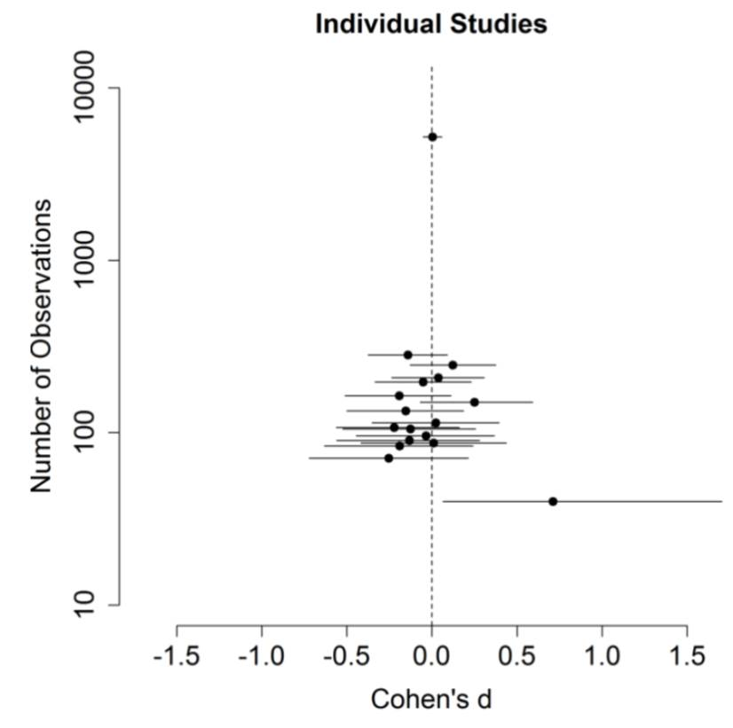

Let's look at a study that refuses to die, despite overwhelming evidence it should. From a [new article in HBR](https://hbr.org/2025/11/how-behavioral-science-can-improve-the-return-on-ai-investments) on using behavioural science when rolling out AI tools:

> Consider building an AI transcription tool. It would be reasonable for designers to assume that the most seamless interface is always best. But [behavioral research](https://doi.org/10.1177/1088868309341564) shows that intentionally adding a little friction—e.g., displaying words in harder-to-read font—actually helps people scrutinize the text more closely, which helps them find and correct errors.

The classic paper on this point is by Adam Alter and friends [-@alter2007].[^1] In Experiment 1, Alter and friends gave students the cognitive reflection test. Here's one question:

[^1]: This wasn't the paper linked from the HBR article. The link is to a review on disfluency by Alter and Daniel M. Oppenheimer [-@alter2009]. Within that review, the claim about hard to read fonts comes from the Alter et al. [-@alter2007] paper.

> A bat and a ball cost \$1.10 in total. The bat costs \$1.00 more than the ball.
>
> How much does the ball cost? \_\_\_\_\_ cents

The questions typically have an intuitive, wrong answer and a correct answer that requires a little more thought.

Alter and friends split the experimental participants into two conditions. Some participants were given the questions in an easy-to-read font, others in a hard-to-read font. And as suggested in the HBR article, those who were given the questions in the disfluent font answered more questions correctly. Sixty-five percent of participants in the disfluent group got all questions correct, compared to only 10 percent in the fluent condition.

The paper has a series of other similar experiments in which they show that disfluency can trigger more analytical forms of reasoning, sometimes correcting the errors of intuition.

This all sounds good until we examine the follow-up studies that have come in since.

@thompson2013 ran a series of experiments on disfluency, including three involving the cognitive reflection test, and found no effect on accuracy. They did suggest there might be an effect among the highest-IQ participants, but nothing in aggregate.[^2]

[^2]: There was some back and forth between @alter2013 and @thompson2013a about how to interpret the replication, but the headline of no improvement in accuracy remains.

Then @meyer2015 ran replications testing disfluent fonts and the cognitive reflection test across 13 labs. Combining those 13 replications with the three by @thompson2013 and the original study by @alter2007 brought the total sample size up to 7,365 people (up from the original 40). The headline finding was there was no effect of disfluent fonts. Further, there was also no effect when the analysis was restricted to only the higher-IQ participants.

This diagram from @meyer2015 highlights the stark contrast between the original study and later attempts to replicate. The top dot centred on zero with the very narrow confidence band is the pooled sample. The dots with confidence intervals below represent the 16 replications. And out by itself on the bottom right is the original study by Alter and friends.

{width="70%"}

Finally, the Many Labs II project [@klein2018] also included Experiment 4 from Alter and friends' paper in its replications. That experiment involved syllogistic reasoning problems. Alter and friends found their 41 participants did better with disfluent fonts. The Many Labs II replication found nothing. This wasn't unexpected: a prediction exercise in advance of the replication gave it a 42% or 32% probability (using survey or market estimations) of replicating.

Back when the @meyer2015 was first published, Terry Burnham [suggested](http://www.terryburnham.com/2015/04/a-trick-for-higher-sat-scores.html) we should measure the rate of learning via citations. In April 2015, Terry Burnham suggested we measure learning via citations. The original Alter paper had 344 citations then, while Thompson's replication had 38.

By November 2025, those numbers have suggested a lack of learning. Alter's paper now has 1,442 citations (up 1,000+), while the replications have grown to 349 and 139. The original study is still being cited far more frequently than the evidence it doesn't replicate.

When people ask me why behavioural economics and behavioural science are still fringe disciplines in applied settings, I have many suggestions. One is this continued absence of quality filter. The shiny stories still get told again and again no matter how much evidence accumulates that they are rubbish. That lack of filter eventually gets found out.

I've been [beating this drum](bad-behavioural-science-failures-bias-and-fairy-tales.md) for almost 10 years now. And sadly it still needs beating.