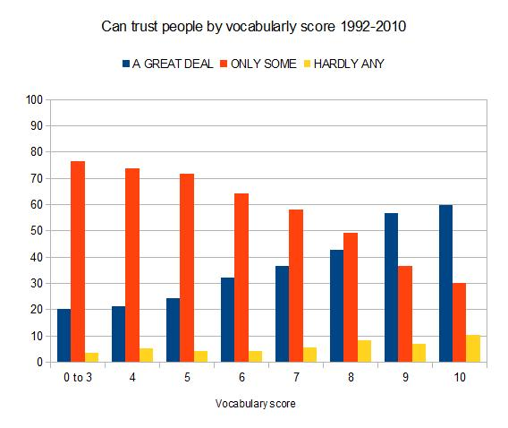

Razib Khan of [Gene Expression](http://blogs.discovermagazine.com/gnxp/) has put together [a series of charts](http://blogs.discovermagazine.com/gnxp/2011/05/the-slow-decline-of-trust-over-time/) on changes in trust in the United States over the last 40 years. The trust data comes from the [General Social Survey](http://sda.berkeley.edu/cgi-bin/hsda?harcsda+gss10), and shows a slight decline in trust over this time.

Besides some interesting results, such as the level of trust in the media, what struck me was the strength of the link between trust and education or vocabulary scores.

This result is consistent with earlier findings that trust correlates with IQ, as I discussed in my [recent post](https://www.jasoncollins.blog/jones-on-iq-and-immigration/). While that post focussed on the implications of increased trust on a country's institutions, these results show that a range of trust levels exist within a country under these same macro-level institutions.

One interpretation of this is that within a country, there is assortment by IQ and education levels, which can allow micro-level institutions in which trust is rewarded to develop. What that implies, of course, is that lower IQ groups face a micro-institutional framework in which people behave in a less trustworthy way.

One [commenter](http://blogs.discovermagazine.com/gnxp/2011/05/the-slow-decline-of-trust-over-time/#comment-69203) to Khan's post suggested that high IQ people are more able to judge whether someone is trustworthy. I tend to agree with Khan's response - that one can be trusting in an environment where trustworthiness flourishes. I would suggest that in many situations, high-IQ people are as likely to get fleeced as other people, but fortunately high-IQ people tend to live in environments where this is unlikely.
