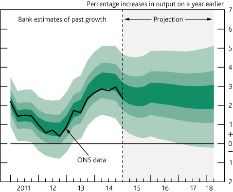

I have been listening to [a podcast of an excellent talk by David Spiegelhalter](http://www.lse.ac.uk/publicEvents/events/2013/10/20131024t1830vSZT.aspx) on "Thinking and Feeling About Risk". The video of the lecture is below.

The lecture covers a lot of interesting material - from the misrepresentation of cancer screening statistics to bicycle helmets - and I recommend listening to or watching the whole thing.

One interesting point was about the presentation of estimates of GDP growth. The Bank of England produces quarterly forecasts of GDP growth, but [when they present them graphically](http://www.bankofengland.co.uk/publications/Pages/inflationreport/irfanch.aspx), they don't include their central estimate. The May 2015 graphic is below.

The story Spiegelhalter tells is that providing a central estimate leads to everyone focusing on that, rather than the considerable range of uncertainty. He shows a similar example where removing the central line for prediction of hurricane movements results in people who sit within the "cone of uncertainty" taking the risk to them more seriously.

I see another benefit of this GDP growth forecast chart. It effectively communicates that The Bank of England has little idea what the level of growth will be. In fact, there is a large range for what they believe the growth rate _was_. If people are going to insist on publishing forecasts such as this (whatever their merits), the more people who come to understand that we have no idea, the better.


