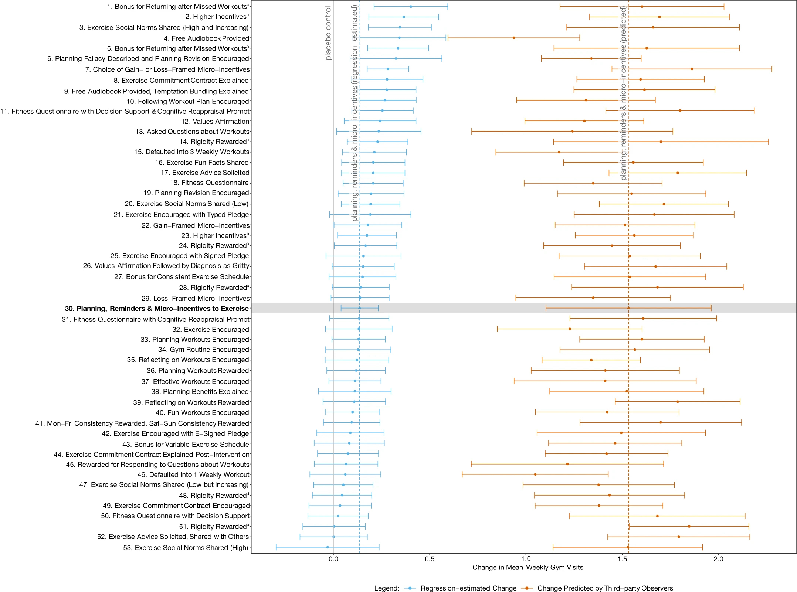

The below are my speaking notes for a presentation in the Innovative methodologies in behavioural science session at [BI Connect 2024](https://behaviouraleconomics.pmc.gov.au/bi-connect-2024), hosted by the Behavioural Economics Team of the Australian Government (BETA) in the Department of Prime Minister and Cabinet.

The notes reflect many of the themes discussed in more detail in a [previous post on megastudies](/megastudy-scepticism).

When BETA posts the video of the session, I will link here.

---

I'm going to start with a story about a [competition held by Netflix](https://web.archive.org/web/20061106031902/http://www.netflixprize.com/index).

They offered \$1 million to the team that could develop an algorithm that could predict film ratings with 10% better accuracy than Netflix's own model. The competition began in October 2006, and by June 2007 over 20 000 teams had registered for the competition and 2000 teams had submitted predictions. The prize was [claimed in 2009](https://web.archive.org/web/20090926213457/http://www.netflixprize.com/leaderboard), albeit the prize algorithm was never implemented by Netflix.

Competitions of this nature now underpin much progress in artificial intelligence. Many date the genesis of the current AI boom to the success of the deep convolutional neural net called AlexNet in the [2012 edition](https://www.image-net.org/challenges/LSVRC/2012/results.html) of the [ImageNet Large Scale Visual Recognition Challenge](https://www.image-net.org/challenges/LSVRC/index.php).

[Kaggle](https://www.kaggle.com/) has industrialised the running of these competitions for private and government entities. The organisation submits a problem and data, and competitors compete to develop the best algorithm. This [Math Olympiad competition](https://www.kaggle.com/competitions/ai-mathematical-olympiad-progress-prize-2) is running now. You can see that 1754 submissions had already been made by participants at the time I took this snapshot.

{width="80%"}

We have also seen informal competitions emerge, such as the measuring of generative AI against standardised benchmarks. When a new version of Claude, ChatGPT, Gemini or Llama is released, they often release measures of their performance against these benchmarks, such as [in this screenshot](https://www.anthropic.com/news/3-5-models-and-computer-use).

{width="60%"}

The approach that underpins these competitions and comparisons is known as the common task framework. Researchers compete to solve the a problem using the same dataset, with each measured against the same scale.

There are many benefits to the common task framework. We have objective measures of performance. We can see what is the state of the art. We can compare apples with apples.

There are also some downsides to the common task framework that I will come to later.

## Megastudies

Is there a behavioural science version of the common task framework?

According to some behavioural scientists, the answer is yes - the megastudy. First labelled megastudy in 2021, the idea behind the megastudy is to test many interventions in a single massive experiment. Don't test one intervention against a control. Test 50. Put these interventions in direct competition with each other.

This idea of testing many interventions in this way has been around since before the behavioural scientists put on their marketing hat, called it the megastudy and published it in Nature. But the megastudy has certainly increased in frequency over the last couple of years.

There is a fairly simple case for the megastudy. We have many studies showing the effects of idiosyncratic behavioural interventions. We have social norms. Loss framing. Scarcity. Incentives. And so on. Which is more effective in achieving the behaviour change you want? We often can't answer this as the various interventions aren't directly compared against each other in the academic literature. The typical academic paper compares one intervention or class of similar interventions against a control.

A megastudy enables us to make that comparison.

## Increasing gym attendance

To illustrate, let me walk through the highest-profile megastudy, which as I hinted was published in Nature.

Katherine Milkman and friends [-@milkman2021] tested 54 interventions to increase the gym visits of 61,000 experimental participants.

Members of a national gym chain were asked if they wished to enrol in a “habit-building science-based workout program”. Those who signed up formed the subject pool and were randomly assigned to the experimental conditions, including a control under which they received no further contact.

{width="60%"}

Over the following 28-days participants were subject to interventions involving varying mixes of incentives and messages. For example, those in the “Social norm (high and increasing)” treatment group received six text message reminders, with content such as:

> Trivia time! What percent of Americans exercised at least 3 times per week in 2016? Reply 1 for 61%, 2 for 64%, 3 for 70% or 4 for 73%.

If they respond 1, 2 or 3, they receive a message back stating:

> It's actually 73%. And this is up from 71% in 2015.

They also received emails with similar facts.

Those in the “Social norm (low)” group received messages with a less rosy situation:

> Trivia time! What percent of Americans exercised at least 3 times per week in 2016? Reply 1 for 35%, 2 for 38%, 3 for 41% or 4 for 44%

As an aside, there don't seem to be any qualms about using deception here.

Some interventions involved incentives. For example, the “Rigidity Rewarded” intervention paid 500 Amazon points worth \$1.79 each time they attended a planned gym visit, and 250 Amazon points worth \$0.90 if they attended the gym at another time.

The headline results of all the interventions are in this figure, with the effect sizes and their 95% confidence intervals represented by the blue lines. The intervention with the largest effect size involved incentives for returning to the gym after a missed workout.

{width="90%"}

Twenty-four of the 53 interventions were found to have a statistically significant effect over the control of no messages, increasing visits by between 9% and 27%. That equates to 0.14 to 0.40 extra weekly gym visits over the control average of 1.48 visits per week.

This figure also contains predictions made by behavioural practitioners, public health academics and lay people - those orange bars on the right indicate the overestimation of effect and lack of any relationship between the predictions and the results. I'll briefly touch on these predictions later.

## Increasing vaccination rates

Another megastudy by most of the same authors released that same year [-@milkman2021a] looked at a series of messages to encourage vaccination. For example:

> John, this is a reminder that a flu vaccine has been reserved for your appt with Dr. Smith. Please ask your doctor for the shot to make sure you receive it.

Again, a bit deceptive as there was no reserved vaccine, but as you can see in this chart, that particular message of a highlighted flu dose was the most effective.

{width="75%"}

Beyond giving us direct comparability, there are some other nice features about megastudies. There are economies to scale: while an individual megastudy is a large exercise, the cost can be lower on a per-intervention basis.

Megastudies also have built-in publication of null findings. We get to see both the successful interventions and the duds.

## Generalising

But what can you as a practitioner or behavioural scientist do with the output of a megastudy?

If you are that particular gym chain or vaccination provider for which the megastudy was conducted, you might scale the most successful messaging.

But what if you are operating in a different context? What if you are a different gym chain with different customer demographics? A yoga studio? A chess club? A university encouraging student attendance? A preventative health provider?

As the authors of these papers argue, the fundamental problem that the megastudy is designed to address is the lack of comparability of interventions tested in different contexts. The context of two different experiments may be sufficiently different that it is not reasonable to ask which intervention is more effective.

But if we cannot easily compare across experiments in different contexts, what confidence can you have that the ordering or magnitude of intervention effect sizes in the megastudy will be reflected in a different context?

We are in a Catch-22 situation. The bigger the comparability problem that the megastudy is seeking to solve, the less useful the megastudy results are for application in other contexts.

Ultimately, this is why good policy or business advice should typically be to run your own experiment.

There is also the question of translating the particular interventions into the new contexts. There are so many degrees of freedom in developing a message, from the visual design, to the precise wording, to the choice of medium, to the timing. The result is that your translated intervention may not capture what drove the success of the previous intervention. The copy may not convey the concept. The wording may be confusing. And so on.

This message from the first megastudy on vaccinations was the worst performing:

> It's flu season & getting a flu shot at your appt is an easy thing you can do to be healthy!

Who were their copywriters?! I would argue that the poor performance of this message gives little information about the effectiveness of health messaging.

This implementation problem again points to the advice: test in your own domain. A megastudy isn't going to save you from doing that.

## Power

And this brings me to possibly the biggest challenge with megastudies.

On its face, megastudies have the benefit of getting a large sample. A total of 61,293 participants for the gym megastudy sounds solid.

But it doesn't take much thought to realise that across 54 interventions (including the control) there is an average of not much more than 1000 participants per intervention. And that relatively small number of participants means that we have low power - that is, a low ability to detect any effects that exist and to differentiate between interventions.

For instance, while the largest effect size in the gym megastudy involved a bonus for returning after a missed workout, this effect size was indistinguishable from around half the other interventions.

The megastudy on vaccinations has the same problem. The 19 interventions across 47 000 participants boosted vaccinations by an average of 2.1 percentage points, but the authors noted that they could not reject the null hypothesis that all 19 effects have the same true value. A megastudy where we can't tell which message works.

Not all megastudies have this problem, but they highlight an issue that we always grapple with as experimentalists. Increasing the number of interventions reduces power unless we can commensurately increase sample size. There's a tradeoff, and sometimes you're better off with fewer interventions.

## Building theory

Beyond the applied nature of these megastudies, another question worth asking is what they offer to science. The flagship megastudy paper was published in Nature after all.

To address this, let me first describe an experiment by Google.

When you visit Google online, they really want you to click on advertising links. What colour link is most likely to induce a click?

Google doesn't mess around in answering questions such as this. In one experiment, they [tested 41 shades of blue](https://www.theguardian.com/technology/2014/feb/05/why-google-engineers-designers). While this experiment was ridiculed by outsiders as the "50 shades of blue" episode, it yielded an additional \$200 million dollars a year in revenue.

Where do megastudies sit between this Google experiment - a valuable optimisation exercise with limited scientific value - and a study designed to teach us something about how the world works.

To date, I'd argue that megastudies are closer to the Google end of the spectrum. They're valuable for the task being optimised, but provide limited feedback into our theoretical understanding of human behaviour.

Each intervention tested in the megastudy is derived from empirical regularities observed in past experiments. But instead of taking on the challenge of giving this mass of empirical evidence some theoretical backbone, megastudies have become domain specific horse races. As a policy maker or business owner, you might reap the benefits. But for science, there is less gain.

I admit I'm asking a lot. I want to see behavioural science build theoretical understanding as to what is going on. These studies are designed to test how to increase gym attendance or vaccination rates. We can't always have everything.

However, this lack of theory is not without costs. For instance, as I've already noted, when asked to predict the ordering of effect sizes for the gym and vaccination megastudies, the practitioners had no idea - predictions for the gym megastudy are represented by the orange bars. We don't have a theoretical framework that can outperform common sense or guide us as to what interventions are most likely to work. You're stuck throwing as many interventions as you can find against a wall to see which will stick. If we had better theory, we might be able to winnow down options for a higher powered study. Megastudies are in part a symptom of this failure.

So, where to from here. What's the future role of megastudies?

## Building on the common task approach

I believe there is more to the common task approach. Common task exercises have catalysed some key moments in machine learning and artificial intelligence. The iterative increases in performance have provided tangible evidence of progress.

](img/what-we-learn-when-we-test-everything/ai-index-2024.png)

Can we bring the megastudy even closer to the common task approach? Common task tournaments typically create an open playing field by making the dataset generally available. Anyone can enter. People can have multiple cracks.

Contrast that with the published megastudies to date from a relatively narrow set of behavioural science teams. I don't see any evidence that behavioural science teams have skill in developing messages beyond marketers - they couldn't predict which were more effective after all - so how could we open up and democratise who provides interventions? I saw earlier this year an open call for intervention submissions to a happiness megastudy, which is a great step, although I'm not sure it ended up on the desks of any marketing agencies. I hope they recruited some weirdos.

Most common task frameworks also allow iterative exploration and progress. Teams can access the data outside of tournaments. People get to repeatedly return to the problem. In contrast, with the megastudies we've got a one-shot game.

So why don't we run this experiment with a gym chain or vaccination provider every year? Solicit open entries, with a process to whittle them down to the required number of interventions. Include a range of the best interventions from previous years.

If we took these extra steps, however, a limitation to the common task framework will become of increasing importance to the megastudy: overfitting. If you run a contest to increase gym attendance again and again there's a higher probability that one of the interventions will capitalise on an idiosyncratic feature of that gym and its members. Great results, poor generalisation.

There are also decreasing marginal gains. The winner of the Netflix prize was never implemented as other cheaper combinations of models delivered most of the same benefits. Performance against many machine learning benchmarks plateaued or maxed out, requiring the development of new benchmarks.

But there is something to be said for a process where we learn and build on what we have learnt, rather than simply trial (hopefully scale) and publish. And by taking the inspiration for the megastudies - the common task framework more seriously - megastudies could contribute to this.

These performance curves on your screen are quite amazing. In the space of a decade, many tasks went from impossible for machines to machines being vastly superior to humans, despite predictions that these advances were decades away. A similar curve in understanding the drivers of human behaviour would be an amazing thing.

And that's where I'll wind up for today.