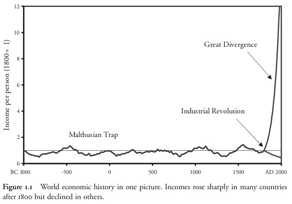

Gregory Clark opens *A Farewell to Alms* with a strong claim:

>The basic outline of world economic history is surprisingly simple. Indeed it can be summarized in one diagram: figure 1.1.
>
>

I like Clark's claim, but I'm now convinced that we need a second. From Michael Kremer's [Population Growth and Technological Change: One Million B.C. to 1990](https://www.jasoncollins.blog/more-people-more-ideas-in-the-long-run/):

>Figure I plots the growth rate of population against its level from prehistoric times to the present.
>
>

Even though there was negligible per person income growth through the Malthusian era, technological change was accelerating. As more people leads to more ideas (as there are more people to come up with them), a larger population leads to faster technological progress. Technological progress in turn allows for further population growth. The resulting pattern is faster than exponential growth in technology and population - a dynamic that does not show up in Clark's chart.

If I were to stretch it to a third diagram I would want something that captures the dynamism of the Malthusian era - population bottlenecks, different rates of growth across different populations and the like - but I'm not sure what that chart would look like yet.
