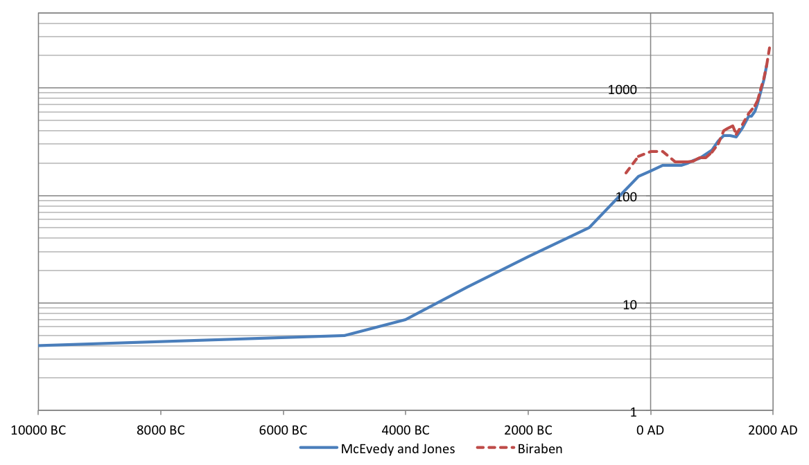

Spurred by [this chart](http://en.wikipedia.org/wiki/File:World_population_growth_%28lin-log_scale%29.png), a number of bloggers (such as [Robin Hanson](http://www.overcomingbias.com/2010/12/romans-foreshadow-industry.html) and [Razib Khan](http://blogs.discovermagazine.com/gnxp/2010/12/the-axial-age-world-population/)) have asked what was happening around 500 BC to cause the jump in population. Was this an almost industrial revolution (with population in the Malthusian state the primary indicator of the level of technology)?

The data in the chart is based on the low estimate by the [United States Census Bureau](https://www.census.gov/data/tables/time-series/demo/international-programs/historical-est-worldpop.html), which in turn comes from a range of sources. Looking at the way the Bureau put the low estimate together, I am not sure that there was a major event around 500 BC as the chart suggests. The main source of data between 5,000 BC and 700 AD is the _Atlas of World Population History_ by Jones and McEvedy. They provide all the data points between those two dates, except they have no measure for 400 BC, which is then sourced from Biraben's 1980 paper, *An Essay Concerning Mankind's   Evolution*. This combination of the two data sources is what causes the appearance of a rapid acceleration of population growth into 400 BC. Splitting out these two data sources, the sudden surge into 400 AD becomes a gentle rise:

The growth in population is not beyond that which might be expected from a scale effect in the development of technology (more people, more ideas - such as that proposed by [Kremer](https://www.jasoncollins.blog/more-people-more-ideas-in-the-long-run/)). In such a case, you would expect the population to increase at greater than an exponential rate (an exponential increase would be a straight line with the logarithmic scale on the y-axis).

One point of interest which does remain is why population growth slowed after this point, and looking at the Biraben data, there was a marked decrease in population. At this time, Europe entered the Dark Ages. Was the technological stagnation and economic decay through this period responsible for the population decline?
